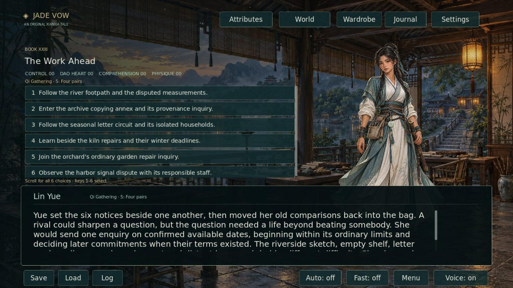
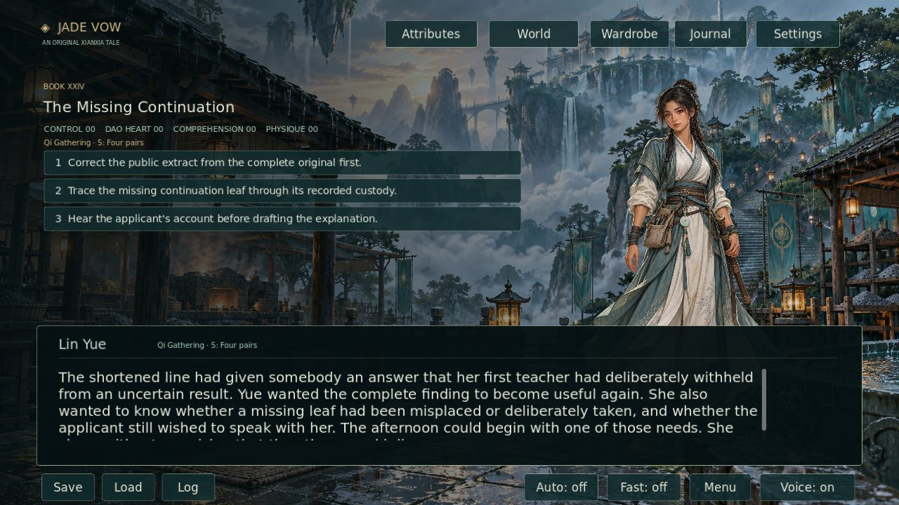
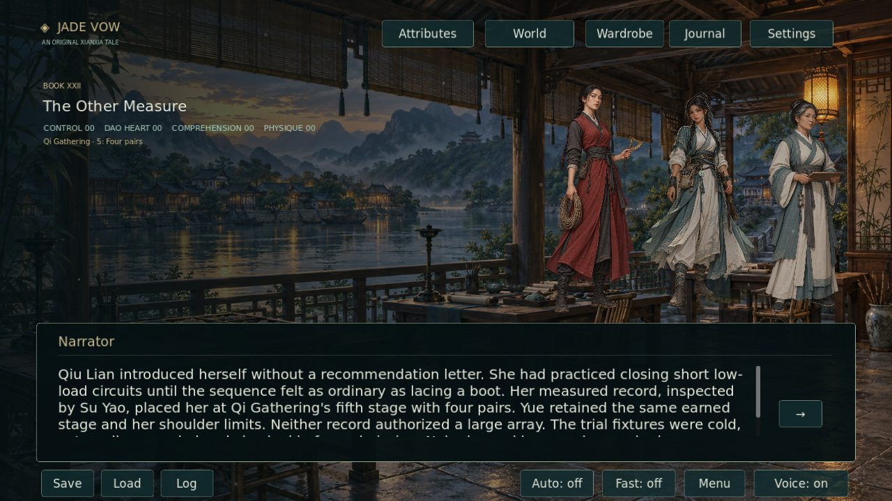

# Jade Vow

[](https://github.com/jgyy/octxian/actions/workflows/ci.yml)

An original xianxia visual novel built in **Godot 4.7.2**. Lin Yue begins as a mortal kiln worker and earns cultivation through practice, failure, recovery and independently witnessed trials. Work, evidence and freely made commitments shape the people she meets.

The campaign contains **2,082,566 displayed prose words across 24,373 scenes and 24 books**. This counts distinct playable alternatives, not words seen in one playthrough. Choice labels, titles, prompts and documentation are excluded. The requested three-million-word manuscript target remains unfinished, with 917,434 words still required. The requested 1,000 authenticated plot repairs and full artwork quotas also remain unfinished.



## Book XXIV · The Missing Continuation

Lin returns to Azure Cloud after her winter commitments. An incomplete teaching extract appears to turn her old uncertain observation into proof of early qi success. Three available approaches lead to a prompt public correction, a custody investigation or a private conversation with the affected applicant. Each completes different work and leaves different questions open.

This first batch adds **2,490 displayed words in 32 scenes**, with three distinct outcomes and saved journals. One additional published timetable contradiction is repaired across two existing opening passages. No new sprite is required for these scenes.

[Story, source evidence, Mermaid diagrams and fresh captures](docs/RETURN_20261009.md)



## Book XXIII · The Work Ahead

Six paths continue after the instrument trial closes. Each follows twenty later-season arcs with local decisions and delayed consequences. Existing work stays on its own calendar. New jobs and resources require separate terms, private records retain their owners, and professional operations remain with qualified people.

| Path | Questions and consequences |
| --- | --- |
| River footpath | Disputed access, incompatible gauge zeros, storm damage and the actual cost of replacement, repair or borrowing |
| Copying annex | Provenance, owner permissions, an expiring lease and a smaller winter service |
| Letter circuit | Private correspondence, isolated households, weather cancellation and a corrected delivery error |
| Kiln repairs | Fuel refunds, rejected wares, winter household orders and the limits of a cold-handling comparison |
| Orchard garden | Paid repair hours, a shortened storm session, plant choices, rest and a family's farewell |
| Harbor signals | Restricted access, professional responsibility, private canvas stock and the right to decline an extension |

Book XXIII adds **742,861 displayed words in 8,823 scenes**. Every path has its own completed outcome. Missing old choices establish no invented participation or relationship. Lin remains at Qi Gathering 5: Four pairs with her shoulder arrangements intact.

[Route counts, budgets, continuity review and captures](docs/SEASON_PATHS_20261008.md) · [Manuscript accounting](docs/CULTIVATION_PROGRESS.json)

## Qiu Lian · The Other Measure

Qiu Lian challenges Lin's patient recovery method with quicker low-load closure. Book XXII offers **competition, cooperation or independent work**, with saved corrections, sharing boundaries and relationship choices. It adds 72,220 words in 975 scenes. The earlier chapter's three endings now continue into Book XXIII while remaining discoverable.

Two original transparent full-body sprites retain **1024 × 1536 native PNG** bytes. Seven new season environments retain six **1672 × 941** canvases and one **1659 × 948** canvas. Maximum native output was requested from the generator; the delivered dimensions are recorded as returned. These originals were not enlarged, padded, cropped or re-encoded.

[Qiu and the three rival paths](docs/RIVAL_PATHS_20261008.md) · [Sprite provenance](assets/art/RIVALS_20261008_PROVENANCE.md) · [Seven background originals](assets/art/SEASON_20261008_PROVENANCE.md) · [Exact background prompts](assets/art/SEASON_20261008_PROMPTS.json)



## Delivered world and remaining production work

| Original asset group | Delivered | Target |
| --- | ---: | ---: |
| Ordinary location backgrounds | 50 | 100 |
| Additional building interiors | 48 | 100 |
| Human NPC paintings | 67 | 500 |
| Spirit-beast paintings | 15 | 501 |
| Distinct world sprites | 82 | 1,001 |

The 98 total backgrounds include the 48 additional interiors once each. Portrait recolors, outfits and motion frames do not count as new world originals. Draft validation reports the remaining quotas; moving the PR out of draft enables strict production checks.

The Book XXII–XXIII continuation authenticated **three underlying literary defects across five existing passages**: an unconditional commission appointment, Tuo Yin's pronouns, and the recipient of an earlier house settlement. A separate saved-choice replay fix prevents repeated rewards or charges. A harbor gallery description now agrees with He Ming's established female salt-packer role. Engine and catalog corrections receive no additional literary repair credit. New manuscript events and corrections before publication also receive zero historical repair credit.

[House-claimant evidence](docs/LETTERS_CLAIMANT_REPAIRS_20261008.json) · [Calendar evidence](docs/COMMISSION_CONTINUITY_REPAIRS_20261008.json) · [Identity evidence](docs/LATE_IDENTITY_REPAIRS_20261008.json) · [Harbor catalog follow-up](docs/HARBOR_CATALOG_FOLLOWUP_20261008.json)

## Play and inspect

Use the latest successful [workflow run](https://github.com/jgyy/octxian/actions/workflows/ci.yml) for the Linux game and validation artifacts. Download and unpack the game artifact, keep `jade-vow` beside `jade-vow.pck`, and launch the executable. Narration, portraits and story data are included in the package.

The game supports saved choices, a journal, character outfit selection, reduced motion, narration and audio settings. Earlier chapters include ordinary relationships, supervised careers, qualified specialties and paid commissions.

[Careers](docs/CAREERS_20261007.md) · [Commissions](docs/COMMISSIONS_20261007.md) · [Cultivation canon](docs/CULTIVATION_SYSTEM.md) · [Wardrobe](docs/WARDROBE.md) · [Attributes](docs/ATTRIBUTES.md)

## Build and validation

Use Python 3.12, ffmpeg and Godot 4.7.2. The bootstrap tool verifies the official engine archive checksum.

```sh
python -m pip install -r requirements.txt
python tools/bootstrap_godot.py
python -m unittest discover -s tests -p 'test_*.py'
python tools/build_assets.py
python tools/generate_voices.py
python tools/validate_assets.py
python tools/validate_world.py
.cache/godot/Godot_v4.7.2-stable_linux.x86_64 --headless --path . --editor --import
.cache/godot/Godot_v4.7.2-stable_linux.x86_64 --headless --path . --script tests/story_test.gd
.cache/godot/Godot_v4.7.2-stable_linux.x86_64 --headless --path . --script tests/season_paths_test.gd
.cache/godot/Godot_v4.7.2-stable_linux.x86_64 --headless --path . --script tests/return_test.gd
.cache/godot/Godot_v4.7.2-stable_linux.x86_64 --path . -- --capture
python tools/verify_screenshots.py
```

Full CI validates fixed-source repair evidence, duplicate prose, every gated route, actual saved decisions, cultivation, native artwork, narration and standalone playback. Season checks require every new scene to be reachable under an actual choice history and cap simultaneous future decisions at four. The viewport verifier expects **170 actual captures**, including fifteen season views. It records a measured count only after capture validation passes. The exported Linux package is tested from a folder without the source checkout.

Piper Lessac supplies narration for every displayed scene. Clips are reused only after text, byte and decoded-audio checks. Speech is 8 kHz mono Vorbis capped at 10 kb/s to limit downloads. Original synthesized music and effects accompany it.

`python tools/validate_world.py --require-complete` requires every manuscript and art target. [Development instructions](docs/DEVELOPMENT.md) · [Story authoring](docs/STORY_AUTHORING.md) · [Latest measured delivery report](docs/content_report.json)

## License

Project code and original story: [MIT](LICENSE). Original artwork provenance is retained under `assets/art/`. Piper's model card and Godot's license notices are included in the Linux package.
