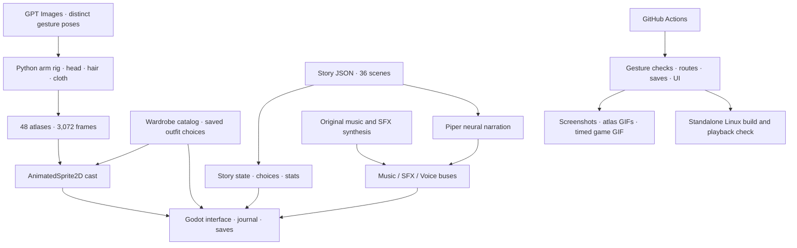

# Jade Vow

[](https://github.com/jgyy/octxian/actions/workflows/ci.yml)

An original xianxia visual novel built in **Godot 4.7.2 stable**, the latest stable release verified on 2026-10-02.

A jade pendant leads Lin Yue to a mountain suspended above the mortal world. Beneath it sleeps a captive star. Decide whether a promise should become a burden, a covenant, or a door.


## Play

Download the `jade-vow-linux` artifact from a successful [CI run](https://github.com/jgyy/octxian/actions/workflows/ci.yml), extract `jade-vow-linux.tar.gz`, and run `./jade-vow`. Keep `jade-vow.pck` beside the executable.

Or clone this repository, open `project.godot` in Godot 4.7.2, and press F6/F5. Generated sprites, music, effects, and neural narration are bundled in the repository.

To run the game from a terminal, install Godot and run these commands from the repository root (`octxian/`):

```sh
# Import the bundled assets on the first run.
godot --headless --path . --editor --import
# Launch the game window.
godot --path .
```

If your Godot executable is named `godot4`, replace `godot` with `godot4` in both commands. After the first import, use `godot --path .` to play again.

- **Enter / Space:** finish the current line, then advance.
- **1–4:** select an available choice.
- **S:** save. **L:** open the dialogue journal. **Esc:** close a panel or open settings.
- The interface provides save/load, auto reading, fast text, an animated wardrobe gallery, audio levels, and reduced motion.

The opening contains 36 scenes, 931 narrated words, cultivation stats, gated choices, and three reachable endings. This is a complete short opening.


## Clothing options

Open **Wardrobe** in the top navigation and choose an outfit independently for each character.

| Outfit | Style |
|---|---|
| Sect Robes | Layered cultivation robes |
| Light Training | Sleeveless wraps and open martial vests, exposed arms and waists, split skirts |
| Moon Festival | Open shoulders and backs, decorated silk, open necklines and high side slits |

The four adult characters each have all three options. Gallery previews animate, selected clothing appears immediately in the story and on the title screen, and choices persist across sessions. Clothing changes preserve dialogue progress and cultivation stats.


## Animation in motion

The PNG files are sprite atlases: each contains an 8×8 sequence of frames. Godot plays them at 16 fps. These previews play the actual generated frames:


[Light Training](docs/animations/training.gif) · [Moon Festival](docs/animations/festival.gif) · [Four motion cycles](docs/animations/motions.gif) · [Frame comparison](docs/animations/sect_frames.jpg)

The following recording samples the running Godot viewport, with background motion disabled:


The animation uses 24 GPT-drawn key poses, two per character/outfit appearance. An articulated upper arm, forearm, and palm follow a curved gesture path over one stable body portrait. The alternate pose supplies clothing beneath the removed resting arm. Head tilt, hair, and cloth movement accompany the gesture. Every loop moves the palm at least 48 pixels in its 384×512 cell.

## Generated art and audio

| Asset | Delivered |
|---|---|
| GPT Images artwork | 24 gesture key poses, twelve outfit reference portraits, one mountain-sect environment |
| Animated sprites | **3,072 unique frames**: 4 characters × 3 outfits × 4 motion cycles × 64 frames |
| Animation playback | 16 fps through AnimatedSprite2D; gestures, head tilt, flowing hair and cloth |
| Music | Original 48-second pentatonic plucked-string composition |
| Sound effects | Page, bell, qi channeling, and sword |
| AI voices | Piper neural narration for all 36 scenes; one Lessac narrator timbre with character pacing |

In-between frames are computed from GPT artwork. They are **not 3,072 separate GPT image requests**. The game has no lip sync. See [art provenance](assets/art/PROVENANCE.md) and the generated voice model card for sources and licensing.

## Rebuild assets

Python 3.12 is recommended.

```sh
python -m venv .venv
. .venv/bin/activate
python -m pip install -r requirements.txt
python tools/build_assets.py
python tools/generate_voices.py
python tools/validate_assets.py
python tools/preview_animations.py
```

Voice generation downloads the public Piper Lessac neural model on its first run. It needs no API key, resumes unchanged lines, and records the model source, SHA-256, upstream model card, and per-line audio hashes.

To add appearances, update `data/wardrobe.json`, GPT pose sheets, and hand/elbow/shoulder landmarks in `data/animation_rigs.json`. Story text and choices live in `data/story.json`. See [development instructions](docs/DEVELOPMENT.md).

## Architecture



## Validation

CI rejects identical frames, tiny sway, whole-image panning, tint changes, particle-only animation, and translucent or missing moving palms. It checks opaque-body and silhouette changes, at least 48 pixels of palm travel, source/code hashes, every decoded frame, audio integrity, and narration coverage.

Godot exercises all 48 outfit/motion loops using the loaded textures. Tests also cover every story route and ending, save corruption handling, wardrobe persistence, UI navigation, settings, and reduced motion. Xvfb captures screenshots and timed character playback. CI exports and launches a Linux package from a folder without the source checkout and checks clean shutdown.

The feature branch bundles verified assets and review media in separate commits. When media is unchanged, the bundle job preserves the current commit. PR checks do not push to branches.

## License

Project code and original story: [MIT](LICENSE). GPT artwork provenance is documented in `assets/art/PROVENANCE.md`. Piper's voice model card is bundled in `assets/generated/voices/MODEL_CARD` and the Linux package. Piper is a build-time dependency; the game plays rendered WAV audio.
