# Jade Vow

[](https://github.com/jgyy/octxian/actions/workflows/ci.yml)

An original xianxia visual novel built in **Godot 4.7.2 stable**, the latest stable release verified on 2026-10-02.

A jade pendant leads Lin Yue to a mountain suspended above the mortal world. Beneath it sleeps a captive star. Decide whether a promise should become a burden, a covenant, or a door.

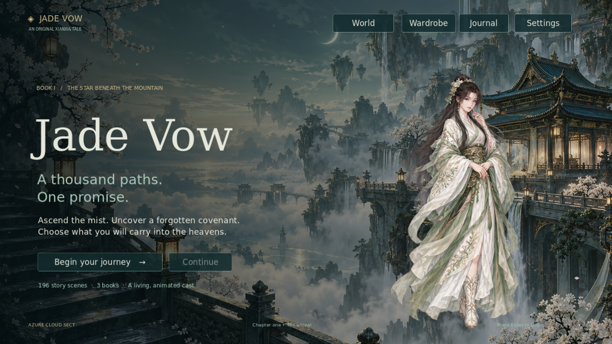

## Play

Download the `jade-vow-linux` artifact from a successful [CI run](https://github.com/jgyy/octxian/actions/workflows/ci.yml), extract `jade-vow-linux.tar.gz`, and run `./jade-vow`. Keep `jade-vow.pck` beside the executable.

Or clone this repository, open `project.godot` in Godot 4.7.2, and press F6/F5. Generated sprites, music, effects, and neural narration are bundled in the repository.

To run the game from a terminal, install Godot and run these commands from the repository root (`octxian/`):

```sh
# Import the bundled assets on the first run.
godot --headless --path . --editor --import
# Launch the game window.
godot --path .
```

If your Godot executable is named `godot4`, replace `godot` with `godot4` in both commands. After the first import, use `godot --path .` to play again.

- **Enter / Space:** finish the current line, then advance.
- **1–4:** select an available choice.
- **S:** save. **L:** open the dialogue journal. **C:** open attributes. **Esc:** close a panel or open settings.
- The interface provides save/load, auto reading, fast text, an animated wardrobe gallery, audio levels, and reduced motion.

The playable script contains **234 scenes and 13,159 authored words** across four books, with cultivation stats and gated choices. Book I has three endings; each continues into Book II, which has three investigations and four settlements. Every settlement continues into Book III, with three river routes, six settlement approaches, and three endings. Each continues into Book IV's orchard, with three investigations and four settlements.

This draft expansion currently adds **five original-scope backgrounds, 30 extra building-interior backgrounds, five human NPC sprites, three spirit-beast sprites, and two inspectable item paintings** at their native generated sizes. The original 100-background quota, 500 human NPCs, 501 spirit beasts and more than one million words remain unfinished. The separate extra 100-interior quota has 30 delivered paintings. Run `python tools/validate_world.py --require-complete` to check all quotas. CI writes exact delivery counts to `build/content_report.json`.

## Character attributes

Open **Attributes** in the top navigation, or press **C**, to inspect Lin Yue's **Qi, Trust, Insight, and Resolve**. Each attribute has a description, a growth hint, a rank, and progress toward its next rank. Choices show their point changes before selection, and locked choices show your current and required points. A short confirmation shows the gains after you choose.

Ranks advance at **3, 6, and 10 points**. The highest rank does not cap your points. Story requirements use exact point totals, and attributes persist across books and in existing saves. Beginning a new journey resets all four to zero.

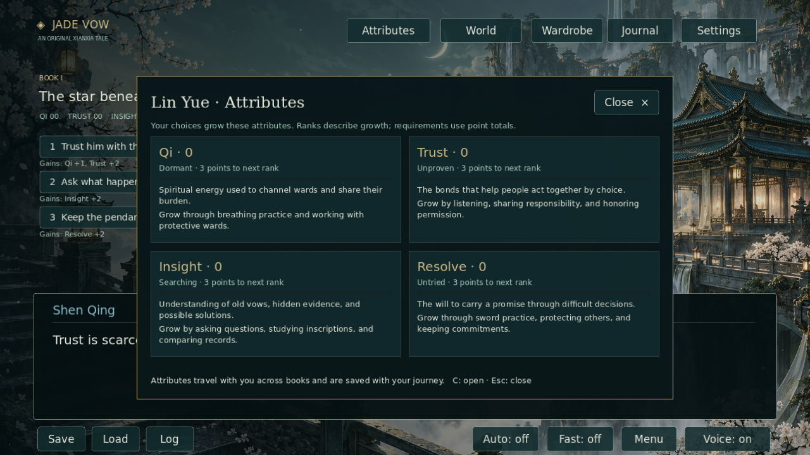

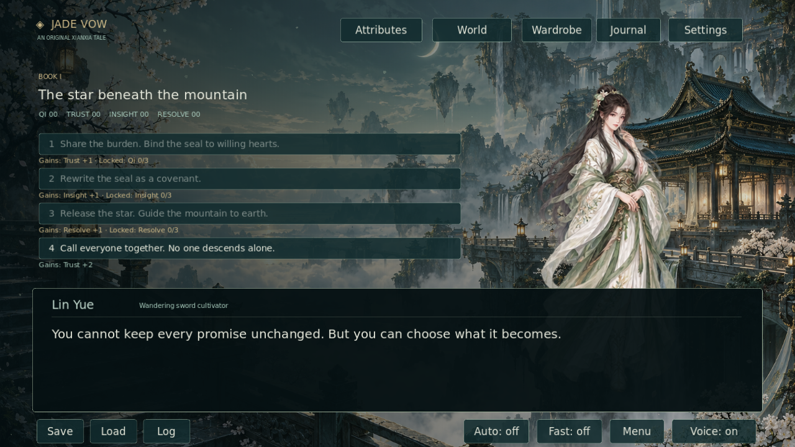

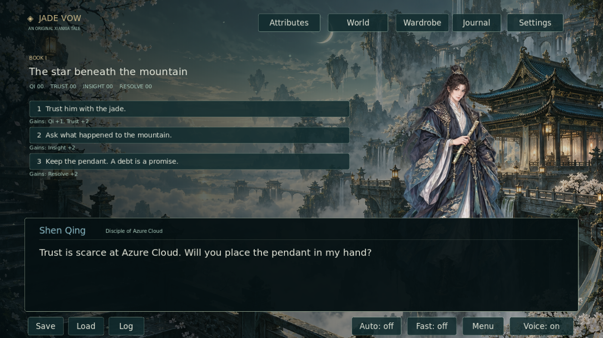

## Book II: The valley that kept its name

Continue from any Book I ending using the **→** continuation button. Su Lan leads you into Salt Lantern Valley, where a protective ward has erased nineteen households from the village register. Investigate the ferry boundary, meet the accused Reed Listener, or examine altered records in the archive. Each investigation offers three approaches, costs, and testimony before a final settlement.

The **World** gallery previews the delivered locations, people, and spirit beasts. The new paintings are preserved at their native sizes: **1672×941** for all five backgrounds, **1024×1536** for each sprite and the clapper, and **1536×1024** for the echo case. Display scaling preserves proportions; no upscaling is presented as added detail. Choose **World → Interiors** for a larger preview of the extra interior paintings; the [interior inventory](docs/INTERIORS.md) records every native file and size.

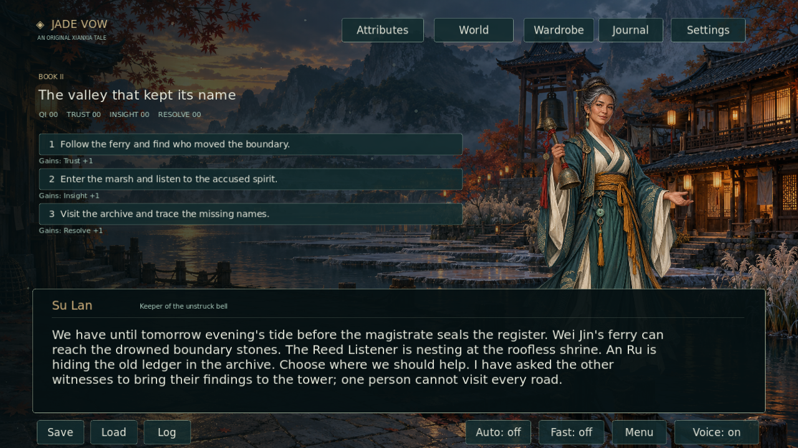

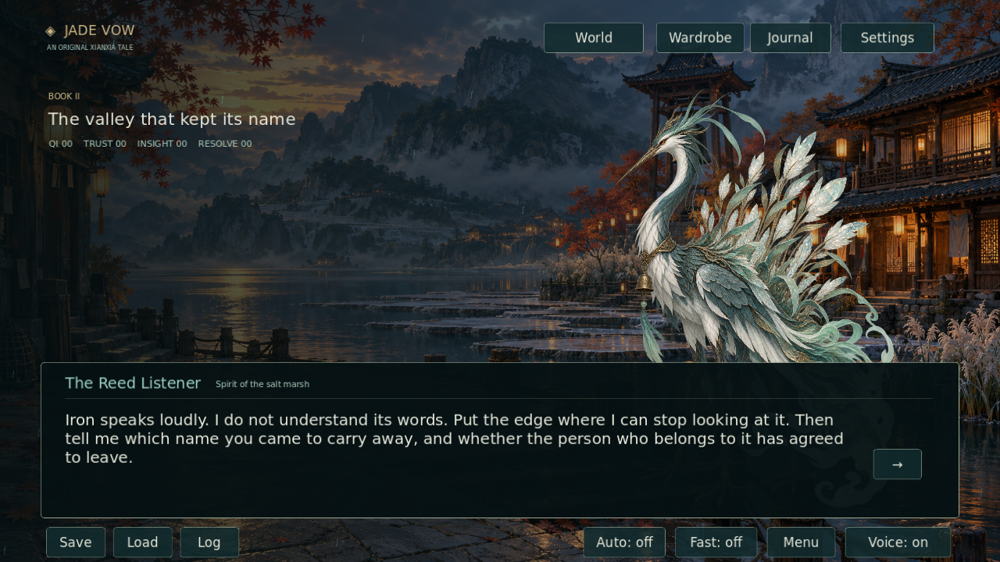

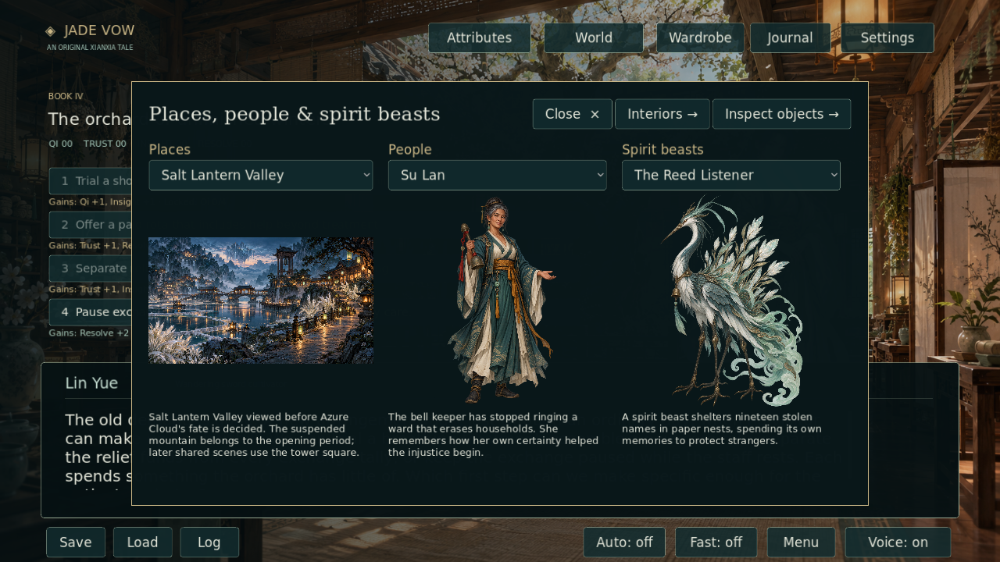

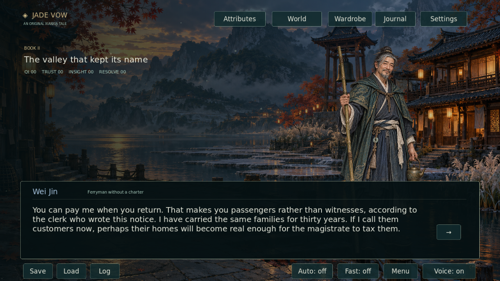

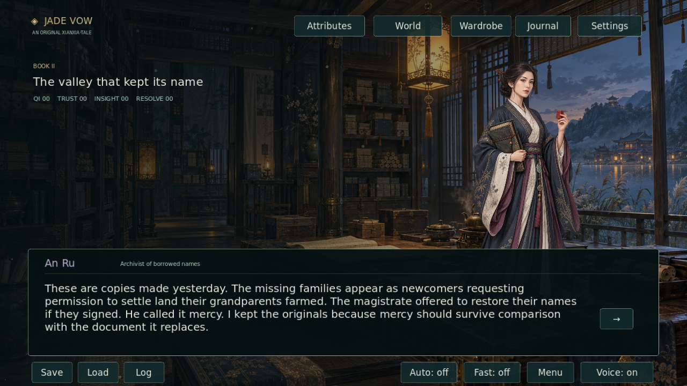

## Book III: The river without a shore

The next spring, living ferry pilot Wei Xiu charts an empty boat circling a landing lost to a flood. Mo Ran entrusted a copy of one memory to its river keeper eleven years earlier. Negotiate a new return place, survey an accessible replacement stair, or establish a supported harbor. Each route has a second choice with different costs and keeps permission separate for each echo.

Scene effects include rain, reed light, soft bell ripples, and qi motes. Effects pause behind panels and disappear with reduced motion. Open **World → Inspect objects** to examine the clapper and sealed echo case; looking at their paintings does not transfer their custody.

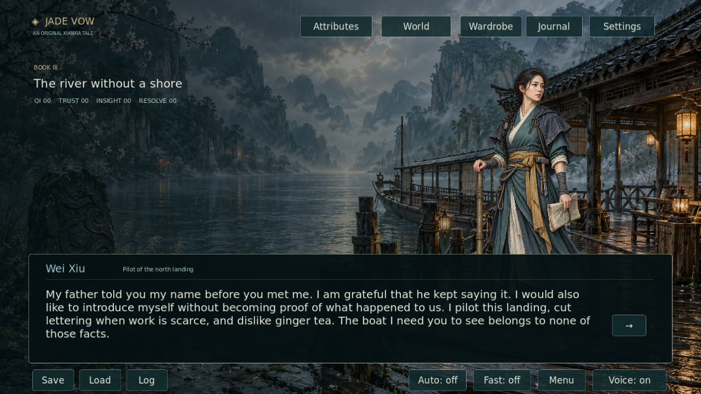

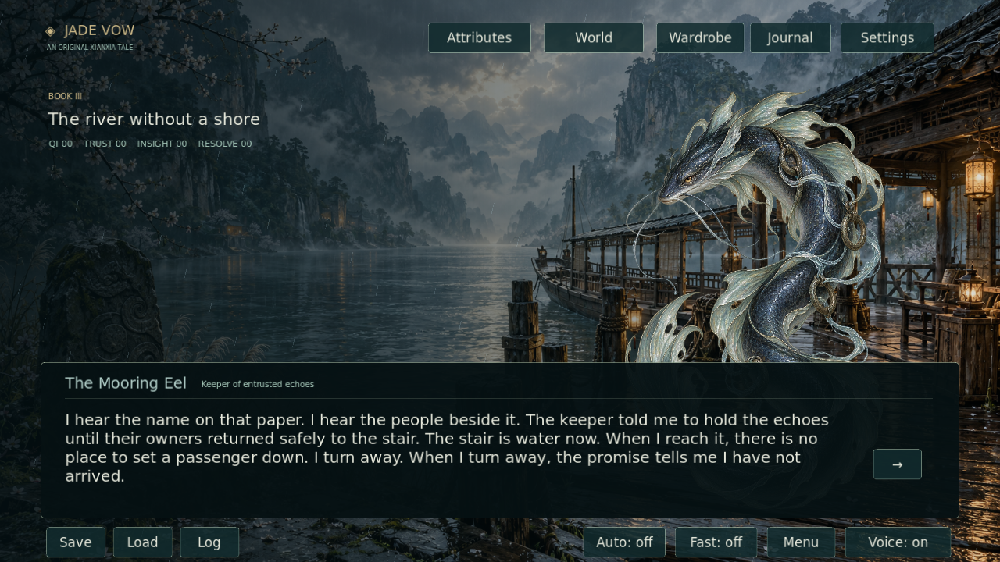


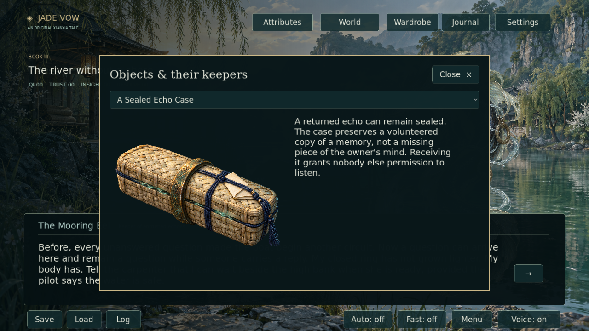

See [the continuity review](docs/CONTINUITY.md) and [the production scope and word budgets](docs/EXPANSION.md) for established facts and remaining work.

## Book IV: The orchard of unfinished winters

Continue from any river ending into the same spring. Ren Qiao's healing orchard transfers temporary sensations while leaving injuries in need of ordinary care. An inherited winter obligation has outlasted the offers that created it. Study the circuit, hear the patients, or examine the accounts before choosing a breathing trial, paid care rota, relief fund, or reviewed pause.

Ren Qiao and the Frostroot Hart have new independent native **1024×1536** portraits. Their original PNGs are retained and checked for transparency, source provenance, and decoded duplicates.

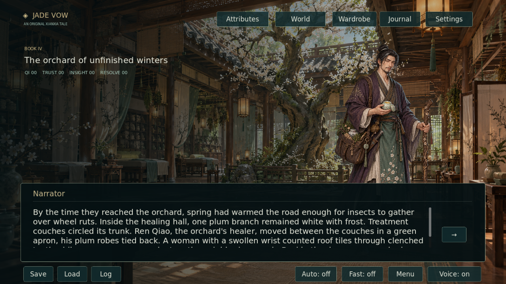

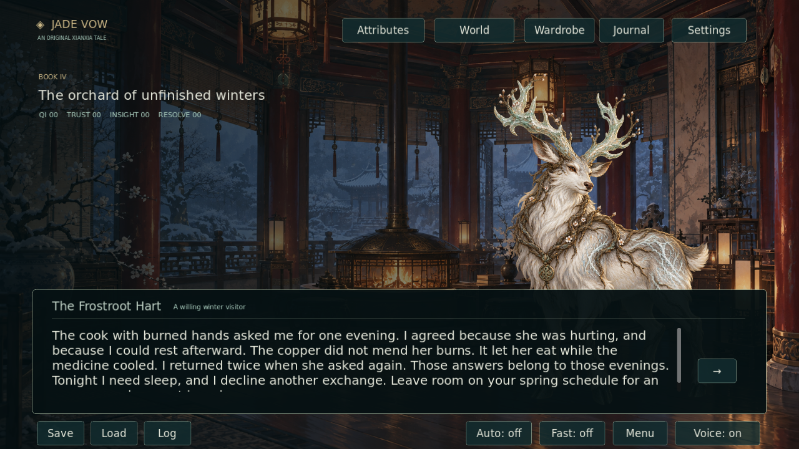

The full production target is **more than one million displayed prose words and 1,001 unique world sprites: 500 humans and 501 spirit beasts**, alongside the existing background quotas. Current delivery is **13,159 words and 8 original world sprites**. This expansion remains unfinished.

## Clothing options

Open **Wardrobe** in the top navigation and choose an outfit independently for each character.

| Outfit | Style |
|---|---|
| Sect Robes | Layered cultivation robes |
| Light Training | Sleeveless wraps and open martial vests, exposed arms and waists, split skirts |
| Moon Festival | Open shoulders and backs, decorated silk, open necklines and high side slits |

The four adult characters each have all three options. Gallery previews animate, selected clothing appears immediately in the story and on the title screen, and choices persist across sessions. Clothing changes preserve dialogue progress and cultivation stats.

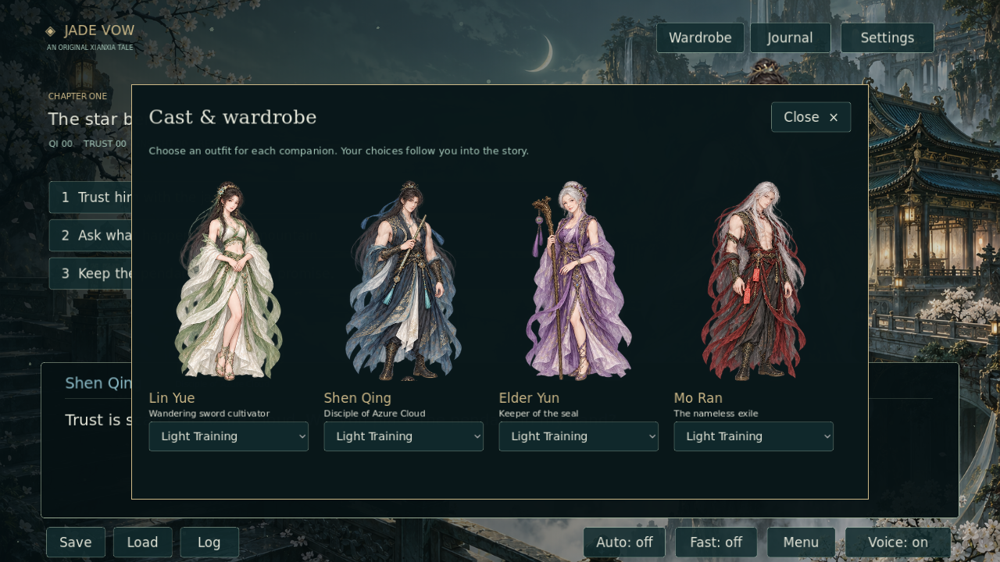

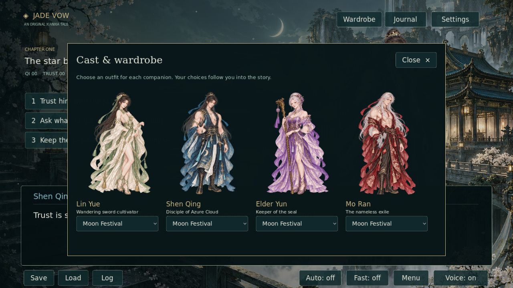

## Animation in motion

Each character and outfit uses one intact portrait. Godot gently moves the whole body up and down in a four-second loop. These previews use the same portraits and bob settings:

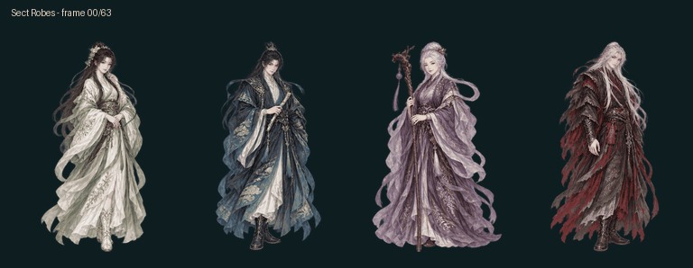

[Light Training](docs/animations/training.gif) · [Moon Festival](docs/animations/festival.gif) · [Four motion cycles](docs/animations/motions.gif) · [Frame comparison](docs/animations/sect_frames.jpg)

The following recording samples the running Godot viewport, with background motion disabled:

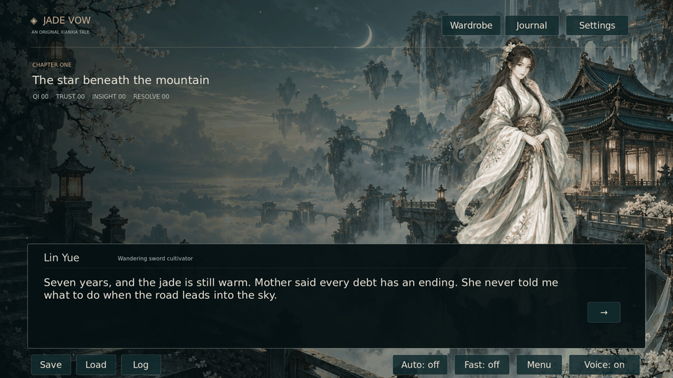

The twelve resting portraits come from the original GPT artwork. Body bobbing preserves each complete drawing. The four story motion labels select a gentle 6–10 pixel bob, and reduced motion leaves the portraits still.

## Generated art and audio

| Asset | Delivered |
|---|---|
| GPT Images artwork | 24 gesture key poses, twelve outfit reference portraits, one mountain-sect environment |
| New world paintings | 5 original backgrounds + 30 extra interiors, 5 human NPCs, 3 spirit beasts, 2 items |
| Character portraits | **12 intact portraits**: 4 characters × 3 outfits |
| Animation playback | Sprite2D whole-body bobbing on a four-second loop |
| Music | Original 48-second pentatonic plucked-string composition |
| Sound effects | Page, bell, qi channeling, and sword |
| AI voices | Piper neural narration for all 234 scenes; one Lessac narrator timbre with character pacing |

Portraits are extracted from GPT artwork and bobbed by Godot at runtime. The game has no lip sync. See [art provenance](assets/art/PROVENANCE.md) and the generated voice model card for sources and licensing.

## Rebuild assets

Python 3.12 is recommended.

```sh
python -m venv .venv
. .venv/bin/activate
python -m pip install -r requirements.txt
python tools/build_assets.py
python tools/generate_voices.py
python tools/validate_assets.py
python tools/preview_animations.py
```

Voice generation downloads the public Piper Lessac neural model on its first run. It needs no API key, resumes unchanged lines, and records the model source, SHA-256, upstream model card, and per-line audio hashes.

World art and descriptions live in `data/world_assets.json`. `tools/validate_world.py` checks references, native dimensions, transparency, reachability, and honest manuscript accounting.

To add appearances or adjust bobbing, update `data/wardrobe.json` and the GPT pose sheets. Story text and choices live in `data/story.json`. See [development instructions](docs/DEVELOPMENT.md).

## Architecture


## Validation

CI checks intact portrait extraction, preserved proportions, source/code hashes, audio integrity, and narration coverage.

Godot exercises all 48 outfit/motion combinations, checking that the complete portrait bobs smoothly and rests when reduced motion is enabled. Tests also cover every story route and ending, atomic rejection of invalid choices, long-campaign saves above 100, damaged settings recovery, world art rendering, save corruption handling, wardrobe persistence, UI navigation, and settings. Xvfb captures screenshots and timed character playback. CI exports and launches a Linux package from a folder without the source checkout and checks clean shutdown.

The feature branch bundles verified assets and review media in separate commits. When media is unchanged, the bundle job preserves the current commit. PR checks do not push to branches.

## License

Project code and original story: [MIT](LICENSE). GPT artwork provenance is documented in `assets/art/PROVENANCE.md`. Piper's voice model card is bundled in `assets/generated/voices/MODEL_CARD` and the Linux package. Piper is a build-time dependency; the game plays rendered WAV audio.
