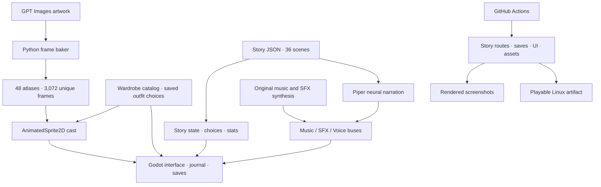

# Jade Vow

[](https://github.com/jgyy/octxian/actions/workflows/ci.yml)

An original xianxia visual novel built in **Godot 4.7.2 stable**, the latest stable release verified on 2026-10-02.

A jade pendant leads Lin Yue to a mountain suspended above the mortal world. Beneath it sleeps a captive star. Decide whether a promise should become a burden, a covenant, or a door.


## Play

Download the `jade-vow-linux` artifact from a successful [CI run](https://github.com/jgyy/octxian/actions/workflows/ci.yml), extract `jade-vow-linux.tar.gz`, and run `./jade-vow`. Keep `jade-vow.pck` beside the executable.

Or clone this repository, open `project.godot` in Godot 4.7.2, and press F6/F5. Generated sprites, music, effects, and neural narration are bundled after the first successful asset build.

- **Enter / Space:** finish the current line, then advance.
- **1–4:** select an available choice.
- **S:** save. **L:** open the dialogue journal. **Esc:** close a panel or open settings.
- The interface also provides save/load, auto reading, fast text, an animated wardrobe gallery, audio levels, and reduced motion.

The opening contains 36 scenes, 931 narrated words, cultivation stats, gated choices, and three reachable endings. It is a complete short opening with multiple endings, rather than a full-length novel.


## Clothing options

Open **Wardrobe** in the top navigation and choose an outfit independently for each character.

| Outfit | Style |
|---|---|
| Sect Robes | Original layered cultivation robes |
| Light Training | Sleeveless wraps and open martial vests, exposed arms and waists, split skirts |
| Moon Festival | Open shoulders and backs, decorated silk, open necklines and high side slits |

The four adult characters each have all three options. Gallery previews animate, selected
clothing appears immediately in the story and on the title screen, and choices persist in
settings across sessions. Clothing changes leave dialogue progress and cultivation stats intact.


## Generated art, animation, and audio

| Asset | Delivered |
|---|---|
| GPT Images artwork | Twelve character outfit portraits and one mountain-sect environment |
| Animated sprites | **3,072 unique frames**: 4 characters × 3 outfits × 4 motion cycles × 64 frames |
| Animation playback | 16 fps, seamless breathing/sway/qi effects through AnimatedSprite2D |
| Music | Original 48-second pentatonic plucked-string composition |
| Sound effects | Page, bell, qi channeling, and sword |
| AI voices | Piper neural narration for all 36 scenes; one Lessac narrator voice with character pacing |

The 3,072 frames are baked from GPT-generated artwork through deformation and effects. They are **not 3,072 independent GPT image requests**. Motion animates the existing portraits, without skeletal articulation or lip sync. See [art provenance](assets/art/PROVENANCE.md) and the generated voice model card for source and licensing details.

## Rebuild assets

Python 3.12 is recommended.

```sh
python -m venv .venv
. .venv/bin/activate
python -m pip install -r requirements.txt
python tools/build_assets.py
python tools/generate_voices.py
python tools/validate_assets.py
```

Voice generation downloads the public Piper Lessac neural model on its first run. It needs no API key, resumes unchanged lines, and records the model source, SHA-256, upstream model card, and per-line audio hashes.

To expand the cast, add GPT artwork to `assets/art`, update the cast mapping in `tools/build_assets.py`, and extend `data/story.json`. Story text and choices are data files; no dialogue is hard-coded in the interface.

## Architecture



## Validation

CI checks asset counts and uniqueness, audio hashes and narration coverage, every story route and ending, save corruption handling, actual UI navigation, all 48 outfit animation cycles, settings and reduced motion. It imports and runs Godot, renders screenshots under Xvfb, and exports a playable Linux package.

CI also launches the packaged game from a folder without the source checkout and checks that its story, animation, and narration load. Godot's license and third-party notices accompany the Linux package.

The feature branch's bundle job adds verified assets and screenshots in a separate small commit. PR checks only read repository contents; they do not push to branches.

## License

Project code and original story: [MIT](LICENSE). GPT artwork provenance is documented in `assets/art/PROVENANCE.md`. Piper's voice model card is bundled in `assets/generated/voices/MODEL_CARD` and in the Linux package. Piper is a build-time dependency; the game plays rendered WAV audio and does not bundle the Piper engine.
