# Jade Vow

[](https://github.com/jgyy/octxian/actions/workflows/ci.yml)

An original xianxia visual novel built in **Godot 4.7.2**. Lin Yue begins as a mortal kiln worker and earns her cultivation through practice, failures, recovery and independently witnessed trials. Work, evidence and freely made commitments shape the people she meets.

The playable campaign contains **1,154,076 displayed prose words across 13,079 scenes and 18 books**. The count includes alternative playable branches; only dialogue prose counts toward the manuscript. Books XII–XVII are now connected through the campaign manifest, with completed forest, desert and archive closing sequences. [Current manuscript, source review and chapter counts](docs/MILLION_WORD_CONTINUATION.md).

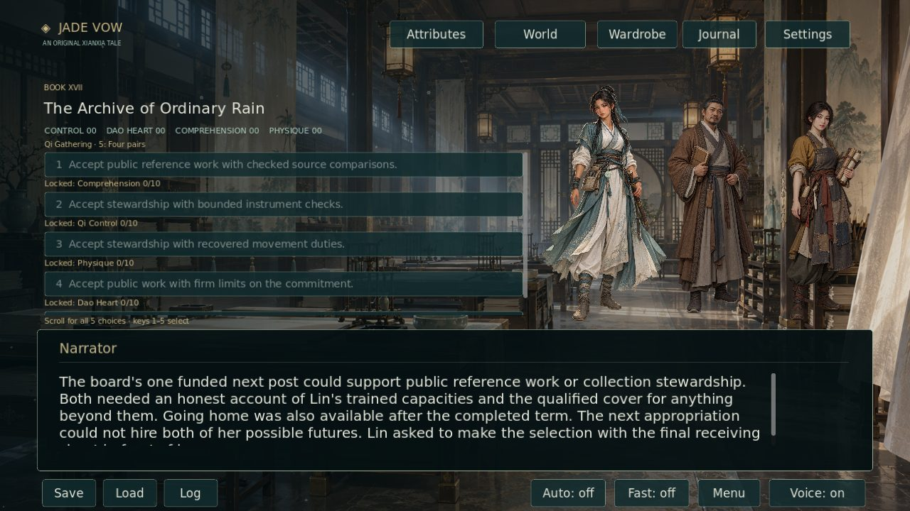

## Saved choices and Book XVIII · 2026-10-06

Choices now retain selected destinations through saves and change later scenes. This revision adds **18,694 net prose words and 248 scenes**: six earlier followthroughs and Book XVIII, *The Letter That Arrived Late*. One copy place, a rain window, a future session, two canvas sheets and one service grant create real competing obligations. Nine final material-and-service combinations keep unchosen losses. [Consequences, source evidence, save diagram and actual captures](docs/CONSEQUENCE_REVISION_20261006.md).

The exact audit verifies **one pre-existing branch inconsistency** and **six gameplay consequence improvements**. The requested 1,000 plot repairs are unverified; the manuscript still needs **845,924 words** for two million. Existing paintings cover the new locations.

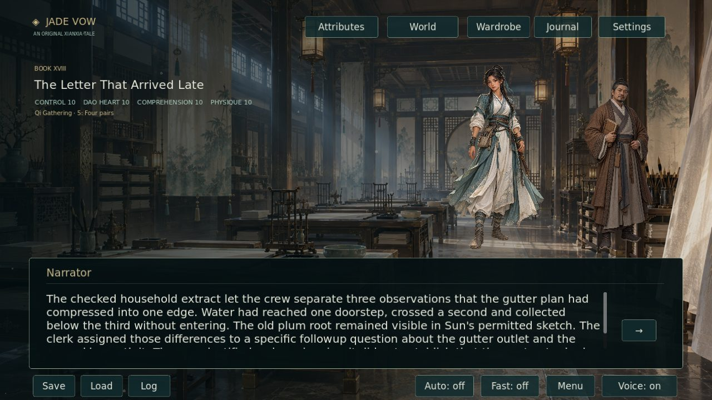

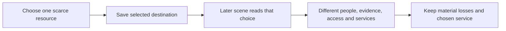

## Storm and salt-road completion credit · 2026-10-06

Thirteen additional choices in Books X–XI now award growth after their exclusive work passages, including the household correction hearing, all three storm departures, all three water investigations, all three optional trials and all three valley settlements. Saves use practice rules 3; older rules retain already-paid selection credit and earlier deferred work remains pending. [Source audit and review](docs/STORM_SALT_REVISION_20261006.md).

This batch fixes **13 source sites of one recurring causality issue**. It does not satisfy the request for 100 new repairs or add manuscript words. The current total remains **1,154,076**, with **845,924** required to reach two million.

## Existing-volume expansion toward two million words

Six new encounters add **8,630 words, 110 passages and eighteen distinct branch outcomes** inside Books XII–XVI. Xu Lin, Chen Rui, Song Mei and Wu Zheng have their own work and interests; the tidemirror otter and cinderback pangolin appear as observed creatures rather than proof of human claims. Each decision offers a trained comparison and two ungated alternatives with different costs. Cultivation stages, original findings, object custody and the existing sequence remain intact.

The requested total is **2,000,000 words**; **845,924 words remain**. The delivery report enforces that total independently from the original rewrite accounting. [Expansion and save diagrams](docs/EXISTING_VOLUME_EXPANSION_20261005.md) · [Episode placement audit](docs/EXPANSION_BRANCHES_20261005.json).

Six additional original **1024×1536 native PNG sprites** are retained at the dimensions delivered by image generation. [Creation records](assets/art/EXPANSION_20261005_PROVENANCE.md). Another **100 deferred-growth source sites** bring the two audits to **201 sites of the recurring causality issue**. Save rules 2 preserve pending revision-1 work and recognise only credit actually paid under older rules. [Additional exact-source audit](docs/ADDITIONAL_REPAIRS_20261005.json).

## Harder desert decisions and completed growth

Six new desert dilemmas add eighteen distinct consequences. Compare incompatible map origins, weigh a dispatch delay, question an old building plan, preserve an unreadable source, test a public warning and separate repair exposure from money already paid. Trained approaches require 10 Comprehension or Physique points. Every dilemma also has two ordinary approaches; those approaches expose their delays, missing evidence or rejected hypotheses in playable prose. No preference grants instant growth.

This revision repairs **101 additional premature-growth choice sites** across Books VI–X. The same gains now follow the actual completed branch passage and are saved once. Version-1 checkpoints from before this change retain their scores and recognise credit already paid on selection. The audit counts 101 source sites affected by one recurring causality issue, alongside **70 geographic staging corrections**; it does not claim 171 unrelated root defects. [Exact source audit](docs/NARRATIVE_REPAIRS_20261005.json) · [Narrative review](docs/NARRATIVE_REVISION_20261005.md).

Three independently generated **1536×1024 native PNG** paintings give Bitter Wells its caravan yard, workroom and workers' lodging. The highest supported native landscape output was requested, and the returned bytes are preserved. [Creation records](assets/art/NARRATIVE_20261005_PROVENANCE.md).

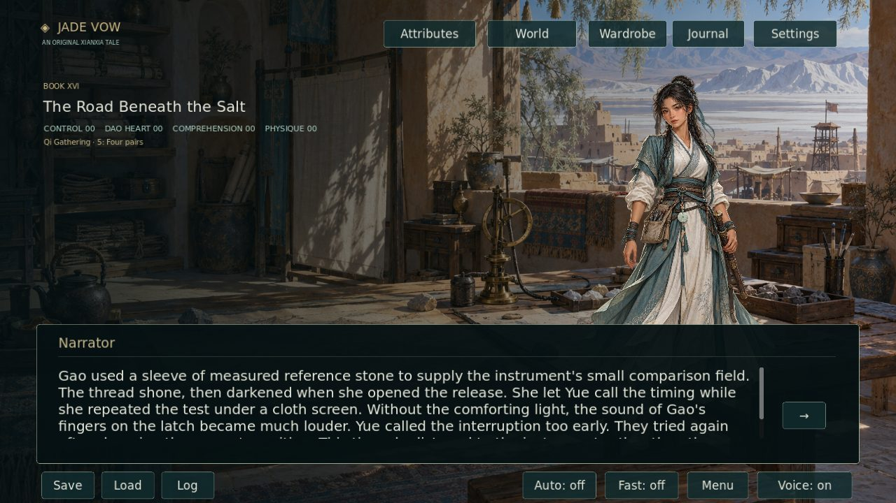

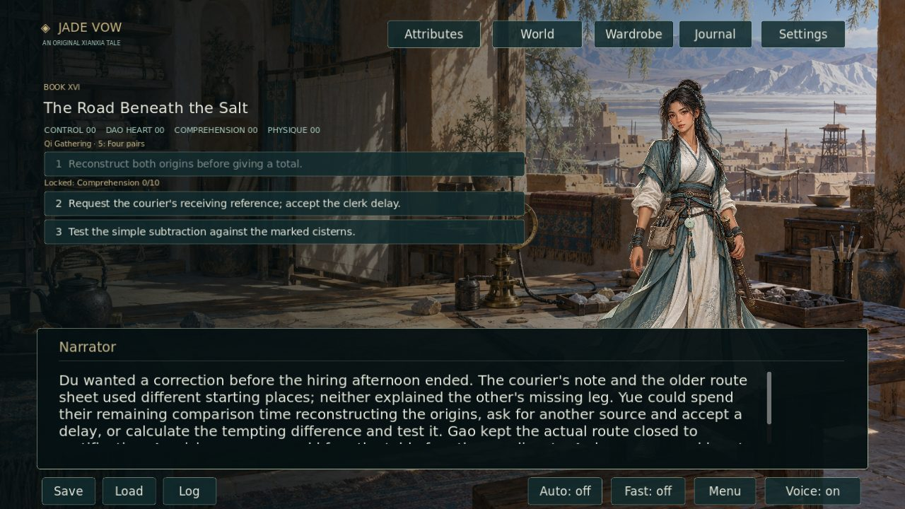

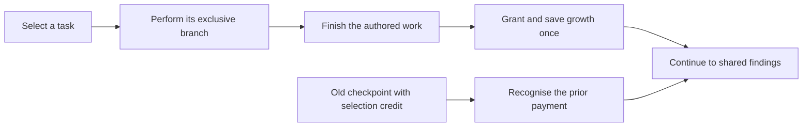

## Continue the journey

Use **Begin your journey** or load an existing checkpoint. The **→** button continues from each retained ending into the next book. Existing scene IDs, saved scores, wardrobe choices and version-1 checkpoints remain supported.

| Books | Story |
|---|---|
| I–IV | A mortal beginning, nineteen restored households, entrusted river echoes and an orchard's unfinished obligations |
| V–VIII | Borrowed faces, a cliff court, the living owner of a sealed ring and recovered foundry trials |
| IX–XI | Thunderfen's survey, the warning that signed twice and water delivered to the names that stayed |
| XII | The Canal That Could Not Be Sold: separate common use, private property, completed labor and finite debt |
| XIII | The Forest With Two Winters: paid winter work, household access and living wildlife routes |
| XIV | The Harbor of Unclaimed Names: actual wage payments, bounded storm protection and one funded improvement |
| XV | The Kiln That Kept Its Ashes: retained failed firings, qualified practice and an earned fifth-stage record |
| XVI | The Road Beneath the Salt: water, rival maps, ordinary rescue and a guide's own settlement |
| XVII | The Archive of Ordinary Rain: recovered source papers, a family key, school access and one selected future |
| XVIII | The Letter That Arrived Late: competing source copies, a rain window, completed return work and lasting material and service choices |

## Attributes change what Lin can lead

Open **Attributes** or press **C** to inspect **Qi Control, Comprehension, Physique and Dao Heart**. Ranks advance at 3, 6 and 10 points; exact scores persist beyond the highest rank. Requirements and available gains are visible before a choice.

The three new closing decisions give all four attributes distinct trained roles at 10 points. Qi Control leads a bounded instrument check, Comprehension leads source comparison, Physique leads cleared ordinary movement, and Dao Heart leads a difficult finite commitment. A qualified-support approach remains available. Your chosen role has its own prose, practical result and responsibility.

In the later books, **92 task rewards now arrive after the work is completed**, instead of when a task is merely selected. Completed practice shows its pending credit before Continue, persists through saves and grants no extra points on a revisit. Three hoped-for future kiln preferences grant no immediate growth. [Attribute meanings and save compatibility](docs/ATTRIBUTES.md).

Scores develop trained capacities. Fuel remains measured separately; realms require their authored examinations. Ordinary care, ownership, historical facts and another person's permission retain their own sources.

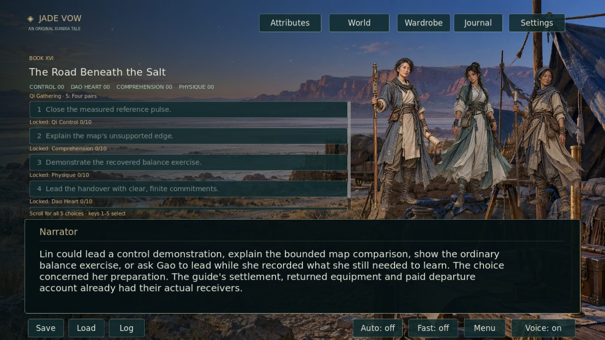

## Ensemble sprites and layered atmosphere

Authored dialogue can stage **up to three independent intact portraits at once**, with speaking-character emphasis, separate outfit choices and body bobbing. Ensemble portraits fit beside the choice cards and above the dialogue panel. 159 scenes use multiple portraits; panels pause atmosphere and reduced motion stops every cast member and hides the effects.

New effects include **snow, mist, dust, heat haze, embers, petals and sea spray**. Scenes can combine up to three layers. The new forest departure uses snow and mist; the desert closing uses dust and heat haze; the archive courtyard uses petals and mist. Choices scroll when a decision has more cards than the reading area can hold. A visible cue lists the number shortcuts; key **5** selects the fifth option.

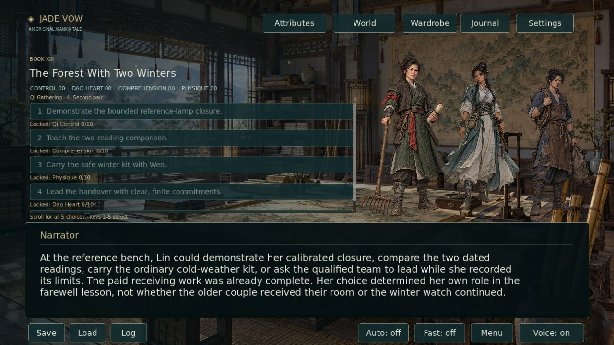

The core cast has three independently generated outfit portraits per adult character: Sect Robes, Light Training and Moon Festival. Select clothing through **Wardrobe**. It persists without changing dialogue progress or scores. Characters animate as whole portraits on a four-second bob; [wardrobe details](docs/WARDROBE.md).

## Native artwork and production scope

This continuation adds three independently generated originals: a **1536×1024 archive courtyard**, a **1024×1536 transparent Lanternwing Crane**, and a **1024×1536 transparent lantern keeper portrait**. All retain the returned native PNG bytes. The highest native output available through the image tool was requested; no enlarged image is counted as new detail. [New provenance](assets/art/MILLION_WORD_PROVENANCE.md) · [World art provenance](assets/art/PROVENANCE.md).

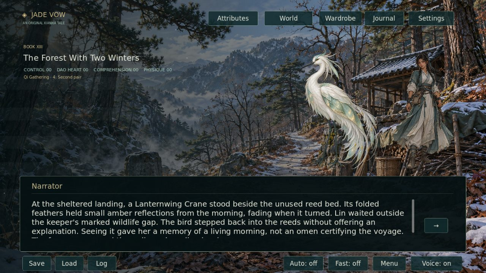

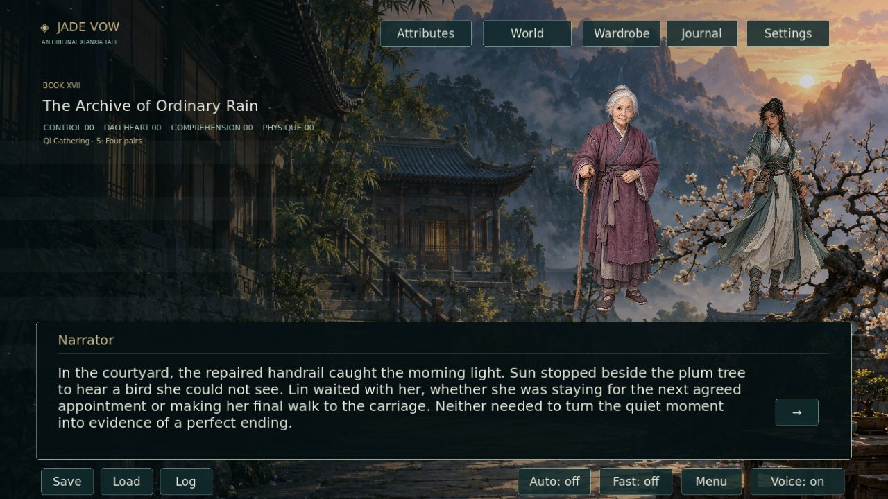

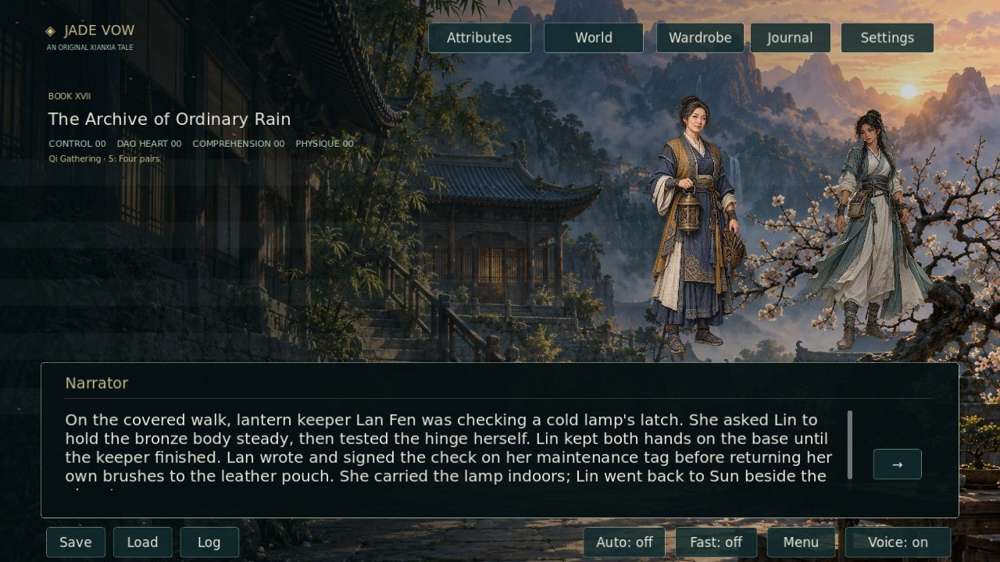

| Production quota | Delivered | Target |
|---|---:|---:|
| Displayed prose words | 1,154,076 | 2,000,000 |
| Original environments | 31 | 100 |
| Extra building interiors | 41 | 100 |
| Human NPC originals | 55 | 500 |
| Spirit-beast originals | 15 | 501 |
| Unique world sprites | 70 | 1,001 |

The manuscript is **845,924 words short of the 2,000,000-word target**. The independent artwork quotas also remain unfinished, so the PR stays draft. Core outfit portraits, items and effects do not inflate world-sprite totals. **World → Interiors** previews delivered interiors; **Inspect objects** displays paintings without granting inventory custody.

## Continuity review

This batch fixes **101 source-anchored continuity and choice-causality sites**: 95 premature task rewards, three missing closing sequences and three absent salt-road continuations. This is an evidenced site count, not 101 independent engine defects. The audit excludes new scenes, speaker definitions and art from its repair count. [Exact before/after audit](docs/CONTINUITY_REPAIRS_20261004.json) · [Review explanations](docs/MILLION_WORD_CONTINUATION.md).

Forest closure preserves the selected wildlife and household arrangements. Desert closure returns equipment and leaves clinical care and the guide's settlement with their actual recipients. Archive closure completes the scheduled school lesson, Sun's paid reading and final handover before accepting one next post or going home. The earned fourth and fifth stages retain their stated limits.

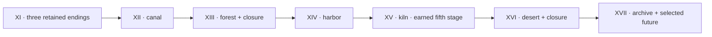

## Build and validation

Use Python 3.12, ffmpeg and Godot 4.7.2. The bootstrap tool verifies the official engine archive checksum.

```sh
python -m pip install -r requirements.txt
python tools/bootstrap_godot.py
python -m unittest discover -s tests -p 'test_*.py'
python -m tools.validate_million_continuation --verify-source
python tools/build_assets.py
python tools/generate_voices.py
python tools/validate_assets.py
python tools/validate_world.py
.cache/godot/Godot_v4.7.2-stable_linux.x86_64 --headless --path . --editor --import
.cache/godot/Godot_v4.7.2-stable_linux.x86_64 --headless --path . --script tests/story_test.gd
.cache/godot/Godot_v4.7.2-stable_linux.x86_64 --headless --path . --script tests/runtime_test.gd
.cache/godot/Godot_v4.7.2-stable_linux.x86_64 --headless --path . --script tests/continuation_test.gd
```

The source audit requires its fixed base commit locally. Full CI checks native dimensions, alpha and provenance, authentic repair anchors, duplicate prose, every gated story route, saves, UI, all outfit motions, completed-practice persistence, ensemble bounds and motion settings. Xvfb captures **83 real viewport screenshots** and timed portrait animation. The Linux package is launched from a folder without the source checkout.

Piper Lessac generates narration for every displayed scene, reusing clips only after text, byte and decoded-audio checks. Changed text is regenerated. Narration uses 8 kHz mono Vorbis capped at 10 kb/s to reduce downloads; this lowers audio fidelity while keeping complete speech and timing. CI can reuse independently verified prior draft narration. Music and sound effects are original synthesized audio.

Draft validation checks delivered content and reports quotas. `python tools/validate_world.py --require-complete` additionally requires every manuscript and art target. Moving the PR out of draft enables that strict check.

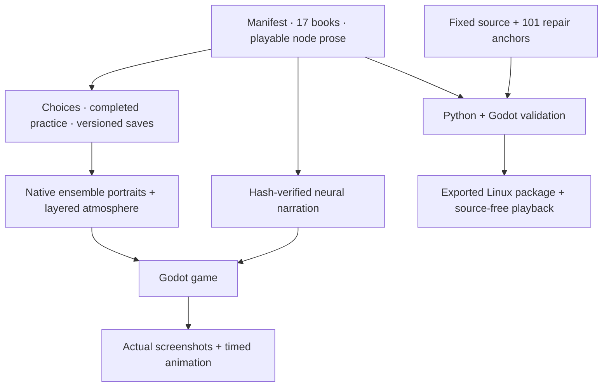

See [development instructions](docs/DEVELOPMENT.md), [story authoring](docs/STORY_AUTHORING.md), [cultivation canon](docs/CULTIVATION_SYSTEM.md) and [measured delivery report](docs/content_report.json).

## License

Project code and original story: [MIT](LICENSE). Original artwork provenance is recorded under `assets/art/`. Piper's model card and Godot's license notices are included in the Linux package.
