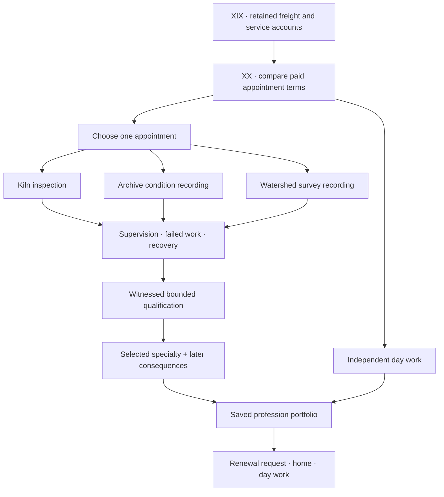
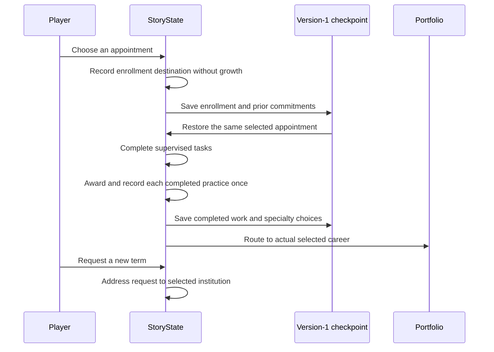
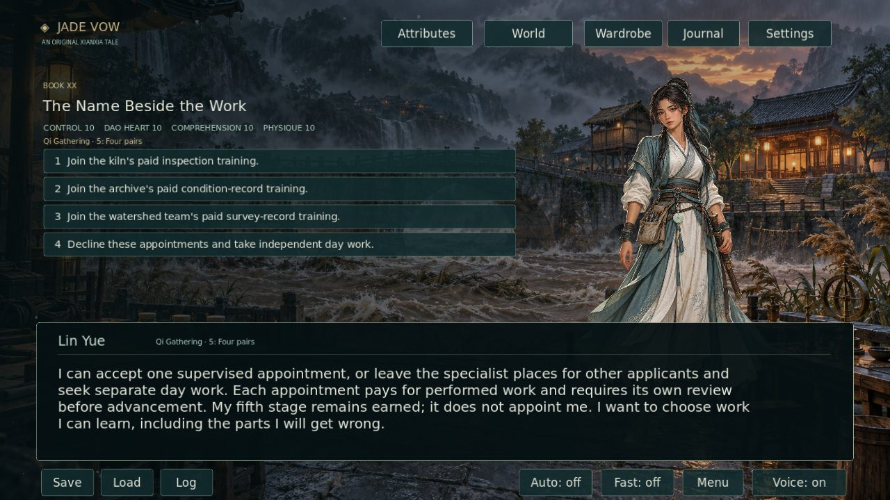
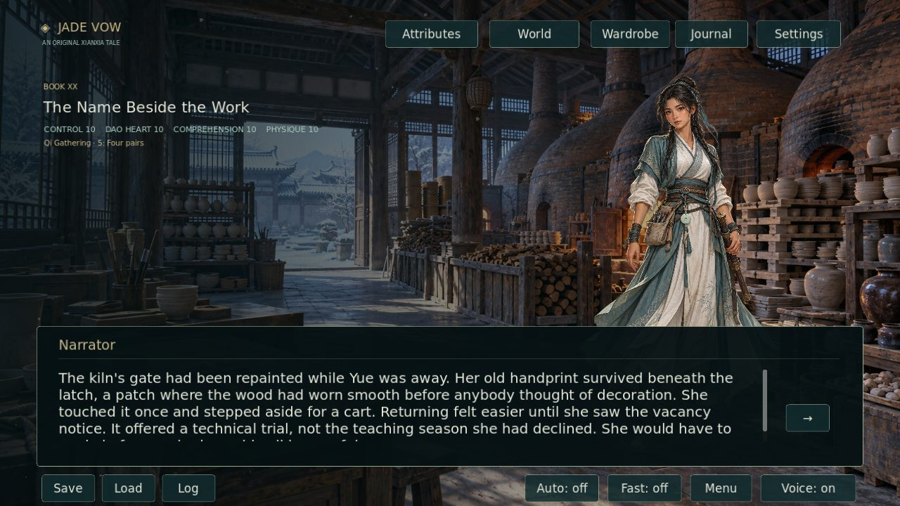
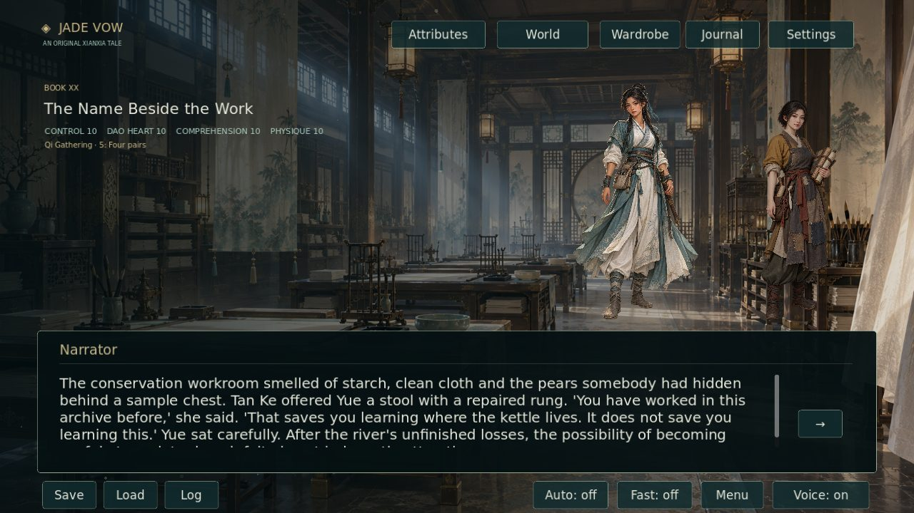
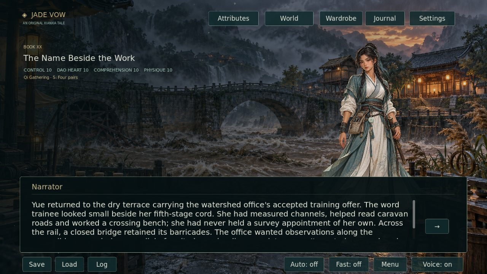
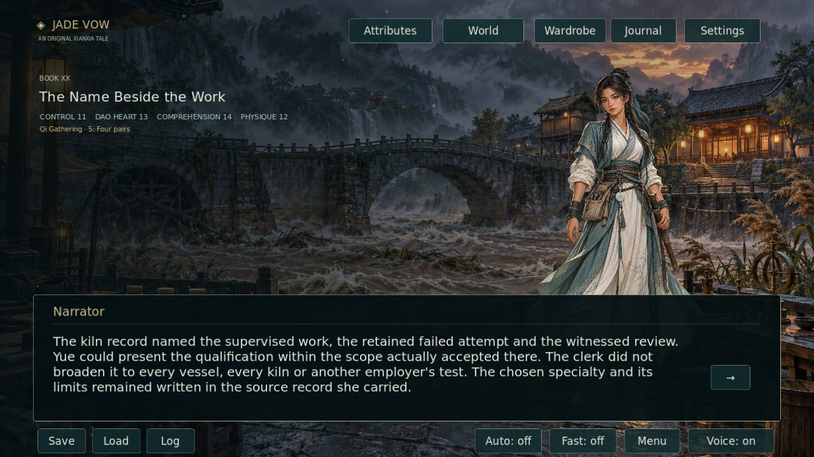

# Book XX · The Name Beside the Work

This continuation adds 29,830 displayed prose words in 403 playable passages. With the nine-word correction to Book XIX, the campaign reaches **1,193,026 words**, leaving **806,974** toward the requested **2,000,000**. Only `node.text` counts; choice labels, documentation, unplayed drafts, images and narration metadata do not add manuscript credit.

Lin Yue can join one of three paid training appointments and develop through actual practice, failure, recovery and independently witnessed assessment. A fourth option leaves her available for ordinary day work. Enrollment is freely made and ungated. Her earned **Qi Gathering 5: Four pairs** remains the same in every career passage.

| Career | Development | Limits |
|---|---|---|
| Kiln inspection | Returning worker, supervised inspection shifts, practical review, accepted specialty | Prior kiln experience is recognized; another vessel or employer still requires its own scope |
| Archive condition recording | Supervised recording, retained mistakes, independent assessed qualification, specialty work | Condition recording grants no paper-treatment license, custody or disclosure power |
| Watershed survey recording | Paid field shifts, failed map corrected and retained, independent recorder review, specialist assignment | Measurements grant no bridge clearance, land judgment or medical authority |
| Independent day work | Accepted sorting shift, receipt, ordinary work reference | Specialist qualification lines remain blank |

The kiln pays 18 copper for three six-copper shifts; personal notebook and postage costs leave 15. The archive spends 88 of its 100-copper appropriation and returns 12; ten four-copper shifts pay 40. The survey's independent 30-copper budget pays Lin 15, Yuan 6, Jiang 3, the witness 2 and supplies/carrier 4. Independent sorting pays 4, with 1 spent on food.

Each training route pays its stated finite wages only for performed work. New employment budgets remain independent of Book XIX's settled recovery account. Unchosen career places return to other applicants; Lin cannot accept three overlapping training schedules. A selected specialty has its own later passage and practical result. Returning home, seeking day work and asking for another limited term preserve completed work; a renewal request itself guarantees no place or wages.

The saved enrollment destination controls the later profession portfolio and the address of a renewal request. Existing source IDs, saved scores, completed practice and prior decisions remain compatible. An old checkpoint without an enrollment record reaches ordinary receiving with blank specialist qualification lines. It invents no enrollment, completed work or wages.

## Source-backed continuity review

The [fixed-source audit](CAREER_CONTINUITY_REPAIRS_20261007.json) authenticates two underlying contradictions against commit `659f6c413867a3c7d5857e4b89c4f3aae1f39ae8`:

- `crossing_linen_04` put a claimant in the evacuated lower freight store. The corrected account places him in the upper-path waiting room.
- `crossing_evidence_rod_01` moved an observer handover into the measured interval. The corrected report places relief after both observations, as the performed-work passage establishes.

A separate [Harbor identity source audit](HARBOR_IDENTITY_REPAIRS_20261007.json) authenticates two additional contradictions in Book XIV: Luo, consistently Fen's father, switches to feminine pronouns in `harbor_road_012` and `harbor_road_017`; Ke Chun, consistently female, switches to a masculine possessive in `harbor_road_012`. Those three pronoun sites constitute two underlying character identity defects and change no words or mechanics. Together the two audits verify **four new underlying contradictions in four existing passages**. Including the terminology clarification below, the PR edits six existing passages.

One terminology clarification across `crossing_qi_03` and `crossing_rise_03` distinguishes the external reference frame from the seventh-stage internal Small circuit. It adds **zero** plot-hole credit. New scenes, connections, choices and tests add no repair credit. **The requested 1,000 verified plot-hole target remains unverified.**

The four Book XIX passages change by nine words. Their IDs, choices, rewards and destinations remain intact. Book XIX's current count becomes 9,118; its older validator preserves the authenticated original 9,109-word delivery separately by reversing only the exact documented text delta. All 23 previous audit sources are checked for overlap with these four IDs.

## Review media and validation

The capture harness selects each appointment through the real choice, saves and reloads it, completes its authored work and reloads before reviewing its portfolio. Nine new Godot viewport captures bring the suite to 130. Native kiln, archive and crossing originals already match these locations and speakers; this batch requires no additional paintings.

[Reed Crossing source verification](../tools/validate_career_repairs.py) and [Harbor identity source verification](../tools/validate_harbor_identity_repairs.py) check exact before/after passages, corroborating sources and honest repair credit. [Career gameplay validation](../tests/careers_test.gd) covers every training branch, zero-score access, failed switch atomicity, save restoration, delayed portfolios and renewals, and completion credit paid once. Existing full CI also checks all campaign routes, native artwork, decoded narration, actual captures and exported Linux playback without the source checkout.

Draft validation reports the unfinished word and artwork targets. Passing that check does not fulfill the two-million-word or 1,000-repair target. The stricter production check stays enabled when a PR leaves draft.
