# Book XXI · The Work After the Witness

Lin Yue's first career term ended with work another person had witnessed. This continuation asks whether that record remains useful when a new employer, a real deadline and other workers depend on it. The player can accept one bounded commission in kiln receiving, archive condition recording, watershed observation or ordinary freight stewardship. Each route carries paid work through a retained mistake, correction, independent receiving and a saved portfolio. Declining an appointment remains a meaningful way to continue.

This is a continuation of the existing draft PR. It adds **71,944 displayed prose words and 936 scenes**, bringing the playable campaign to **1,264,970 words and 14,543 scenes**. **735,030 words remain** toward the requested two million. These figures count displayed manuscript text; this review document, prompts, diagrams and metadata contribute no manuscript words. The requested one thousand verified historical plot repairs remains unfinished. The four previously authenticated defects keep their existing exact-source evidence; new commission failures are authored events, not extra historical repair credit.

## From a record to a responsibility

The six retained Book XX endings keep their IDs and ending text. Their continuation leads to the new commission opening rather than replacing the outcome the player earned. A completed career term, a request for more work and an accepted future booking remain different facts. The opening has two ungated choices: accept the offered current commission or decline it. Acceptance reads the saved earlier enrollment to dispatch kiln, archive or survey work, with ordinary freight as the explicit fallback. The new offers state the actual term, pay, permitted work and person responsible for receiving an unfinished record if Yue stops. Declining reaches its own deferred-offer portfolio and never claims a completed commission.

The saved earlier enrollment and specialties shape the corresponding workplace's assignment. A present record can identify the bounded task Yue previously demonstrated. A missing specialty record leaves that specialty unverified and uses the route's narrower supervised work. It does not manufacture a passed examination, an old wage or an unperformed specialty. Ordinary receiving remains available without acquiring a kiln, archive or survey qualification.

All four routes develop a different kind of professional coordination. The kiln puts specimen identity, actual use and a dispatch recommendation under separate checks. The archive makes Yue responsible for traceable condition summaries and qualified referrals. The survey asks her to arrange paid assistants, explain incompatible observations and deliver a record a regular keeper can reproduce. Ordinary stewardship develops an honest material-and-receiving reference while leaving the three specialist qualifications blank.

Lin retains **Qi Gathering, stage 5: Four pairs**. Pay, a wider job title and independent professional review do not advance a realm or create an internal circuit. Shoulder restrictions continue to determine actual handling. Source operation, unstable-paper treatment, structural inspection and protected custody remain with the people who hold those separate responsibilities.

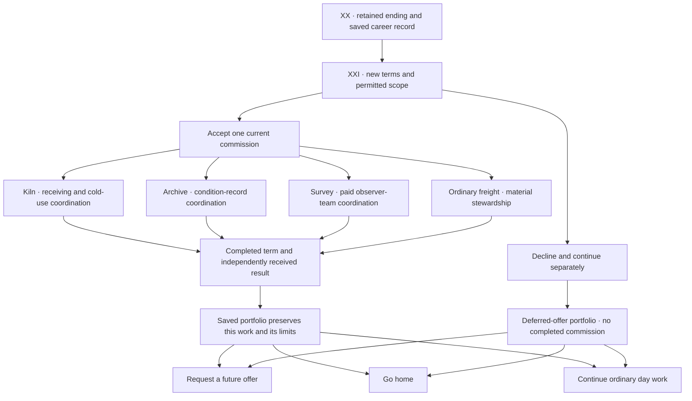

## Four commissions with different consequences

**The kiln commission** gives Yue six paid shifts and a household order of eight bowls. The work concerns ordinary receiving and observed cold use. A maker's specification remains separate from Yue's comparison, and the household's actual counter cannot be substituted with an attractive yard drawing. The earlier specialty changes what she can lead without becoming authority over firing programs.

Three decisions select a detailed comparison, a correction method and one household service. A cleared partnered handling comparison requires ten Physique points; cloth passage and source comparison remain ungated. A practiced source-dependency correction requires ten Comprehension points; witnessed repetition and recipient consultation remain ungated. Four washable mats, two staffed handoffs or a readable current-use packet each consume the same finite service reserve.

Under dispatch pressure Yue mistakes two records with a repeated source for independent confirmation. The individual observations remain useful, but the recommendation is withdrawn. Two actual chipped pieces consume the replacement reserve; the lost cart reservation remains a real delivery cost. Later corrective work cannot restore the missed early use. The selected service reaches the actual shared kitchen, and the unpurchased services remain unperformed.

The earned result is ordinary coordination supported by inspected work and a retained failure. The further three-shift kiln booking is explicitly offered and accepted after the commission. Its twenty-one copper remains **unearned** until those future shifts occur. Choosing another future plan does not erase that accepted obligation or pay it in advance.

**The archive commission** comprises twelve paid shifts. Yue negotiates an overlapping carriage date before signing. Thirty-six stable issued public copies enter a supported receiving project; original source papers and private notebooks stay with their actual custodians. Her assistant scope allows condition entries, supported placement and coordination, with unstable material referred to qualified staff.

A signed summary transposes two condition descriptions. Qualified receiving stops its release, preserves the wrong summary and checks the physical items. Accurate mandatory notices reach affected readers before any optional explanation is chosen. One copy remains held under its actual referral; thirty-five released copies keep their stated permissions. An explanation cannot make the held copy available.

A current-duty decision first chooses deepening the documented earlier specialty or two shifts of supervised shared receiving. Both preserve the earlier saved specialty and use the same finite wages and qualified cover. The shared assignment is a real fresh-play option, and its later record claims no specialty work performed elsewhere. A later decision chooses a public explanation, accepted appointments with the affected readers or worker retracing of the correspondence method. The later twenty-four-copper service buys one portable public-copy class, one additional enclosure batch or two staffed evening sessions. These are completed services with different recipients and omissions. A chosen specialty informs judgment without forcing a matching project.

Independent review examines both the retained error and the performed revised method. Yue's developed responsibility remains condition-record coordination, not paper treatment, private adjudication or access to protected sources. Twelve finished shifts earn sixty copper. The unused eighteen-copper reserve returns rather than becoming an unannounced second service.

**The survey commission** covers ten calendar days with four field shifts, desk coordination, an independent review and final receiving. Two hired assistants are paid for actual preparation and work. Their completed wages do not depend on Yue passing her own review. Yuan's operating supervision and Jiang's examination have separate terms; nobody earns a pass bonus.

Three ungated decisions choose paired concurrent observations or task rotation, a fresh reset-and-repeat or permitted custody-source comparison, and a reproducible location handover or an attended station-user explanation. Each approach keeps the evidence it did not obtain visible. The failed opening series is not repaired by silently borrowing the unperformed method.

A completed location handover can help an authorized inspection crew reproduce permitted points. A received explanation can give current readers dates, source limits and contacts. Neither establishes safe structures, land authority or a flood forecast. Yue develops a bounded lead-recorder role through staffing, correction and receiving. The regular station keeper takes responsibility after the term; a potential later notice is not a permanent appointment or a claim on her unpaid availability.

**The ordinary freight commission** offers eight paid mornings without requiring a specialist title. Yue arranges actual receiving and light material stewardship, preserving her shoulder limits. A failed handling account can be corrected through desk reconstruction or an ordinary walking comparison. Neither method grants authority over structures, clinical care or another occupation's examination.

The record reconciles fifty-four pieces: fifty-one released, two disputed coats held and one faulty strap held. Unresolved ownership and failed material remain unresolved instead of being transformed into successful delivery by a neat final total. A twelve-copper supplemental service buys a covered rack, paired labels or later receiving windows. Each serves a different need; the other two remain outside the purchase.

The completed work supplies an ordinary receiving and materials-steward reference. Kiln, archive and survey qualifications remain blank on this route. The keeper can notify Yue of a later term, but no future morning, reservation fee or ongoing unpaid shift is implied.

## Money follows work

These are alternative commissions, not four purses Yue receives in the same history. The earlier Reed Crossing recovery grant and closed trainee accounts supply no new wages. Stop clauses preserve payment for accepted performed hours; completing an unsafe task is never required merely to make an allocation total round.

| Account | New funded amount | Received work and reconciliation |
|---|---:|---|
| Kiln hall commission | 90 copper | Yue 42 for six shifts; permitted comparisons 18; independent review 12; two actual replacement losses 18 |
| Kiln meals and lodging | 18 copper | Separate finite provision for the six accepted days |
| Kiln household purchase | 120 copper | Eight bowls 80; packing and delivery 20; one performed service 20 |
| Archive commission | 180 copper | Yue 60; qualified cover 36; independent review 18; supports and recording materials 24; one supplemental service 24; unused reserve 18 returned |
| Survey commission | 120 copper | Yue 44; assistants 40; Yuan 12; Jiang 8; materials and carriage 8; review witness 3; completed return courier 5 |
| Ordinary freight commission | 120 copper | Yue 48; porter 24; keeper 16; base materials 12; witness 8; one supplemental service 12 |

The kiln's delivery twenty retains a lost four-copper reservation, the later ten-copper cart and six-copper packing. Its replacement losses are internal nine-copper costs, distinct from the ten-copper selling price of each household bowl. Six finished shifts pay Yue forty-two; where the earlier fifteen-copper net receipt is present, the two supported recorded amounts total fifty-seven; missing evidence supplies no additional wages. The separate accepted three-shift offer remains future work.

Survey pay separates thirty-two for four completed eight-copper field tickets from twelve released after the actual coordination deliverable. Each assistant receives twenty for four completed five-copper shifts. Independent review is paid for its performed assessment, regardless of whether it approves a wider role. The five-copper courier payment follows delivered archive handover and return receipt.

Ordinary freight pays Yue eight completed mornings at six each. The porter receives three per completed morning and the keeper two. The ledger tracks the held pieces independently of earned labor, so a legitimate custody hold does not become a wage forfeiture.

## Saved choices and completed practice

Branch choices record the selected destination. Later passages read those actual saved choices to recover the selected method, performed service and portfolio. Reopening the game or loading a checkpoint retains the decision instead of letting a shared scene default to whichever outcome would be most convenient.

Growth belongs to completed practice nodes. Selecting a method, signing a contract or requesting a future post grants no immediate growth. A completion can credit its authored attribute once; revisiting its passage cannot collect the same reward again. No commission grants qi merely for obtaining a title. Current work records and cultivation metadata keep their separate meanings.

Missing old decisions need an explicit narrower fallback. A fallback can describe supervised present work or a missing placement record; it cannot infer an old specialty, private permission or wage. The shared completed portfolio likewise preserves the actually completed commission, with ordinary work remaining ordinary. The opening is `commission_entry`; accepted work dispatches through `commission_dispatch`, while refusal begins `commission_defer_01`. Future request, home and day-work choices retain an already accepted kiln booking: a conflicting plan requires a compatible calendar or the holder's consent to change dates.

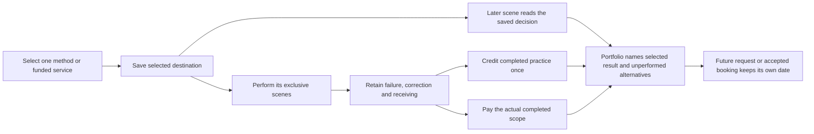

## Seven native original paintings

Seven opaque independent paintings were requested at the highest available native landscape resolution with a 16:9 composition. Six returned **1672 × 941** pixels; the review loggia returned **1672 × 940**. The delivered PNG bytes are preserved without resizing, cropping, upscaling, editing, recompression or compositing. The actual dimensions, byte counts, immutable blobs and full generation requests are recorded in [native provenance](../assets/art/COMMISSIONS_20261007_PROVENANCE.md) and [prompts with native proof](../assets/art/COMMISSIONS_20261007_PROMPTS.json).

The assay courtyard, rain gauge station, carrier tally court, review loggia and long rain quay add five original environments. The enclosed monsoon vault and shared canal kitchen add two building interiors. The delivered catalog now contains **91 backgrounds: 46 environments and 45 additional interiors**. Existing portraits are reused; **65 human NPC originals, 15 spirit-beast originals and 80 unique world sprites** remain unchanged. A background painting supplies no extra character or repair credit.

The compositions support practical work: clear ordinary exits, supported surfaces, separate measuring equipment and finite supplies. Weather and natural lighting are atmosphere rather than cultivation powering a town. The quay introduces the offers; each workplace has its own scene; the loggia supplies the shared review setting. Every original is also registered in the actual World gallery.

## Actual game captures and validation

The capture harness records the ten Godot viewports below through actual selected careers, completed work and saved portfolio restoration. Generated paintings and rendered screenshots have separate source records. The successful game job publishes the capture artifacts; draft PR #9 records the actual workflow links and verified final commit.

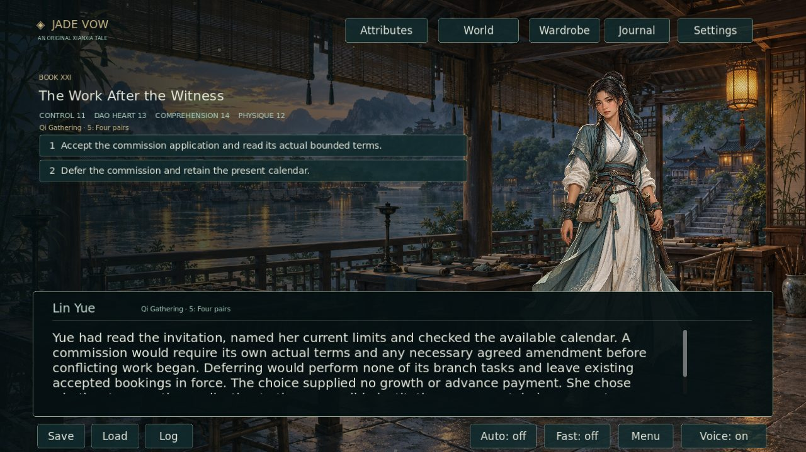
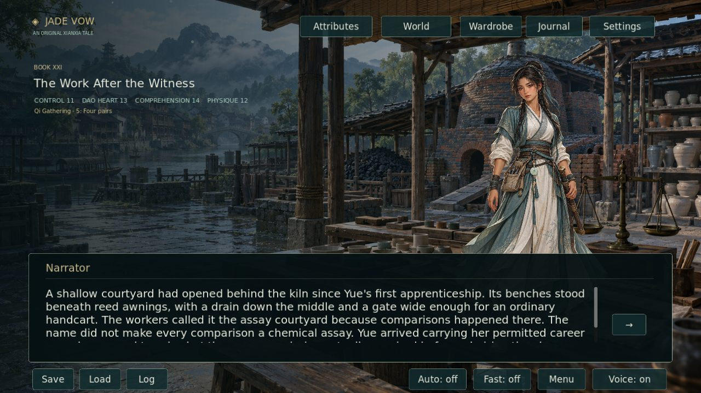
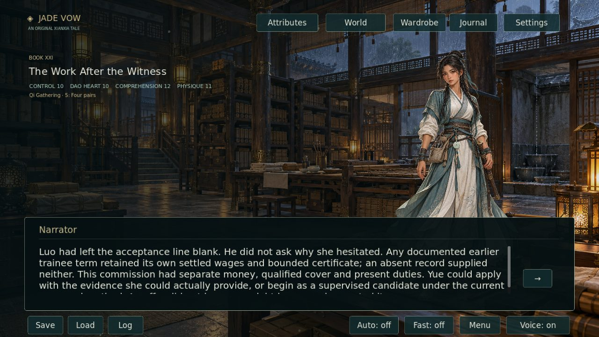
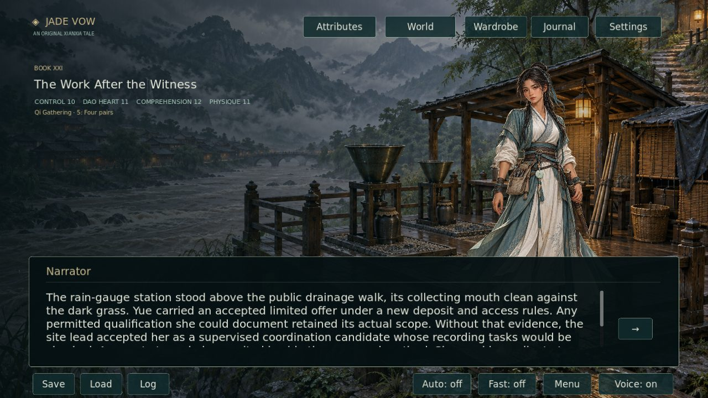
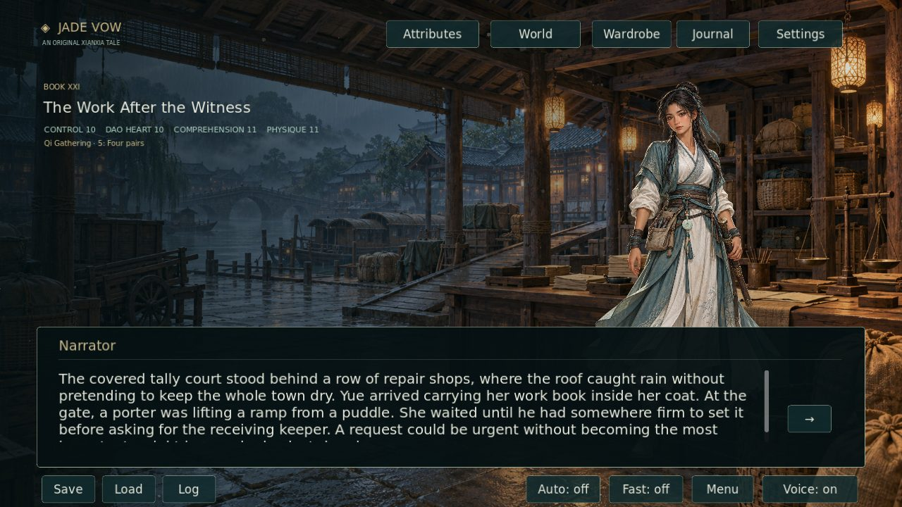
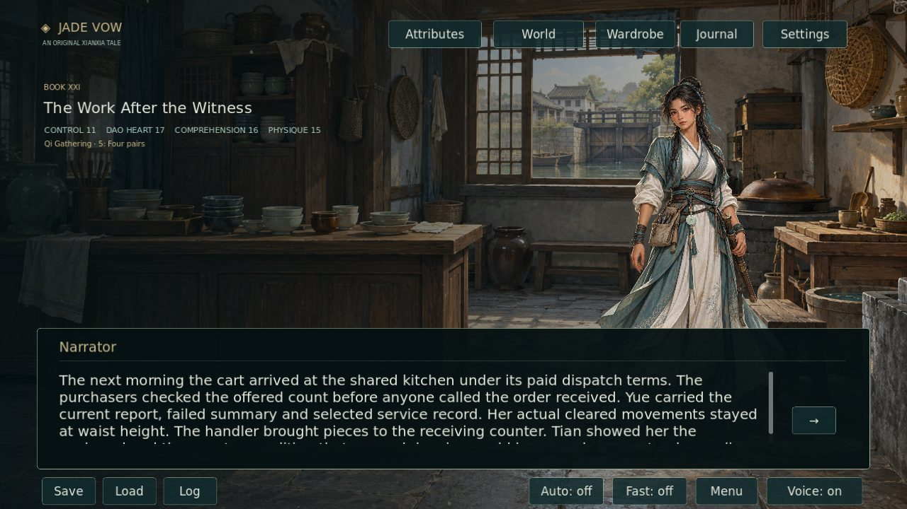
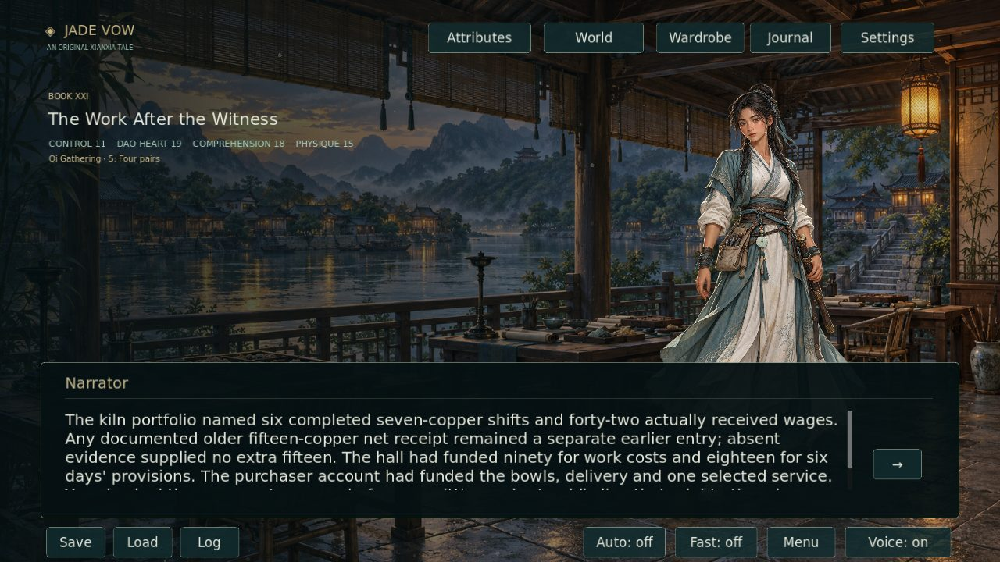
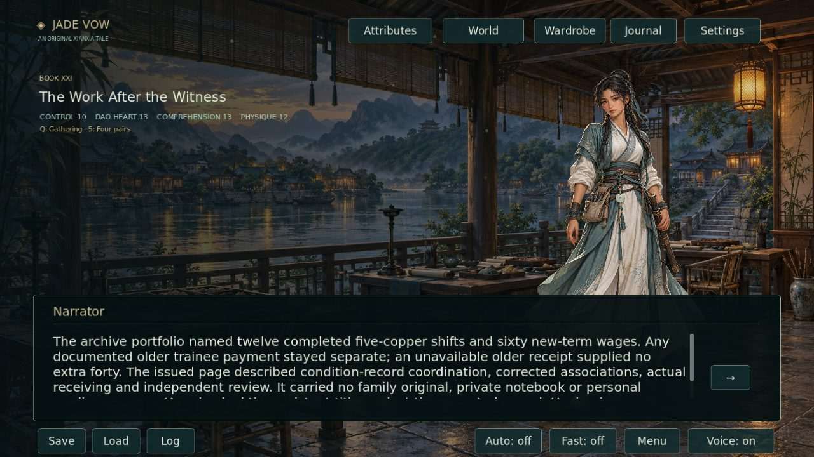
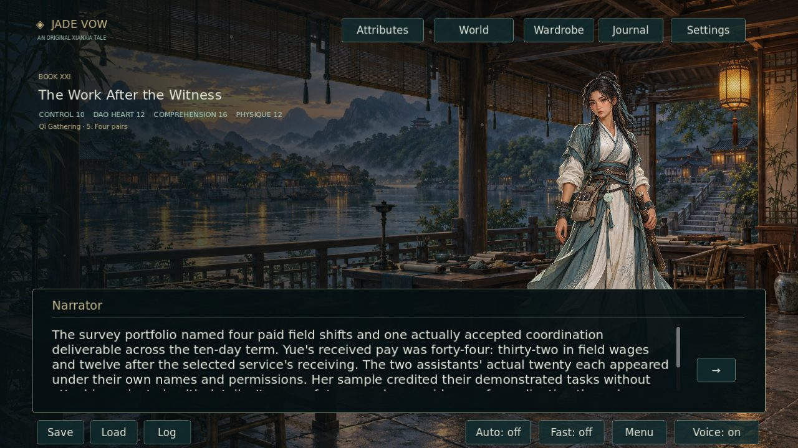
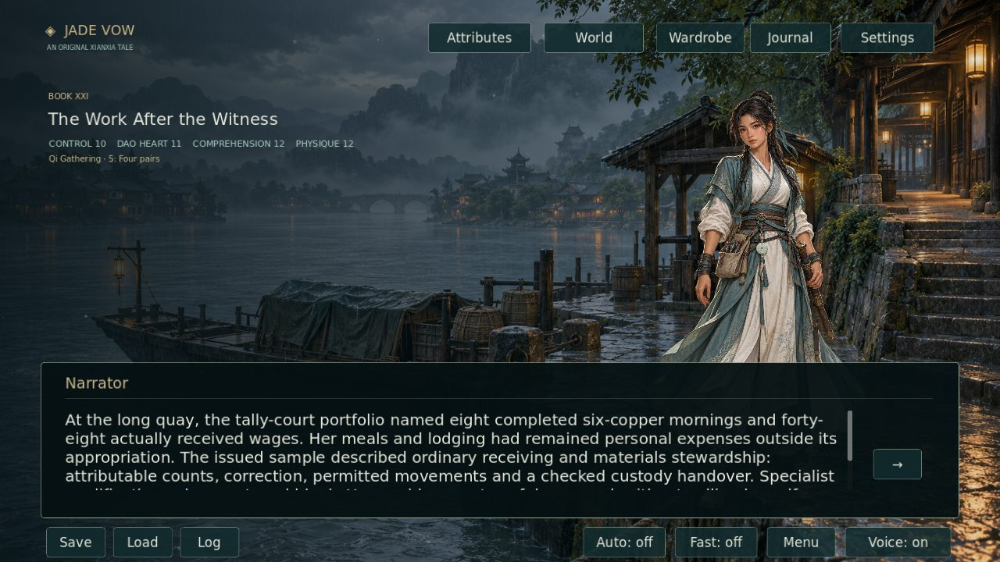

Draft validation checks manuscript accounting, unique paragraphs, readable passage lengths, route reachability on actual histories, cultivation limits and native artwork dimensions. Runtime checks should exercise fresh choices, retained specialties, missing records, zero-score ungated alternatives, completed-practice persistence and save/reload through the receiving portfolio. Screenshot checks must verify real decoded frames, while the source-free Linux package must load every new registered original at its catalog dimensions and play narration for the new passages.

Commit-specific validation and capture results are linked from [draft PR #9](https://github.com/jgyy/octxian/pull/9). The draft stays open while the two-million-word manuscript, one-thousand verified-repair target and independent artwork quotas remain unfinished.
