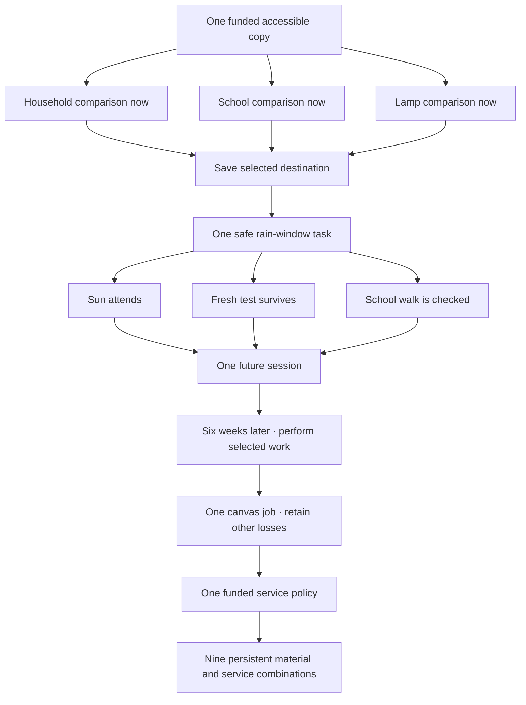
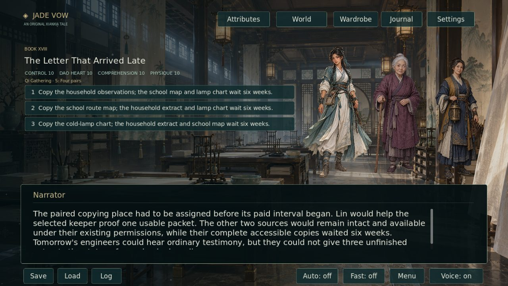
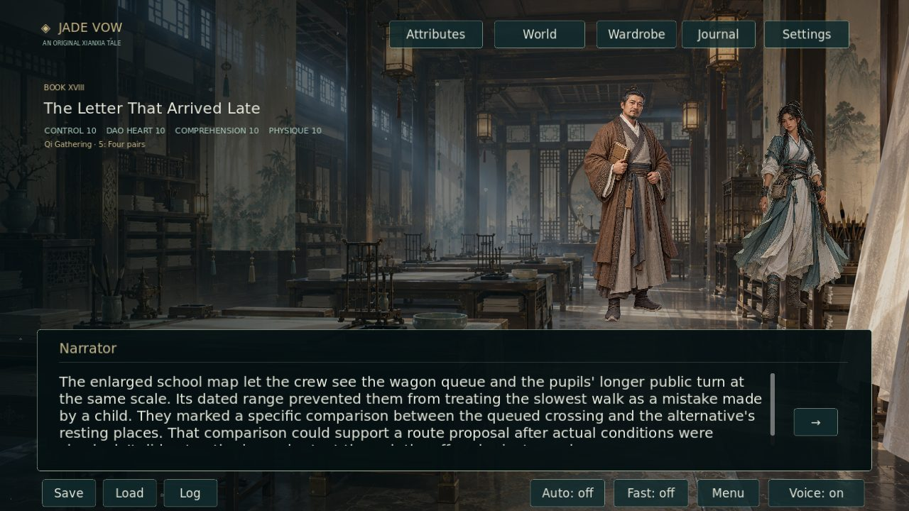
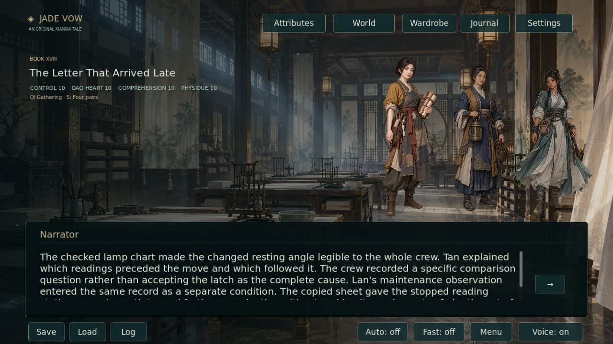

# Choices that remain in the world · 2026-10-06

PR #7 now records actual selected destinations and uses them to choose later narrative passages. Book XVIII and six earlier followthroughs add **18,694 net displayed prose words across 248 new scenes**. The campaign contains **1,154,076 words across 13,079 scenes and 18 books**. Alternative playable branches count; titles, documentation and labels do not.

**Scope remains incomplete.** Another **845,924 words** are required for two million. The new source audit substantiates **one pre-existing inconsistent branch fact**, alongside **six gameplay consequence improvements**. It does not substantiate 1,000 discovered or repaired plot holes. Five additional errors caught during authoring were corrected before publication and are not counted as pre-existing defects. Existing art covers these locations; this revision adds no paintings or enlarged derivatives.

## Consequences

The first new review funds one complete accessible source copy. Household, school and lamp choices give the later engineering crew different usable questions; the other complete copies wait six weeks. One safe rain-window task then changes whether Sun can attend her doorway visit, fresh instrument evidence survives, or a checked school walk can happen. One future appointment reserves two hours for its keeper and removes Lin from the other preparation lists.

Six weeks later, the selected appointment actually happens and receives its separate payment. Two sound canvas sheets can protect only one job: sixteen annotated public booklets, the inspected short approach, or He Xi's booked delivery. The other services retain their losses. A separate twelve-copper storm grant then buys one accepted policy: close for the rainy term, hold one inspected reserve reading, or transfer public service to the school. **Nine final combinations** preserve both the material choice and the service policy.

The new choices add no attribute rewards. Their effects appear in later people, evidence, access, teaching stock, courier earnings and operating services, including when all four attribute scores are identical.

| Earlier decision | Playable later consequence |
|---|---|
| Salt water trial | The selected test's commercial, planting or delivery benefit; missing alternative wet tests and work costs remain missing |
| Forest access project | Independent lower footway or ten-week staffed assistance, with different walking opportunities and support obligations |
| Harbor funded improvement | A permitted four-week report reaches Lin at the kiln; unbought index, fittings or visiting work remains unavailable |
| Desert causeway notice | Retained conditional handling capacity, missed booking, or a limited sketch-backed request with a recovery cost |
| Desert warning | Different arrival times, repeated-wording mistakes and real correction work |
| Archive next post | A real first day of selected public/stewardship work, or departure and the local staffing gap |

[Exact original anchors, routing tables and classification](CHOICE_CONSEQUENCE_AUDIT_20261006.json). The salt correction removes the unchosen seed-salvage finding from the shared grain-house draw.



## Saves and source identity

Version 1 and practice rules 3 remain supported. The optional `decisions` dictionary maps a choice scene ID to its selected destination ID. Option reordering does not change that identity. A revisit cannot switch an already recorded commitment. An earlier checkpoint can still begin a different journey.

A `next` passage may have a validated `routes` table. The first matching recorded choice selects its consequence; the existing `next` remains the generic fallback. Old saves without decision records retain that generic route, with no selected outcome inferred from scores. Invalid records, malformed sibling routes, unsupported destinations and overflowing pending practice reject before any state mutation.

Traversal retains a decision only while a downstream passage still reads it. Stat dominance is compared within the same retained decisions. The combined campaign remains acyclic. All conditional fallbacks also occur on legitimate fresh paths; there are no legacy-only paragraphs increasing the count.

## Editorial review

The original 12,831 scene nodes and 130 authored decisions were structurally scanned. The source-backed repair identifies the unconditional seed-salvage assertion; six other sites are explicitly classified as missing downstream gameplay consequences.

Independent review of every new scene caught and removed five errors: overstated doorway ingress, substitution of He Xi's mother for Sun's booked testimony/source, today's school observation appearing in an older copy on every path, canvas described as removed but later still installed, and a universally missing lamp reading despite recovered or preserved evidence. The corrected text keeps observers, dates and physical custody with their actual branches.

Static integration verifies 13,079 scene links and paragraphs, 51 conditional predicates, every fresh scene's reachability and 75 continuity checkpoints. No exact duplicate or over-100-word paragraph was added. The stat-aware Godot suite additionally exercises actual attainable routes. Full CI runs the fixture suite, real authored-choice save/routing contracts, source authentication, native-art and complete narration validation, the UI, captures and standalone Linux playback.

```sh
python -m tools.validate_consequence_revision --verify-source
python -m unittest discover -s tests -p 'test_*.py'
godot --headless --path . --script tests/story_test.gd
godot --headless --path . --script tests/consequences_test.gd
godot --headless --path . --script tests/authored_consequences_test.gd
```

## Actual review captures

CI walks the selected copy branch and subsequent authored passages to the delayed result at identical scores of 10 in all four attributes. It renders the real viewport, verifies distinct pixels and bundles these full-size JPEG captures after the complete game job succeeds. [Build runs](https://github.com/jgyy/octxian/actions?query=branch%3Acodex%2Fstorm-salt-continuity-20261006) contain the logs and PNG originals.







