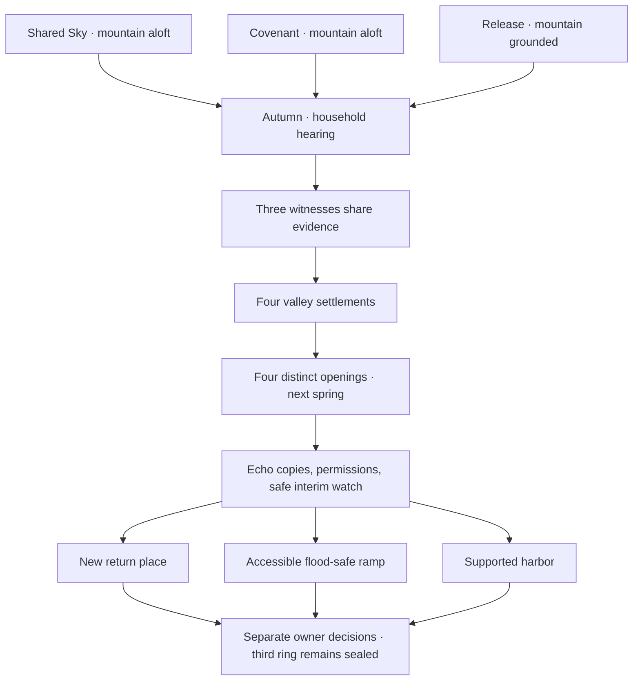

# Continuity review through Book III

The manuscript currently contains 196 scenes and 10,274 authored prose words. This review records the delivered chapters; the million-word campaign remains unfinished.

| Topic | Established fact | Editorial correction or guard |
|---|---|---|
| Azure Cloud | Shared/covenant routes leave it aloft; release grounds it | Ferry evidence dates to the revised register, and common valley art does not show a floating mountain |
| Pendant | Lin Yue retains it on all continuing routes | Release ending no longer leaves it behind before later uses |
| Nineteen households | Their records and claims were erased, not their living occupants | Wei Xiu is introduced as alive; the Listener shelters names |
| Su Lan's husband | Dead seven winters in Book II, eight by Book III | Bell erasure occurred last winter; no resurrection is promised |
| Investigator knowledge | Lin Yue visits one road before the assembly | The other witnesses present their findings before settlement choices |
| Archive privacy | Public land clauses are distinct from personal debts | Full originals may be checked without an unpermitted public debt reading |
| Seasons | Book II starts in autumn; every Book III opening is next spring | Seed ending's spring is reused rather than followed by a second winter |
| Memory echoes | Volunteered external copies; originals remain in their owners' minds | Return does not grant an audience permission to listen |
| Three rings | Mo Ran, living carpenter Luo Fen, and an unidentified owner | Every ring retains separate permission; the unidentified ring stays sealed |
| Keeper and flood | Keeper died two summers before Book III; stair was lost last winter | Stop clause permits sheltered waiting while return locations are renegotiated |
| Temporary watches | Eight-day reserve supports interim care | Ten-day stair route renews paid watches before expiry |
| Landing safety | Pilots may stop a return when conditions change | Survey, accessible ramp, load test, high-water berth, and spring review precede return |

The unidentified third owner is an intentional open question. Later chapters must find an identity through permitted records, and retain the owner's authority over the echo. An unfinished question must not silently become proof of abandonment.

`data/continuity.json` contains fact anchors and fourteen required-scene checks. `tools/validate_world.py` rejects structural paths that skip those knowledge or safety scenes; Godot route tests separately check the actual stat gates. These checks support, rather than replace, an editorial reading.

The validation pipeline also tests the exported game's new world portraits, background, narration, and object inspector. Its Godot installer pins the official 4.7.2 archive digest and verifies cached bytes offline, avoiding anonymous API rate limits.
