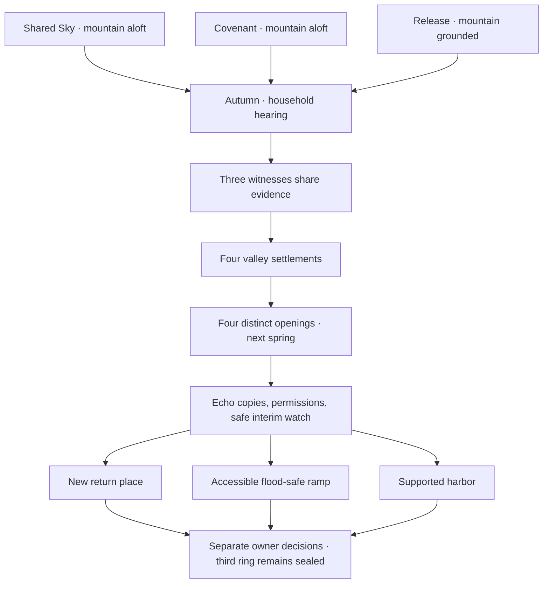

# Continuity review through Book V

The manuscript currently contains 353 scenes and 23,615 authored prose words. This review records the delivered chapters; the million-word campaign remains unfinished.

| Topic | Established fact | Editorial correction or guard |
|---|---|---|
| Azure Cloud | Shared/covenant routes leave it aloft; release grounds it | Ferry evidence dates to the revised register, and common valley art does not show a floating mountain |
| Pendant | Lin Yue retains it on all continuing routes | Release ending no longer leaves it behind before later uses |
| Nineteen households | Their records and claims were erased, not their living occupants | Wei Xiu is introduced as alive; the Listener shelters names |
| Su Lan's husband | Dead seven winters in Book II, eight by Book III | Bell erasure occurred last winter; no resurrection is promised |
| Investigator knowledge | Lin Yue visits one road before the assembly | The other witnesses present their findings before settlement choices |
| Archive privacy | Public land clauses are distinct from personal debts | Full originals may be checked without an unpermitted public debt reading |
| Seasons | Book II starts in autumn; every Book III opening is next spring | Seed ending's spring is reused rather than followed by a second winter |
| Memory echoes | Volunteered external copies; originals remain in their owners' minds | Return does not grant an audience permission to listen |
| Three rings | Mo Ran, living carpenter Luo Fen, and an unidentified owner | Every ring retains separate permission; the unidentified ring stays sealed |
| Keeper and flood | Keeper died two summers before Book III; stair was lost last winter | Stop clause permits sheltered waiting while return locations are renegotiated |
| Temporary watches | Eight-day reserve supports interim care | Ten-day stair route renews paid watches before expiry |
| Landing safety | Pilots may stop a return when conditions change | Survey, accessible ramp, load test, high-water berth, and spring review precede return |

The unidentified third owner is an intentional open question. Later chapters must find an identity through permitted records, and retain the owner's authority over the echo. An unfinished question must not silently become proof of abandonment.

`data/continuity.json` contains fact anchors and 69 required-scene checks. `tools/validate_world.py` rejects structural paths that skip those knowledge or safety scenes; Godot route tests separately check the actual stat gates. These checks support, rather than replace, an editorial reading.

The validation pipeline also tests the exported game's new world portraits, background, narration, and object inspector. Its Godot installer pins the official 4.7.2 archive digest and verifies cached bytes offline, avoiding anonymous API rate limits.

## Book IV · orchard editorial review

The three river outcomes keep their different custody arrangements on the journey to the orchard. Mo Ran's case remains sealed; Luo Fen's ring is awaiting her berth on return, already home on stair, and awaiting her answer on harbor. The unidentified ring remains sealed with the Eel. The orchard follows during the same spring; its frost comes from the treatment ward.

Pain exchange transfers temporary sensation, never injury or memory. Each carrier, patient, and spirit retains separate permission. The Frostroot Hart's earlier individual offers authorize no new exchange; it declines tonight and Ren Qiao corrects the schedule. The inherited household demand is removed while a separate measured closing rhythm remains. Food and ordinary care do not depend on accepting an exchange.

Elder Yun's written renewal term was omitted from the old copper mark; the ending shows a corrected copy of that mark, preserving the distinction. The breathing settlement establishes the orchard's agreement to sell seed stock while retaining enough for planting. All outcomes retain staffing limits, ongoing injuries, and review dates rather than promising complete healing.

The matron's assistants investigate roads Lin Yue did not take and report their findings before settlement. Structural checkpoints require the safe pause, separate Hart permission, shared findings, and stated resources before later decisions. Each new scene was reviewed against existing river outcomes and the chapter's own mechanics.

## Book V · city editorial review

The four orchard-specific openings retain the spring chronology and each outcome's limits. Tao Wen's new paid orchard dispatch is separate from yesterday's three completed jobs and canceled fourth C-17 parcel. His collection fee K-204 was taken once and duplicated; rental is paid, and the genuine return price remains unsettled.

Masks convey exterior likeness and licensed voice timbre, never another person's memories, skill or mind. The removable return collar is separate from the shell's original work authorization. Qiao's schedule gives Bian Hui reed-seven and performer Tao Min reed-nine, while their two returned tokens both repeat reed-seven. Performer Tao Min and courier Tao Wen are distinct living adults.

Mei's retained conversion order shows temporary recognition-use licenses copied into permanent name-proof collateral. Her own approval remains documented. Original permissions, contradictory forms and genuine charges stay available for challenge. The registrar's countersigned warrant restores public proofs and proper wage claims before any reform selection; commercial debts and missing wage deposits remain separate.

Fei compares offered cloth fragments with plain amber and retained amber-violet wax. Original tags stay sealed. The Porcelain Courser and Fei separately permit the relevant redacted consignment link, providing independent timing corroboration. Scent and material findings show product/source comparisons, never guilt or an unseen handler. The Moth completes its offered-fragment comparison and declines a further hearing test; it does not retroactively leave an invented scrap untested.

Lin Yue visits one route; the other teams report evidence before settlement. All four endings preserve corrected rights and genuine disputed costs. Existing volunteered credit is capped and closes after three nights; separate ledgers need paid staff; the worker pool requires distinct model permissions and allows exit; Tuesday's audit is a review rather than automatic clearance. No city route opens the third river ring or claims the next court chapter is already delivered.

