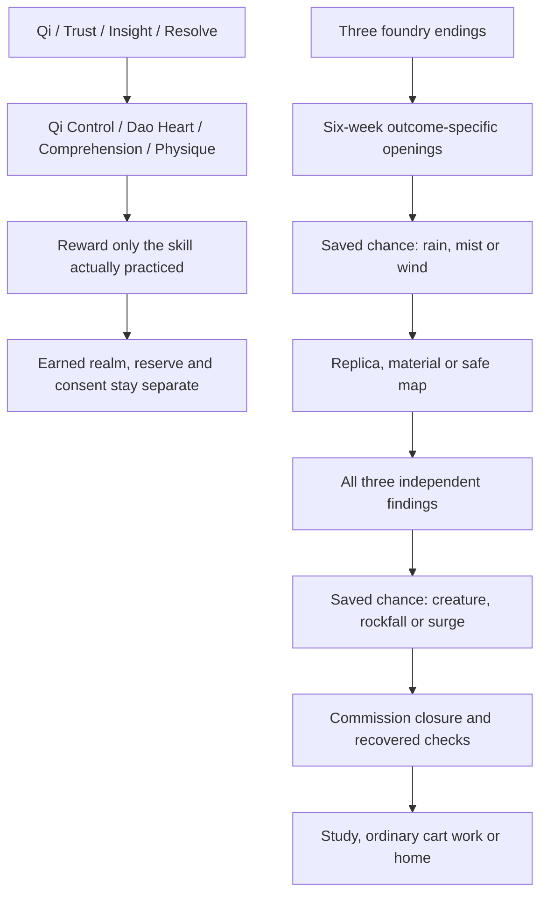

# Continuity and progression review · 2026-10-03

This batch makes **115 anchored corrections: 102 choice-causality corrections and 13 rewritten prose passages**. The [machine-readable before/after audit](CONTINUITY_REPAIRS_20261003.json) identifies each existing scene, choice index and destination. Renaming attributes, adding scenes, editing documentation and updating metadata earn no repair count.

The choice corrections make the cultivation capacities causal: paperwork cannot condition tissue, evidence searches cannot create qi practice, and another person's existing offer cannot be bought with a player score. Some are progression-design inconsistencies rather than contradictions in a paragraph. The count does not claim 115 independent literary mysteries or a complete elimination of all issues in the inherited manuscript.

The prose corrections address unsupported projected light, an unmeasured mask-strand experiment, qi reading of brush impressions, pendant knowledge of another person's memory, a supposed roof-drying capability without a repair method, an “empty” full-load boat, an incomplete stopped breathing trial, and the aftermath attributing ordinary reed movement to a pulse. Each preserves scene IDs and the last earned realm.

| ID | Existing anchor | Problem | Correction |
|---|---|---|---|
| PROG-001 | `first_choice` · choice 3 | “Keep the jade wrapped until its circuit is explained.” credited physical conditioning without recovered bodily exercise. | Credit Dao Heart 2 for this method; leave this offered approach available without a score gate. |
| PROG-002 | `listen_choice` · choice 1 | the growth reward for “Ask the exile what the star wants.” did not identify the capacity practiced by that particular method. | Credit Comprehension 3 for this method; leave this offered approach available without a score gate. |
| PROG-003 | `listen_choice` · choice 3 | “Ask Elder Yun why she waited.” credited physical conditioning without recovered bodily exercise. | Credit Dao Heart 3 for this method; leave this offered approach available without a score gate. |
| PROG-004 | `final_choice` · choice 3 | “Signal the mountain's controlled landing.” credited physical conditioning without recovered bodily exercise; reading or planning was gated by physical conditioning. | Credit Dao Heart 1 for this method; keep only relevant requirements {"insight":3}. |
| PROG-005 | `lantern_hub` · choice 1 | the growth reward for “Follow the ferry and find who moved the boundary.” did not identify the capacity practiced by that particular method. | Credit Comprehension 1 for this method; leave this offered approach available without a score gate. |
| PROG-006 | `lantern_hub` · choice 3 | “Visit the archive and trace the missing names.” credited physical conditioning without recovered bodily exercise. | Credit Comprehension 1 for this method; leave this offered approach available without a score gate. |
| PROG-007 | `ferry_choice` · choice 1 | “Raise the stone publicly, keeping its protective ward intact.” credited physical conditioning without recovered bodily exercise; “Raise the stone publicly, keeping its protective ward intact.” credited qi practice although the chosen task does not deliver a measured trace. | Credit Qi Control 2 for this method; leave this offered approach available without a score gate. |
| PROG-008 | `archive_choice` · choice 1 | “Publish the original land clauses and every condition, preserving private debts.” credited physical conditioning without recovered bodily exercise. | Credit Dao Heart 2 for this method; leave this offered approach available without a score gate. |
| PROG-009 | `lantern_final_choice` · choice 1 | the already offered cooperation was locked behind a player score. | Credit no new attribute for this method; leave this offered approach available without a score gate. |
| PROG-010 | `river_approach_choice` · choice 1 | the growth reward for “Let Mo Ran identify himself and offer his receipt.” did not identify the capacity practiced by that particular method. | Credit Comprehension 1 for this method; leave this offered approach available without a score gate. |
| PROG-011 | `river_approach_choice` · choice 3 | “Listen at the boundary without crossing it.” credited physical conditioning without recovered bodily exercise. | Credit Comprehension 1 for this method; leave this offered approach available without a score gate. |
| PROG-012 | `river_resolution_choice` · choice 1 | the growth reward for “Negotiate a new return place with the owner and spirit.” did not identify the capacity practiced by that particular method. | Credit Comprehension 1 for this method; leave this offered approach available without a score gate. |
| PROG-013 | `river_resolution_choice` · choice 3 | “Arrange a temporary harbor while every owner is contacted.” credited physical conditioning without recovered bodily exercise. | Credit Comprehension 1 for this method; leave this offered approach available without a score gate. |
| PROG-014 | `return_safety_choice` · choice 2 | “Reserve a supported watch and a date to reconsider.” credited physical conditioning without recovered bodily exercise. | Credit Dao Heart 1 for this method; leave this offered approach available without a score gate. |
| PROG-015 | `harbor_watch_choice` · choice 1 | “Fund eight days, with a reserve for moving to safety.” credited physical conditioning without recovered bodily exercise. | Credit Dao Heart 1 for this method; leave this offered approach available without a score gate. |
| PROG-016 | `orchard_investigation_choice` · choice 1 | “Trace the disconnected circuit with a measured breath.” credited physical conditioning without recovered bodily exercise; “Trace the disconnected circuit with a measured breath.” credited qi practice although the chosen task does not deliver a measured trace. | Credit Qi Control 3 for this method; leave this offered approach available without a score gate. |
| PROG-017 | `orchard_investigation_choice` · choice 2 | “Share the patients' meal and hear what they need.” credited physical conditioning without recovered bodily exercise. | Credit Dao Heart 3 for this method; leave this offered approach available without a score gate. |
| PROG-018 | `orchard_investigation_choice` · choice 3 | “Compare winter allocations with the original treatment terms.” credited physical conditioning without recovered bodily exercise. | Credit Comprehension 3 for this method; leave this offered approach available without a score gate. |
| PROG-019 | `orchard_resolution_choice` · choice 2 | “Offer a paid rota that includes help beyond treatment.” credited physical conditioning without recovered bodily exercise; the already offered cooperation was locked behind a player score. | Credit Dao Heart 2 for this method; leave this offered approach available without a score gate. |
| PROG-020 | `orchard_resolution_choice` · choice 3 | the growth reward for “Separate relief funding and publish the new accounting.” did not identify the capacity practiced by that particular method. | Credit Comprehension 2 for this method; keep only relevant requirements {"insight":4}. |
| PROG-021 | `orchard_resolution_choice` · choice 4 | “Pause exchanges for seven days and provide ordinary care.” credited physical conditioning without recovered bodily exercise. | Credit Dao Heart 2 for this method; leave this offered approach available without a score gate. |
| PROG-022 | `city_investigation_choice` · choice 1 | “Compare the masks, substituted collars, and return tokens.” credited qi practice although the chosen task does not deliver a measured trace. | Credit Comprehension 3 for this method; leave this offered approach available without a score gate. |
| PROG-023 | `city_investigation_choice` · choice 2 | “Trace the recognition batch through licenses and courier charges.” credited physical conditioning without recovered bodily exercise. | Credit Comprehension 3 for this method; leave this offered approach available without a score gate. |
| PROG-024 | `city_investigation_choice` · choice 3 | the growth reward for “Test the offered wax traces against dispatch controls.” did not identify the capacity practiced by that particular method. | Credit Comprehension 3 for this method; leave this offered approach available without a score gate. |
| PROG-025 | `city_final_choice` · choice 1 | “Bridge three nights with voluntarily offered furnace-hour credit.” credited qi practice although the chosen task does not deliver a measured trace; ordinary funding or study was gated by qi control. | Credit Comprehension 2 for this method; keep only relevant requirements {"insight":3}. |
| PROG-026 | `city_final_choice` · choice 2 | the growth reward for “Separate permanent proofs from temporary recognition accounts.” did not identify the capacity practiced by that particular method. | Credit Comprehension 2 for this method; keep only relevant requirements {"insight":3}. |
| PROG-027 | `city_final_choice` · choice 3 | “Help workers form their own limited licensing cooperative.” credited physical conditioning without recovered bodily exercise; the already offered cooperation was locked behind a player score. | Credit Dao Heart 2 for this method; leave this offered approach available without a score gate. |
| PROG-028 | `city_final_choice` · choice 4 | “Pause the disputed batch for a dated individual audit.” credited physical conditioning without recovered bodily exercise. | Credit Dao Heart 2 for this method; leave this offered approach available without a score gate. |
| PROG-029 | `city_mask_method` · choice 2 | “Compare the job dates and drying board.” credited physical conditioning without recovered bodily exercise. | Credit Comprehension 3 for this method; keep only relevant requirements {"insight":5}. |
| PROG-030 | `city_mask_method` · choice 3 | “Ask the workers to reconstruct their fittings.” credited physical conditioning without recovered bodily exercise. | Credit Comprehension 3 for this method; leave this offered approach available without a score gate. |
| PROG-031 | `city_registry_choice` · choice 1 | “Trace the dispatch and cancellation times.” credited physical conditioning without recovered bodily exercise. | Credit Comprehension 3 for this method; keep only relevant requirements {"insight":5}. |
| PROG-032 | `city_registry_choice` · choice 2 | the already offered cooperation was locked behind a player score. | Credit Comprehension 3 for this method; leave this offered approach available without a score gate. |
| PROG-033 | `city_registry_choice` · choice 3 | “Reconcile the payment slips Tao provides.” credited physical conditioning without recovered bodily exercise. | Credit Comprehension 3 for this method; leave this offered approach available without a score gate. |
| PROG-034 | `city_perfumer_choice` · choice 2 | the already offered cooperation was locked behind a player score. | Credit Comprehension 2 for this method; leave this offered approach available without a score gate. |
| PROG-035 | `city_perfumer_choice` · choice 3 | “Use the vacant loom bay for a slow strip comparison.” credited physical conditioning without recovered bodily exercise. | Credit Comprehension 2 for this method; leave this offered approach available without a score gate. |
| PROG-036 | `mortal_mite_choice` · choice 2 | the growth reward for “Use the long scoop to clear its path to the grate.” did not identify the capacity practiced by that particular method. | Credit Physique 1 for this method; leave this offered approach available without a score gate. |
| PROG-037 | `court_investigation_choice` · choice 1 | the growth reward for “Follow the witnesses and make room for their finite days.” did not identify the capacity practiced by that particular method. | Credit Comprehension 1 for this method; leave this offered approach available without a score gate. |
| PROG-038 | `court_investigation_choice` · choice 2 | “Examine the rain records, gauges, and clocks.” credited qi practice although the chosen task does not deliver a measured trace. | Credit Comprehension 1 for this method; leave this offered approach available without a score gate. |
| PROG-039 | `court_investigation_choice` · choice 3 | “Trace access costs and the remaining assistance fund.” credited physical conditioning without recovered bodily exercise. | Credit Comprehension 1 for this method; leave this offered approach available without a score gate. |
| PROG-040 | `court_final_choice` · choice 2 | “Bring two separately agreed testimony sessions to the lower landing.” credited physical conditioning without recovered bodily exercise; the already offered cooperation was locked behind a player score. | Credit Comprehension 2 for this method; leave this offered approach available without a score gate. |
| PROG-041 | `court_final_choice` · choice 3 | the growth reward for “Stage the evidence docket with paid source checks and handling.” did not identify the capacity practiced by that particular method. | Credit Comprehension 2 for this method; keep only relevant requirements {"insight":4}. |
| PROG-042 | `court_final_choice` · choice 4 | “Issue a dated limited remand for one independent reinspection.” credited physical conditioning without recovered bodily exercise. | Credit Dao Heart 2 for this method; leave this offered approach available without a score gate. |
| PROG-043 | `court_witness_a1_10` · choice 2 | the growth reward for “Test rotating appointments around work.” did not identify the capacity practiced by that particular method. | Credit Comprehension 1 for this method; leave this offered approach available without a score gate. |
| PROG-044 | `court_witness_a2_10` · choice 1 | the growth reward for “Check the lower-gate shelter.” did not identify the capacity practiced by that particular method. | Credit Comprehension 1 for this method; leave this offered approach available without a score gate. |
| PROG-045 | `court_witness_a4_10` · choice 2 | “Compare Bai’s written duty clauses.” credited physical conditioning without recovered bodily exercise. | Credit Comprehension 1 for this method; leave this offered approach available without a score gate. |
| PROG-046 | `court_witness_a6_10` · choice 1 | the growth reward for “Follow Su E’s bell and oven sequence.” did not identify the capacity practiced by that particular method. | Credit Comprehension 1 for this method; leave this offered approach available without a score gate. |
| PROG-047 | `court_witness_a8_10` · choice 1 | “Lead with firsthand sources and their limits.” credited physical conditioning without recovered bodily exercise. | Credit Comprehension 1 for this method; leave this offered approach available without a score gate. |
| PROG-048 | `court_witness_a8_10` · choice 2 | “Lead with delivered access and remaining costs.” credited physical conditioning without recovered bodily exercise. | Credit Comprehension 2 for this method; leave this offered approach available without a score gate. |
| PROG-049 | `court_rain_calibration_choice` · choice 2 | the already offered cooperation was locked behind a player score. | Credit Comprehension 2 for this method; leave this offered approach available without a score gate. |
| PROG-050 | `court_rain_calibration_choice` · choice 3 | “Use steady daylight and record the delay.” credited physical conditioning without recovered bodily exercise. | Credit Comprehension 2 for this method; leave this offered approach available without a score gate. |
| PROG-051 | `court_rain_signal_choice` · choice 2 | the already offered cooperation was locked behind a player score. | Credit Comprehension 2 for this method; leave this offered approach available without a score gate. |
| PROG-052 | `court_rain_signal_choice` · choice 3 | “Use plain boards and preserve missed comparisons.” credited physical conditioning without recovered bodily exercise. | Credit Comprehension 2 for this method; leave this offered approach available without a score gate. |
| PROG-053 | `court_rain_trace_choice` · choice 2 | the already offered cooperation was locked behind a player score. | Credit Comprehension 2 for this method; leave this offered approach available without a score gate. |
| PROG-054 | `court_rain_trace_choice` · choice 3 | “Make two ordinary ruled sketches without consuming the sample.” credited physical conditioning without recovered bodily exercise. | Credit Comprehension 2 for this method; leave this offered approach available without a score gate. |
| PROG-055 | `court_rain_bulletin_choice` · choice 2 | the already offered cooperation was locked behind a player score. | Credit Comprehension 2 for this method; leave this offered approach available without a score gate. |
| PROG-056 | `court_rain_bulletin_choice` · choice 3 | “Prepare a plain paired copy for the authorized source check.” credited physical conditioning without recovered bodily exercise. | Credit Comprehension 2 for this method; leave this offered approach available without a score gate. |
| PROG-057 | `court_rain_forecast_choice` · choice 2 | the already offered cooperation was locked behind a player score. | Credit Comprehension 2 for this method; leave this offered approach available without a score gate. |
| PROG-058 | `court_rain_forecast_choice` · choice 3 | “Use the scheduled gauge interval and retain the delay.” credited physical conditioning without recovered bodily exercise. | Credit Comprehension 2 for this method; leave this offered approach available without a score gate. |
| PROG-059 | `court_rain_notice_choice` · choice 2 | the already offered cooperation was locked behind a player score. | Credit Comprehension 2 for this method; leave this offered approach available without a score gate. |
| PROG-060 | `court_rain_notice_choice` · choice 3 | “Send the complete notice through its ordinary route.” credited physical conditioning without recovered bodily exercise. | Credit Comprehension 2 for this method; leave this offered approach available without a score gate. |
| PROG-061 | `court_rain_final_check_choice` · choice 2 | the already offered cooperation was locked behind a player score. | Credit Comprehension 2 for this method; leave this offered approach available without a score gate. |
| PROG-062 | `court_rain_final_check_choice` · choice 3 | “Check receipts, source labels, and copy permissions in order.” credited physical conditioning without recovered bodily exercise. | Credit Comprehension 2 for this method; leave this offered approach available without a score gate. |
| PROG-063 | `court_cost_question_hub` · choice 2 | the growth reward for “Compare the copying notices.” did not identify the capacity practiced by that particular method. | Credit Comprehension 1 for this method; leave this offered approach available without a score gate. |
| PROG-064 | `court_cost_question_hub` · choice 3 | “Check authority over the reserve.” credited physical conditioning without recovered bodily exercise. | Credit Comprehension 1 for this method; leave this offered approach available without a score gate. |
| PROG-065 | `court_cost_lift_choice` · choice 2 | the growth reward for “Observe the empty-chair transfer.” did not identify the capacity practiced by that particular method. | Credit Comprehension 1 for this method; leave this offered approach available without a score gate. |
| PROG-066 | `court_cost_lift_choice` · choice 3 | “Revise the appointment timetable.” credited physical conditioning without recovered bodily exercise. | Credit Comprehension 1 for this method; leave this offered approach available without a score gate. |
| PROG-067 | `court_cost_copy_choice` · choice 2 | the growth reward for “Check the annex correction history.” did not identify the capacity practiced by that particular method. | Credit Comprehension 1 for this method; leave this offered approach available without a score gate. |
| PROG-068 | `court_cost_copy_choice` · choice 3 | “Review the outgoing notices.” credited physical conditioning without recovered bodily exercise. | Credit Comprehension 1 for this method; leave this offered approach available without a score gate. |
| PROG-069 | `court_cost_storage_choice` · choice 2 | the growth reward for “Check the shelf and return calendar.” did not identify the capacity practiced by that particular method. | Credit Comprehension 1 for this method; leave this offered approach available without a score gate. |
| PROG-070 | `court_cost_storage_choice` · choice 3 | “Review completed key entries.” credited physical conditioning without recovered bodily exercise. | Credit Comprehension 1 for this method; leave this offered approach available without a score gate. |
| PROG-071 | `court_cost_time_choice` · choice 2 | the growth reward for “Review bounded invitation terms.” did not identify the capacity practiced by that particular method. | Credit Comprehension 1 for this method; leave this offered approach available without a score gate. |
| PROG-072 | `court_cost_time_choice` · choice 3 | “Ask about an interrupted appointment.” credited physical conditioning without recovered bodily exercise. | Credit Comprehension 1 for this method; leave this offered approach available without a score gate. |
| PROG-073 | `court_cost_private_choice` · choice 2 | the growth reward for “Review the access-only clinician note.” did not identify the capacity practiced by that particular method. | Credit Comprehension 1 for this method; leave this offered approach available without a score gate. |
| PROG-074 | `court_cost_private_choice` · choice 3 | “Distinguish yard work from court attendance.” credited physical conditioning without recovered bodily exercise. | Credit Comprehension 1 for this method; leave this offered approach available without a score gate. |
| PROG-075 | `court_cost_local_choice` · choice 2 | the growth reward for “Review correction and stopping terms.” did not identify the capacity practiced by that particular method. | Credit Comprehension 1 for this method; leave this offered approach available without a score gate. |
| PROG-076 | `court_cost_local_choice` · choice 3 | “Check the messenger's limited task.” credited physical conditioning without recovered bodily exercise. | Credit Comprehension 1 for this method; leave this offered approach available without a score gate. |
| PROG-077 | `court_cost_reserve_choice` · choice 2 | the growth reward for “Explain optional local sessions first.” did not identify the capacity practiced by that particular method. | Credit Comprehension 1 for this method; leave this offered approach available without a score gate. |
| PROG-078 | `court_cost_reserve_choice` · choice 3 | “Explain staged source checking first.” credited physical conditioning without recovered bodily exercise. | Credit Comprehension 1 for this method; leave this offered approach available without a score gate. |
| PROG-079 | `court_cost_report_choice` · choice 2 | the growth reward for “Open with the storage calendar gap.” did not identify the capacity practiced by that particular method. | Credit Comprehension 1 for this method; leave this offered approach available without a score gate. |
| PROG-080 | `court_docket_first_choice` · choice 2 | the already offered cooperation was locked behind a player score. | Credit Comprehension 1 for this method; leave this offered approach available without a score gate. |
| PROG-081 | `court_docket_source_choice` · choice 2 | the already offered cooperation was locked behind a player score. | Credit Comprehension 1 for this method; leave this offered approach available without a score gate. |
| PROG-082 | `court_docket_source_choice` · choice 3 | “Trace the index stamp” credited physical conditioning without recovered bodily exercise; reading or planning was gated by physical conditioning. | Credit Comprehension 1 for this method; keep only relevant requirements {"insight":3}. |
| PROG-083 | `court_docket_calendar_choice` · choice 2 | the already offered cooperation was locked behind a player score. | Credit Comprehension 1 for this method; leave this offered approach available without a score gate. |
| PROG-084 | `court_docket_calendar_choice` · choice 3 | “Test an invitation against a shift” credited physical conditioning without recovered bodily exercise; reading or planning was gated by physical conditioning. | Credit Comprehension 1 for this method; keep only relevant requirements {"insight":3}. |
| PROG-085 | `court_docket_duty_choice` · choice 2 | the already offered cooperation was locked behind a player score. | Credit Comprehension 1 for this method; leave this offered approach available without a score gate. |
| PROG-086 | `court_docket_duty_choice` · choice 3 | “Map the ordinary inspection view” credited physical conditioning without recovered bodily exercise; reading or planning was gated by physical conditioning. | Credit Comprehension 1 for this method; keep only relevant requirements {"insight":3}. |
| PROG-087 | `court_docket_custody_choice` · choice 2 | the already offered cooperation was locked behind a player score. | Credit Comprehension 1 for this method; leave this offered approach available without a score gate. |
| PROG-088 | `court_docket_custody_choice` · choice 3 | “Test record and witness counts” credited physical conditioning without recovered bodily exercise; reading or planning was gated by physical conditioning. | Credit Comprehension 1 for this method; keep only relevant requirements {"insight":3}. |
| PROG-089 | `court_docket_approval_choice` · choice 2 | the already offered cooperation was locked behind a player score. | Credit Comprehension 1 for this method; leave this offered approach available without a score gate. |
| PROG-090 | `court_docket_approval_choice` · choice 3 | “Test the review handoff” credited physical conditioning without recovered bodily exercise; reading or planning was gated by physical conditioning. | Credit Comprehension 1 for this method; keep only relevant requirements {"insight":3}. |
| PROG-091 | `court_docket_reply_choice` · choice 2 | the already offered cooperation was locked behind a player score. | Credit Comprehension 1 for this method; leave this offered approach available without a score gate. |
| PROG-092 | `court_docket_reply_choice` · choice 3 | “Read the proposed remand questions” credited physical conditioning without recovered bodily exercise; reading or planning was gated by physical conditioning. | Credit Comprehension 1 for this method; keep only relevant requirements {"insight":3}. |
| PROG-093 | `court_docket_report_choice` · choice 2 | the already offered cooperation was locked behind a player score. | Credit Comprehension 1 for this method; leave this offered approach available without a score gate. |
| PROG-094 | `court_docket_report_choice` · choice 3 | “Read the plain page for promises” credited physical conditioning without recovered bodily exercise; reading or planning was gated by physical conditioning. | Credit Comprehension 1 for this method; keep only relevant requirements {"insight":3}. |
| PROG-095 | `ring_investigation_choice` · choice 1 | “Take the reed channel with Wei Xiu and the offered custody record.” credited qi practice although the chosen task does not deliver a measured trace. | Credit Comprehension 1 for this method; leave this offered approach available without a score gate. |
| PROG-096 | `ring_investigation_choice` · choice 3 | the growth reward for “Walk the former ferry approach with Wei Jin.” did not identify the capacity practiced by that particular method. | Credit Physique 1 for this method; leave this offered approach available without a score gate. |
| PROG-097 | `ring_archive_ask_help` · choice 2 | “Ask Mei Dulan to explain the ferry permit comparison.” credited physical conditioning without recovered bodily exercise. | Credit Comprehension 1 for this method; leave this offered approach available without a score gate. |
| PROG-098 | `ring_road_brace_choice` · choice 1 | “Spread the anchor load with Wei Jin.” credited qi practice although the chosen task does not deliver a measured trace. | Credit Comprehension 1 for this method; leave this offered approach available without a score gate. |
| PROG-099 | `ring_road_terms_choice` · choice 2 | “Mend your sleeve while Wei Jin writes his limits.” credited physical conditioning without recovered bodily exercise. | Credit Dao Heart 1 for this method; leave this offered approach available without a score gate. |
| PROG-100 | `foundry_work_choice` · choice 1 | “Take the modest cup-sorting shifts.” credited physical conditioning without recovered bodily exercise. | Credit Comprehension 1 for this method; leave this offered approach available without a score gate. |
| PROG-101 | `foundry_work_choice` · choice 3 | the growth reward for “Keep the lighter rota and recovered shoulder practice.” did not identify the capacity practiced by that particular method. | Credit Physique 1 for this method; leave this offered approach available without a score gate. |
| PROG-102 | `foundry_creature_choice` · choice 3 | the growth reward for “Clear the upper access and account for departing workers.” did not identify the capacity practiced by that particular method. | Credit Comprehension 1 for this method; leave this offered approach available without a score gate. |
| PROSE-001 | `ring_marsh_ache` | The aftermath contradicts the grounded position light and ordinary pole used earlier, attributing reed movement and tissue strain to a pulse. | Rewritten bounded mechanism; full prose in JSON audit. |
| PROSE-002 | `court_weather_setup` | The station demonstration creates a floating light with no learned delivery path, dose or discharge. | Rewritten bounded mechanism; full prose in JSON audit. |
| PROSE-003 | `court_rain_forecast_lamp` | The forecast branch omits the grounded wick and stopping allowance established on other lighting branches. | Rewritten bounded mechanism; full prose in JSON audit. |
| PROSE-004 | `city_mask_seam` | The seam method never states the dose, available route, losses or discharge; its glow can appear to read the actual collar. | Rewritten bounded mechanism; full prose in JSON audit. |
| PROSE-005 | `ring_archive_private_copy` | A first-pair novice asserts a qi technique can read brush pressure, despite no such technique being learned. | Rewritten bounded mechanism; full prose in JSON audit. |
| PROSE-006 | `ring_archive_mortal_pace` | Shen claims enough personal qi to dry a roof while the scene provides no reserve, apparatus or qualified roof work. | Rewritten bounded mechanism; full prose in JSON audit. |
| PROSE-007 | `stair_test` | An empty boat is described as tested under full load, leaving the load test unexplained. | Rewritten bounded mechanism; full prose in JSON audit. |
| PROSE-008 | `orchard_breath_trial` | The timing pulse lacks a dose; a dizzy participant can be counted as completing the intervention despite stopping. | Rewritten bounded mechanism; full prose in JSON audit. |
| PROSE-009 | `ring_qi_temptation` | Pendant warmth may imply that private echoes can be retrieved through an unearned technique, undermining the stated copy mechanics. | Rewritten bounded mechanism; full prose in JSON audit. |
| PROSE-010 | `court_weather_offer` | The offer suggests unsupported projected light is an available novice skill. | Rewritten bounded mechanism; full prose in JSON audit. |
| PROSE-011 | `ring_marsh_practice_choice` | The choice mentions a meridian surge without limiting it to the only earned pair and can imply leg circulation for balance. | Rewritten bounded mechanism; full prose in JSON audit. |
| PROSE-012 | `court_rain_observation_options` | The common observation offer does not define the finite light apparatus inherited by each branch. | Rewritten bounded mechanism; full prose in JSON audit. |
| PROSE-013 | `ring_road_brace_bank` | Anchor distribution formerly earned qi even though the rig bears the load; the physical operation needs explicit ordinary handling. | Rewritten bounded mechanism; full prose in JSON audit. |

Book IX adds 94 independently authored scenes and 5,921 words. Its scenes receive no repair credit. Six-week openings preserve all three foundry outcomes; random weather and interruptions change observable circumstances while wages, permissions and stage-four capability stay fixed.

CI checks complete route reachability, every anchored prerequisite, scene uniqueness, maximum paragraph length, native artwork, atomic saves, narration, UI and the exported game. Focused tests ensure a resolved chance event cannot be selected by a number shortcut or rerolled by reloading, and that stage-four work never promotes the protagonist.
