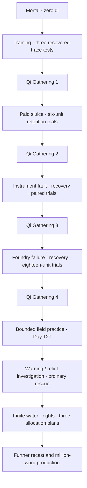

# Cultivation rewrite production ledger

Lin Yue begins as a mortal kiln worker with zero retained qi. Paid work, failures, recovery and independent recovered examinations earn Body Tempering and Qi Gathering's first four stages. The pendant grants no cultivation. Books IX–XI practice the fourth stage without awarding a fifth.

## Delivered manuscript

| Measure | Actual delivered |
|---|---:|
| Whole playable campaign | **2,335 scenes / 190,774 words** |
| Credited cultivation rewrite | **1,091 scenes / 78,081 words** |
| Inherited prose awaiting recast | **112,693 words** |
| New storm ledger / salt-road scenes | **336 scenes / 24,617 words** |
| Existing prose repaired in this batch | **53 root defects / 78 paragraphs** |
| Existing-prose net word change | **+229 words** |
| Net campaign word addition | **24,846 words** |
| Remaining displayed words toward 1,000,001 | **809,227** |
| Remaining credited rewrite words toward 1,000,001 | **921,920** |

[Machine-readable accounting](CULTIVATION_PROGRESS.json) identifies each credited scene once. The world validator recomputes displayed, rewrite and inherited totals and rejects stale or duplicated credit. Titles, labels, outlines, metadata, documentation and artwork descriptions add no manuscript words.

[The continuation report](CONTINUATION_20261003.md) distinguishes the 53 new root prose defects from the prior PR's 115 corrections. The audits match complete original and corrected paragraphs; repeated manifestations remain grouped. New chapters and their editorial draft corrections receive no existing-content repair credit.

The fourteen-volume, 1,050,000-word architecture remains a production plan. The complete recast and million-word campaign remain unfinished.

## Earned progression and chronology

The mortal opening earns stage one through three recovered retained-trace tests. Paid sluice work earns stage two through three calibrated six-unit overnight retention trials, then stage three through paired-meridian work, instrument-fault diagnosis, eleven rest days and three recovered twelve-unit examinations. Reserve, throughput, sampling discharge, purity and delivery loss remain separate.

[Foundry work](FOUNDRY_EXPANSION.md) spans 299 scenes and 22,198 current words. Warm-material failure and recovery precede three independent eighteen-unit trials; stage four is earned on Day Eighty. The current place ends on Day Eighty-four. The subsequent six-week bench term ends on Day One Hundred Twenty-six. Every [Thunderfen entrance](THUNDERFEN_EXPANSION.md) now departs on Day One Hundred Twenty-seven, after contracted work, keeping the two established arm pairs.

[Book X](STORM_LEDGER_EXPANSION.md) and [Book XI](SALT_ROAD_EXPANSION.md) continue all preceding outcomes. Their separate apparatus supplies, ordinary rescue, recovered control checks and finite water allocations develop experience without an unseen fifth-stage examination.

The [cultivation canon](CULTIVATION_SYSTEM.md) defines anatomy, twelve gates, assessment, limits and recovery. The four [choice capacities](ATTRIBUTES.md) are Qi Control, Dao Heart, Comprehension and Physique; their ranks grant no realm, fuel or consent.

## Native generated art

The twelve core 1024×1536 RGBA portrait masters remain independent originals copied byte for byte into runtime portraits. [Core provenance](../assets/art/CORE_PROVENANCE.md) records the cast and three outfits. The seven [Thunderfen originals](../assets/art/THUNDERFEN_PROVENANCE.md) retain native environment, portrait, object and effect bytes.

Four [new originals](../assets/art/STORM_SALT_PROVENANCE.md) add the 1774×887 warning observatory, 1672×941 watermill, 1024×1536 forewoman and 1024×1536 Salamander. Maximum native detail was requested; actual returned dimensions and portrait alpha are recorded. No enlargement is credited.

Catalog delivery is **14 original-scope backgrounds, 34 additional interiors, 20 human NPCs, 12 monsters, 6 items and 4 effects**. The original 100-background / 500-human / 501-beast targets and additional 100-interior target remain unfinished. Core wardrobe variants and effects do not inflate unique-world-sprite counts.

## Validation and remaining production

All 2,335 scenes are graph-reachable with unique normalized prose, valid references and no scene over 100 words. The continuity ledger reviews eleven books, 167 facts and 51 mandatory checkpoint groups. The new graph tests separately protect 27 evidence, safety, recovery and funding prerequisites from each entrance.

CI runs Python accounting/audit regressions, native-art checks, narration validation, Godot route/save/UI tests, **72 actual viewport captures**, timed body-bob checks and source-free Linux playback. The bundled report and workflow establish runtime/media success. Strict full-production acceptance remains enabled when the PR leaves draft.

