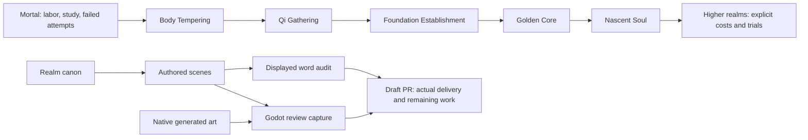

# Cultivation rewrite production ledger

This draft tracks a full editorial replacement of Jade Vow with a cultivation-centered epic. Lin Yue begins as a mortal with no sensed qi, no awakened bloodline and no inherited technique. Progress comes from practice, recovery, study, work and costly choices.

## Required delivery

- More than 1,000,000 original words displayed by reachable story scenes.
- A detailed cultivation canon: realms, stages, meridians, resources, failures, techniques, professions, tribulations and measurable breakthrough conditions.
- Generated environment, character, monster, item and effects art at the generator's highest available native detail; record actual dimensions, never describe enlargement as new detail.
- Small reviewable commits; draft PR evidence includes current screenshots and Mermaid diagrams.

## Accounting

The inherited campaign contains 122,882 displayed words. Existing prose is not automatically counted as rewritten prose. Outlines, budgets, codex descriptions, repeated text and asset descriptions do not satisfy the manuscript quota.

This ledger will report delivered rewrite scenes and words separately, including any integration, rendering or generation limits. The PR stays a draft until the full manuscript and asset scope are delivered and checked.

## Editorial sequence

1. Establish the realm canon and the mortal opening.
2. Integrate an earned first-breath arc without granting power for ordinary attribute gains.
3. Rewrite each later book against the canon and expand the campaign toward the million-word target.
4. Generate the visual library, validate native files, and refresh review captures.

