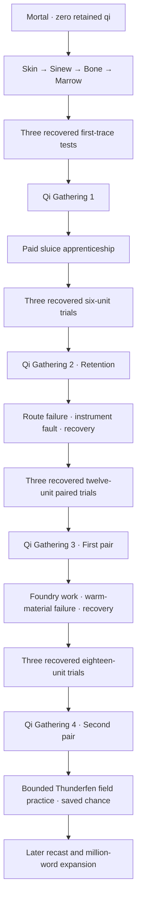

# Cultivation rewrite production ledger

Lin Yue begins as a mortal kiln worker with zero retained qi. She earns Body Tempering and the first four Qi Gathering stages through paid work, failures, recovery and independent recovered examinations. The pendant grants no cultivation. Book IX practices the fourth stage without awarding a fifth.

## Delivered manuscript

| Measure | Actual delivered |
|---|---:|
| Whole playable campaign | **1,999 scenes / 165,928 words** |
| Credited cultivation rewrite | **705 scenes / 48,905 words** |
| Inherited prose awaiting recast | **117,023 words** |
| Book IX Thunderfen continuation | **94 scenes / 5,921 words** |
| Existing prose passages recast in this batch | **13 scenes / 1086 current words** |
| Existing choice-causality corrections | **102 distinct choices; no prose credit** |
| Net displayed-word addition in this batch | **5,833 words** |
| Remaining displayed words toward 1,000,001 | **834,073** |
| Remaining credited rewrite words toward 1,000,001 | **951,096** |

The 13 prose rewrites change existing displayed text by −88 words. Previously credited passages remain counted once, so they and the new chapter add 6,923 words to rewrite credit. The [115-entry audit](CONTINUITY_REPAIRS_20261003.md) distinguishes choice-causality issues from prose contradictions; new chapters, renaming, metadata, labels, outlines, documentation and art descriptions contribute zero repair credit.

[The machine-readable ledger](CULTIVATION_PROGRESS.json) identifies every credited scene. The world validator recomputes displayed, rewrite and inherited words and rejects stale, duplicated or unknown credit. The fourteen-volume **1,050,000-word** architecture is a plan; the complete recast remains unfinished.

## Earned progression

The mortal opening earns stage one with three recovered retained-trace tests. The paid sluice apprenticeship earns stage two with three calibrated six-unit overnight retention trials, then stage three with paired-meridian work, an instrument fault, eleven rest days and three recovered twelve-unit examinations. Reserve, throughput, sampling discharge, purity and delivery loss remain separate.

The [foundry arc](FOUNDRY_EXPANSION.md) delivers 299 scenes and 22,177 words. Warm-material failure and recovery precede three independent recovered eighteen-unit trials; stage four is earned on Day Eighty. The [Thunderfen arc](THUNDERFEN_EXPANSION.md) continues all three outcomes six weeks later and keeps that stage fixed. Ordinary tools, qualified crews and separate fuel carry the large protection loads.

The [cultivation canon](CULTIVATION_SYSTEM.md) defines anatomy, twelve gates, assessment, limits and recovery. Open **Attributes → Cultivation realms** in the game. The four [choice capacities](ATTRIBUTES.md) are Qi Control, Dao Heart, Comprehension and Physique; their ranks award no realm, fuel or consent.

## Native generated art

The twelve core portraits have been completely regenerated as independent **1024×1536 RGBA** masters; runtime copies preserve their original bytes. [Core provenance](../assets/art/CORE_PROVENANCE.md) records all four characters and three outfits. Legacy sheets and small derived portraits were removed.

Seven new [Thunderfen originals](../assets/art/THUNDERFEN_PROVENANCE.md) cover two locations, one surveyor, two monsters, an item and an effect. Backgrounds retain 1672×941, portraits and item retain 1024×1536, and the effect retains 1536×1024. The image tool exposes no resolution setting; requests use maximum supported native detail and records state actual returned dimensions. No enlargement is credited.

Current catalog delivery is **12 original-scope backgrounds, 34 additional interiors, 19 human NPCs, 11 monsters, 6 items and 4 effects**. The original 100-background / 500-human / 501-beast targets and the additional 100-interior target remain unfinished. Core wardrobe variants and effects do not inflate unique world-sprite counts.

## Validation and remaining production

All 1,999 scenes are graph-reachable with unique normalized prose and no scene over 100 words. The continuity ledger records all nine books, 157 facts and 49 mandatory checkpoints. Actual gated state traversal, save compatibility and all chance alternatives are checked in Godot CI; graph reachability alone does not substitute for those tests.

CI runs Python accounting and advancement regressions, retained native-art/alpha checks, narration validation, Godot route/save/UI tests, **66 actual viewport captures** and source-free Linux playback. The final validated run and bundled screenshots are linked in the draft PR. Marking the PR ready invokes strict full-production acceptance, so this continuation remains a draft.

