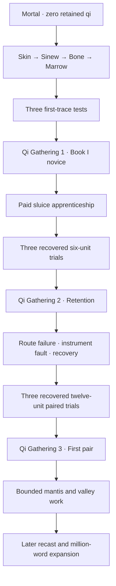

# Cultivation rewrite production ledger

Lin Yue begins as a mortal kiln worker with zero retained qi. She earns Body Tempering and the first three Qi Gathering stages through paid work, failed measurements, injuries, recovery and repeatable examinations. The pendant grants no cultivation.

## Delivered manuscript

| Measure | Actual delivered |
|---|---:|
| Original mortal-training expansion | 77 scenes / 5,151 words |
| Rewritten original Book I | 36 scenes / 2,341 words |
| New sluice apprenticeship | 131 scenes / 7,860 words |
| Recast valley openings and power scenes | 21 scenes / 1,418 words |
| Total cultivation rewrite | **265 scenes / 16,770 words** |
| Whole playable campaign | **1,602 scenes / 137,517 words** |
| Inherited prose awaiting recast | 120,747 words |

This continuation delivers **9,278 cultivation rewrite words**, including 7,860 added training words and 1,418 recast words. Replacing older passages produces a net campaign increase of 8,085 words. Only playable node text counts. Canon, labels, outlines, documentation and art descriptions contribute zero manuscript credit.

[The machine-readable ledger](CULTIVATION_PROGRESS.json) lists every credited scene. The world validator recomputes the total, rewrite and inherited counts and rejects stale, duplicated or unknown credit. The strict target remains **1,000,001 words**: 862,484 additional displayed words are needed, or **983,231 rewrite words** for the complete rewritten manuscript. The fourteen-volume 1,050,000-word architecture is a plan.

## Earned progression

The mortal opening reaches Qi Gathering stage one through three recovered retained-trace tests. During the repaired-road delay after Book I, Lin Yue works at the brine sluice for nearly three months. Stage two requires three calibrated six-unit overnight retention trials. Stage three requires three twelve-unit first-pair trials, compatible purity, interruption control and normal next-day sensation.

The arc separates reserve, route throughput, sampling discharge, delivery loss and ordinary fatigue. A salt bridge falsifies the caliper's return readings, prompting independent assessment, eleven rest days and a revised inspection. Reed-Step powers a rated cuff-to-sole stitch through the first arm pair; it never assumes an unopened leg channel works.

Three work/recovery options rejoin before stage two. Three mantis-response options rejoin after source isolation and before the valley journey. Crews and separate fuel carry the large ward loads. Choice attributes remain proficiency, separate from authored realm labels.

[The canon](CULTIVATION_SYSTEM.md) defines all twelve gates and provides the local second/third-stage assessment table. Open **Attributes → Cultivation realms** in the game.

## Native generated art

Ten cultivation masters are retained. This continuation adds the **1536×1024 brine sluice workshop**, **1024×1536 RGBA Duan Zhi**, **1024×1536 RGBA brine mantis**, **1024×1536 RGBA meridian caliper**, and **1536×1024 RGBA paired-channel effect**.

The existing five cover the lower terrace, Han Mei, furnace mite, practice wick and first trace. [Provenance](../assets/art/CULTIVATION_PROVENANCE.md) records native generation. The image tool exposes no resolution parameter; requested maximum detail is reported at actual returned dimensions. No enlargement is credited.

The larger artwork library remains unfinished: nine original-scope environments, 32 additional building interiors, fifteen human NPCs, eight monsters, four items and two effects are currently delivered. Effects do not count as world sprites.

## Validation and remaining production

The merged-data audit passes unique prose, the 100-word scene limit, character/art/stage references, actual gated reachability and every continuity checkpoint. All 1,602 scenes and 25 endings are reachable across 150,807 capped states.

CI runs Python accounting and advancement regressions, native art and alpha checks, complete narration, Godot route/save/UI checks, forty-nine actual viewport captures and standalone Linux launch. The final run and media commit are linked in the draft PR.

The complete million-word cultivation recast and the large world-art quotas remain unfinished. The current authored progression reaches stage three; later inherited prose still awaits recast. The codex is detailed reference lore rather than a full dynamic cultivation economy.

