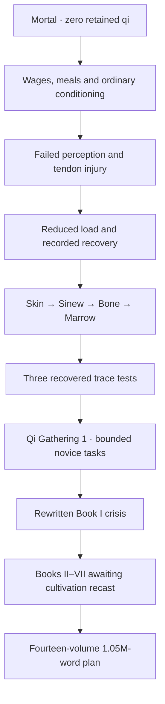

# Cultivation rewrite production ledger

The draft rewrites Jade Vow around cultivation. Lin Yue begins as a mortal kiln worker with no retained qi, then earns Body Tempering assessments and his first Qi Gathering trace through practice, failure, paid work, recovery and repeated tests. The pendant grants no cultivation.

## Delivered manuscript in this batch

| Measure | Actual delivered |
|---|---:|
| New training scenes | 77 |
| New training words | 5,151 |
| Rewritten original Book I scenes | 36 |
| Rewritten original Book I words | 2,341 |
| Cultivation rewrite words | 7,492 |
| Whole playable campaign words, including inherited prose | 129,432 |
| Whole playable campaign scenes | 1,471 |

Only displayed node text counts. The inherited Books II–VII contain 121,940 words awaiting recast. Outlines, realm codex entries, choice labels, budgets, documentation, repeated passages and asset descriptions contribute zero manuscript words.

The strict playable word target remains **1,000,001**. The current campaign is **870,569 words short**. Counting only cultivation rewrite prose, **992,509 words remain** toward a completely rewritten million-word manuscript. The fourteen-volume budget is **1,050,000 words**, a plan rather than delivered prose.

## Cultivation system and presentation

[The detailed canon](CULTIVATION_SYSTEM.md) defines twelve gates, six anatomy concepts, eight practice steps, five techniques, five crafts and five resource classes. It records admission, capabilities, limits, failure, recovery and breakthrough tests for every realm. **Attributes → Cultivation realms** opens the reference codex. Authored realm labels remain separate from Qi, Trust, Insight and Resolve point ranks.

The opening includes food and work decisions, failed bowl comparisons, tendon injury, reduced practice, examinations under changed conditions, an ordinary-tool response to a furnace mite and three recovered retained-trace measurements. Book I's mountain crisis uses expert operators and independently fueled arrays; the novice performs a bounded relay or evacuation task.

## Native generated art

Five masters are committed: a 1672×941 terrace environment; 1024×1536 Han Mei, furnace mite and copper wick portraits; and a 1536×1024 first-trace effect. See [creation provenance](../assets/art/CULTIVATION_PROVENANCE.md). The image tool exposes no resolution control. Actual native dimensions are recorded; enlargement is never credited as added detail.

These are one additional background, one human NPC, one monster, one item and one effect. The existing large artwork quotas remain unfinished. The replacement mite composition counts as one design.

## Validation and remaining production

The direct merged-data audit passes scene links, reachable scenes, unique paragraphs, ≤100-word scene text, defined realm/stage references and all continuity checkpoints. CI is responsible for Python regression tests, native-pixel and alpha validation, complete narration generation, Godot traversal, UI tests, standalone packaging and forty-four actual viewport captures. Rendering status must be checked on the final source state before screenshots are described as current.

Remaining work includes rewriting and expanding Books II–VII and all later volumes, reaching more than one million unique cultivation manuscript words, generating the remaining world library and implementing any full dynamic cultivation-resource simulation. The present codex is reference lore, with only the opening's advancement authored in gameplay. The PR stays a draft.

