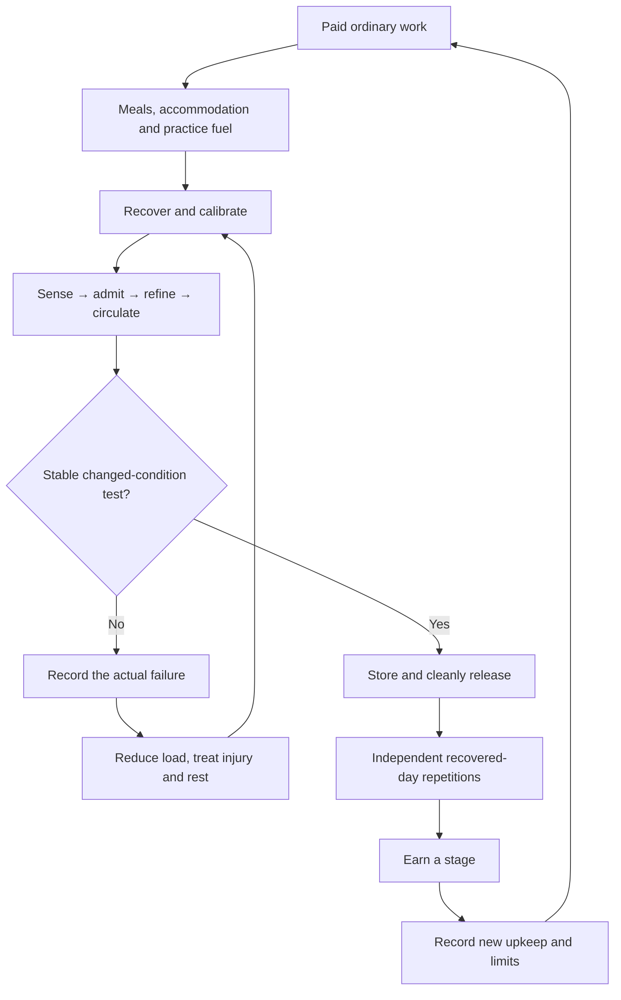
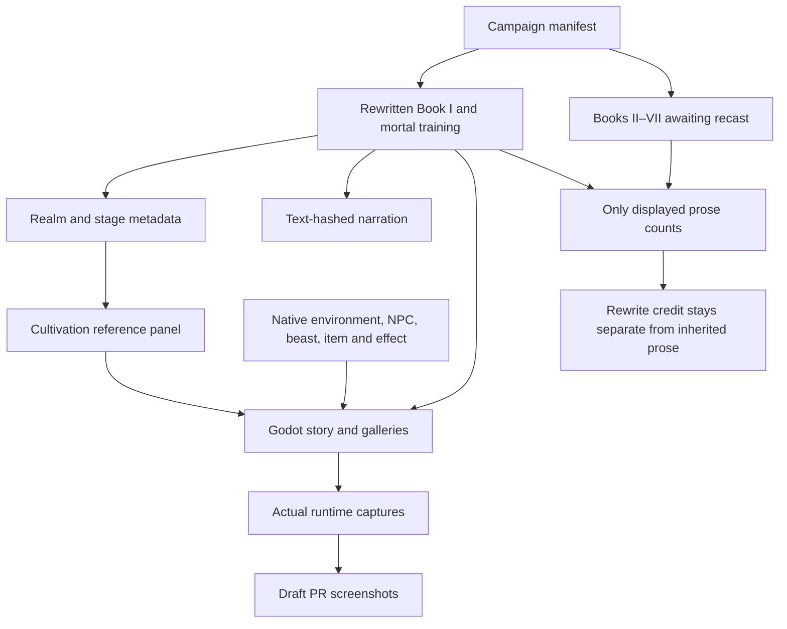
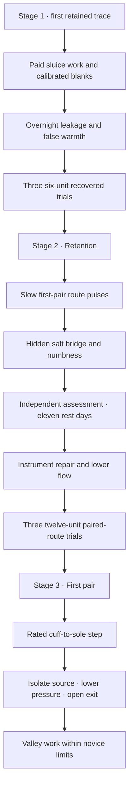

# Cultivation canon and manuscript architecture

The rewrite centers on Lin Yue's cultivation. She begins at twenty-four as a mortal kiln worker with no retained qi and an initially unmeasured ordinary mixed root. She earns training through work and persists through failed tests, injury, hunger, envy and recovery. The pendant carries an offered memory; it supplies no root, technique, skill, reserve or realm.

The machine-readable canon is [data/cultivation.json](../data/cultivation.json). The game exposes it through **Attributes → Cultivation realms**. Realm labels in the opening come from authored scene metadata. Qi, Trust, Insight and Resolve remain separate choice attributes; their point ranks do not grant cultivation realms.

## Manuscript target

The proposed manuscript has fourteen volumes of **75,000 original displayed words each: 1,050,000 words total**. At roughly 65 words per readable scene this requires about 16,155 scenes. These are budgets, not delivered prose. Each volume needs unique scenes, consequential choices, ordinary livelihoods, training, failures and recovery. The inherited Books II–VII remain awaiting their rewrite and cannot be credited as new cultivation manuscript.

Only playable node text counts. Codex entries, documentation, outlines, choice labels, repeated scenes, portraits and narration metadata do not count. Future expansion must replace or deliberately recast existing prose; adding a realm label to a settlement scene is not an editorial rewrite.

| Volume | Title | Realm focus | Word budget |
|---|---|---|---|
| I | The first retained breath | Mortal → Qi Gathering 1 | 75,000 |
| II | The twelve channels | Qi Gathering 1–4 | 75,000 |
| III | The river circuit | Qi Gathering 5–9 | 75,000 |
| IV | The uneven foundation | Foundation: Platform | 75,000 |
| V | Eight pillars beneath the skin | Foundation: Pillars → Joined | 75,000 |
| VI | The core that would not close | Golden Core: Seed → Nine turns | 75,000 |
| VII | A law worth carrying | Golden Core: Sealed | 75,000 |
| VIII | The body left waiting | Nascent Soul | 75,000 |
| IX | A principle in winter | Spirit Transformation | 75,000 |
| X | The price of distance | Void Refinement | 75,000 |
| XI | The land that could withdraw | Integration | 75,000 |
| XII | The flaw inside the law | Mahayana | 75,000 |
| XIII | Nine crossings of heaven | Tribulation Crossing | 75,000 |
| XIV | The first immortal morning | True Immortal | 75,000 |

### Volume I: The first retained breath

Paid kiln work, failed root tests, four Body Tempering assessments, injury, three retained-trace tests and a bounded mountain emergency.

Required exit: First trace retained on three recovered mornings; pendant grants no cultivation.

### Volume II: The twelve channels

Recast Salt Lantern Valley around a novice's paid ward apprenticeship. Compare lost records with failed talisman releases, gather scarce fuel and learn the first two paired routes.

Required exit: A stable paired route survives changed room conditions and ordinary work.

### Volume III: The river circuit

Use river travel to expose finite reserve, purification loss, beast-specific channels and the cost of great-circuit bridges. Rewrite echo investigations as consequences of cultivation craft.

Required exit: Great circuit and at least 90% compatible purity; no instant advancement from an echo.

### Volume IV: The uneven foundation

Recast the healing orchard around condensation preparation, ordinary treatment, an expensive failed attempt and rebuilding unequal droplets.

Required exit: A liquid platform passes repeated closure and interrupted-breath tests.

### Volume V: Eight pillars beneath the skin

Recast the city as a cultivation labor and furnace economy. Train each bridge, earn fuel through talisman work, confront predatory shortcut pills and support fellow apprentices.

Required exit: Joined foundation survives ninety recovered days rather than a tournament victory.

### Volume VI: The core that would not close

Recast the cliff court around the consequences of a flawed core method. Use four inquiries to understand technique limits, then commit to a personal stable law through difficult practice.

Required exit: Nine inspected turns with explicit crack and reserve records.

### Volume VII: A law worth carrying

Recast the third-ring return as a conflict between a copied memory and lived comprehension. The protagonist's law is tested in changed conditions and through a costly core tribulation.

Required exit: A sealed core and a prepared soul cradle; neither borrowed identity nor stolen experience.

### Volume VIII: The body left waiting

Build the cradle, fail a projection, recover bodily independence and face the mirror trial. Friends take their own cultivation paths, with gains and losses that cannot be appropriated.

Required exit: Three independent soul tasks with reliable return and preserved identity.

### Volume IX: A principle in winter

Study a principle across seasons; remove the favorable environment; learn how bodily, core and soul responses disagree. Antagonists apply the same resource rules.

Required exit: The chosen principle remains usable beyond its favorite conditions.

### Volume X: The price of distance

Survey paired anchors, finance a passage, survive a shifted return site and account for travelers, stored goods and decaying seams.

Required exit: Three closed passages under changing conditions; no unknown-destination teleportation.

### Volume XI: The land that could withdraw

Fund a bounded domain through an entire seasonal cycle. Deal with competing cultivators, beast habitats, upkeep and the right of contributors to leave.

Required exit: A whole domain can release every borrowed load while preserving independent identity.

### Volume XII: The flaw inside the law

Name the real flaw in the protagonist's law, change actions rather than slogans, test it elsewhere and prepare the ninefold transition.

Required exit: A mature law with tested exceptions and ordinary-world obligations accounted for.

### Volume XIII: Nine crossings of heaven

Devote distinct chapters to all nine trials, damage between them, evacuation work, independent companions' choices and an ascension that can fail.

Required exit: All nine trials; abandoned domains closed before departure.

### Volume XIV: The first immortal morning

Return to cautious trace admission in a denser environment. Preserve ordinary identity and the consequences of centuries of decisions. End with an established path, not omnipotence.

Required exit: Immortal circulation calibrated and sustained; death and resource limits remain possible.

## Cultivation gates

The lifespan ranges below describe healthy potential, not an invulnerability promise. Reserve, capacity, purity, strain and control are measured independently. Injuries can reduce usable capacity without erasing every lesson learned.

### Mortal

Stages: Unsensed → Conditioned → First perception.

**Mechanism:** No retained qi; ordinary food, tools and muscles perform work.

**Admission:** Lin Yue begins here, with zero reserve and no reliable spiritual sensation.

**Practice:** Posture, literacy, breath without retention, load management and observation. A sensation that cannot survive a blank comparison is recorded as uncertain.

**Breakthrough:** Enter Body Tempering only after repeatable ordinary exercises, healed practice injuries and a stable rhythm under load.

**Capabilities:** Ordinary craft, travel, sword drills and study. No qi technique, flight, ward binding or spiritual healing.

**Limits:** Being stubborn does not create qi. A gift or auspicious object cannot perform the required exercises.

**Failure:** Dehydration, overwork and confusing a racing pulse with spiritual perception.

**Recovery:** Food, water, sleep, reduced work and treatment when needed.

**Span:** Ordinary human lifespan.

### Body Tempering

Stages: Skin → Sinew → Bone → Marrow.

**Mechanism:** Prepare tissue to withstand a future circuit using graded ordinary loads and carefully supervised external washes.

**Admission:** Mortal conditioning is repeatable and the aspirant can release tension before pain changes their gait.

**Practice:** Skin: repeated friction and recovery. Sinew: aligned load and deliberate release. Bone: progressive support without impact shortcuts. Marrow: circulation and rest through a whole workday.

**Breakthrough:** Complete four assessments over separate recovered days, sense qi reliably, admit and cleanly release a trace through an external grounded practice lead, and retain three breath-units overnight on three recovered tests without tremor. This does not open an internal meridian pair; that is earned at Qi Gathering stage 3.

**Capabilities:** Greater endurance, controlled falls and a steady training stance. External medicinal qi does not become personal reserve.

**Limits:** No sword aura, ward command or healing others. Stage names describe demonstrated resilience, not indestructibility.

**Failure:** Hidden fractures, damaged tendons, toxic washes and missing meals. Pain is a reason to inspect, not proof of progress.

**Recovery:** Step back to the last tolerated load; repair takes weeks or months and can reduce capacity.

**Span:** No guaranteed lifespan extension.

### Qi Gathering

Stages: 1: Trace → 2: Retention → 3: First pair → 4: Second pair → 5: Four pairs → 6: Six pairs → 7: Small circuit → 8: Balanced reservoir → 9: Great circuit.

**Mechanism:** Admit, refine and retain ambient qi in the lower dantian.

**Admission:** Three breath-units retained overnight on three tests, clean release and no next-day tremor.

**Practice:** Early stages stabilize a trace; middle stages balance six paired channels; late stages bridge governing and conception vessels before the great circuit. Record usable reserve separately from purity.

**Breakthrough:** Ninth stage, at least 90% compatible purity, a great circuit that survives interrupted breath, and three separate stable compression trials under supervision.

**Capabilities:** Stage 1 lights a wick briefly; stage 3 reinforces one prepared movement; stage 6 maintains a small talisman; stage 9 sustains a local ward relay.

**Limits:** Early stages cannot fly, shatter a mountain or cure an injury. Qi reserve must be replenished. Wards amplify a permitted input but cannot remove their fuel budget.

**Failure:** Leakage, phase grit, reflux at a bridge and overconfidence after the first successful trace.

**Recovery:** Safe discharge, channel rest, compatible food and low-load recirculation. A damaged route can make a former stage temporarily unusable.

**Span:** Healthy practice may reach roughly 120 years; injury and ordinary disease still matter.

### Foundation Establishment

Stages: Platform → Pillars → Joined foundation.

**Mechanism:** Condense gaseous qi into a liquid reservoir anchored to balanced extraordinary vessels.

**Admission:** All Qi Gathering breakthrough tests, a prepared grounding circle and fuel for three days of supervised recovery.

**Practice:** Platform stabilizes liquid droplets; Pillars bind the eight vessel bridges one at a time; Joined foundation transfers load across all bridges without cracking the reservoir.

**Breakthrough:** Hold a circulating liquid reservoir through sleeping, walking and interrupted practice for ninety recovered days; formulate a stable core seed with a named compatible method.

**Capabilities:** Sustained reinforcement, a short supported glide using a prepared artifact, durable local arrays and limited spiritual perception.

**Limits:** Artifact flight consumes its own fuel and the user's control. Foundation is not Golden Core, even with an expensive pill.

**Failure:** Unequal pillars, borrowed incompatible qi and cracks hidden by sedatives.

**Recovery:** Rebuild the damaged pillar, sometimes returning to gaseous reserve. A Foundation pill assists condensation but cannot supply control.

**Span:** Approximately 180–250 healthy years, subject to method and injury.

### Golden Core

Stages: Seed → Nine turns → Sealed core.

**Mechanism:** Crystallize the liquid reservoir around a personal stable circulation law.

**Admission:** Joined foundation and ninety-day stability; compatible core seed, recovery reserve and a protected site for the nine turns.

**Practice:** Each turn increases coherence while expelling grit. Crack inspection follows every turn. The ninth seals a repeating cycle without external pressure.

**Breakthrough:** A sealed core that sustains its own circulation, accurate spiritual reflection and a prepared soul cradle. Pass a three-part core tribulation testing load, control and contradiction.

**Capabilities:** Independent short flight, stronger arrays, sustained sword aura and perception across a bounded landscape.

**Limits:** A core does not produce unlimited qi. Rushed or cracked cores limit throughput. Core quality is coherence and repairability, not color or social prestige.

**Failure:** Core cracking, runaway heat or choosing a law one can recite but cannot maintain under conflict.

**Recovery:** Unload the core, bind cracks, rebuild turns. Shattering can end cultivation; survival does not guarantee restoration.

**Span:** Approximately 400–600 healthy years.

### Nascent Soul

Stages: Cradle → Awakening → Embodiment.

**Mechanism:** Form a spiritual self supported by the core and upper dantian without consuming ordinary identity.

**Admission:** Sealed core, soul cradle and stable reflection; separate understanding of copied memory versus lived personhood.

**Practice:** Cradle aligns attention; Awakening sustains coherent perception outside one sensory channel; Embodiment returns perception reliably to the body.

**Breakthrough:** Maintain three independent soul tasks without losing recall or bodily control; survive a mirror trial confronting a real unresolved contradiction.

**Capabilities:** Brief soul projection, remote sensing through an established anchor and coordinated multiple techniques.

**Limits:** Projection leaves the body vulnerable and drains reserve. Memory echoes do not create extra souls. A destroyed body cannot be replaced casually.

**Failure:** Anchor severance, false doubles, overstretched attention and projection beyond the known return range.

**Recovery:** Withdraw projection, restore anchors and rehearse a single task. Lost spiritual structure may remain lost.

**Span:** Approximately 800–1,200 healthy years.

### Spirit Transformation

Stages: Attunement → Resonance → True spirit.

**Mechanism:** Bring body, core and soul into one repeatable response to a chosen environmental principle.

**Admission:** Embodied Nascent Soul, a comprehended principle and stable return from projection.

**Practice:** Study the principle under hostile conditions; gradually align bodily channels, core cycle and soul attention. Contradictory conditions are measured explicitly.

**Breakthrough:** Demonstrate a principle that still functions when its favored environment is removed; establish a bounded domain seed.

**Capabilities:** Change an existing process within an area: guide rain already present, carry an existing sound or redirect available heat.

**Limits:** No creation from nothing, absolute mind control or universal immunity. Range and expenditure grow together.

**Failure:** Environmental dependence, eroded personal perception and bodily mismatch.

**Recovery:** Separate the aligned systems, relearn ordinary sensation and repair one interface at a time.

**Span:** Approximately 1,500–2,000 healthy years.

### Void Refinement

Stages: Boundary → Passage → Return.

**Mechanism:** Refine the limits between local spaces using known paired anchors.

**Admission:** True spirit and a domain seed that can be closed without abandoning an active technique.

**Practice:** Boundary measures distance through the domain; Passage joins two prepared anchors; Return closes the seam and accounts for every traveler and consumed anchor.

**Breakthrough:** Three maintained passages across changing conditions, no unresolved seam, and a fully embodied domain boundary.

**Capabilities:** Short anchored spatial travel, protected storage spaces and greater domain control.

**Limits:** Unknown destinations cannot be selected safely. A passage consumes prepared anchors; storage is not infinite or outside time.

**Failure:** Seam collapse, anchor drift, trapped technique load and returning to an altered site.

**Recovery:** Ground the seam, recover the nearest intact anchor and rebuild local distance measurements.

**Span:** Approximately 3,000–4,000 healthy years.

### Integration

Stages: Body-domain → Soul-domain → Whole domain.

**Mechanism:** Integrate the practitioner with a bounded domain while keeping exits and independent identity intact.

**Admission:** Void Return and a closed domain whose upkeep the practitioner can actually fund.

**Practice:** Body-domain shares physical load; Soul-domain shares perception; Whole domain balances both during conflict and deliberate withdrawal.

**Breakthrough:** Sustain the domain through a seasonal cycle, release every borrowed resource cleanly and identify a flaw that cannot be solved by more power.

**Capabilities:** Large coordinated arrays, controlled weather within measured bounds and defense across an inhabited region.

**Limits:** A domain still needs fuel. People within it retain independent wills. Borrowed land or labor can be withdrawn.

**Failure:** Domain dependence, concealed resource debt and carrying more territory than the core can release.

**Recovery:** Shrink the boundary, repay loads and restore bodily independence before expanding again.

**Span:** Approximately 5,000–6,000 healthy years.

### Mahayana

Stages: Law seed → Law body → Mature law.

**Mechanism:** Hold a consistent principle across body and domain without relying on a single favorable world condition.

**Admission:** Whole domain, seasonal stability and a concrete acknowledged flaw.

**Practice:** Resolve the flaw through changed action; test the law in another region and with independent observers. A convenient explanation cannot replace a changed technique.

**Breakthrough:** A mature law, ordinary-world obligations accounted for and a prepared route through the ninefold ascension trial.

**Capabilities:** Vast but bounded transformations of existing processes and long-range anchored travel.

**Limits:** Law is not omnipotence. Contradictory laws and unavailable resources still impose limits.

**Failure:** Brittle law, hidden exceptions and treating domination as comprehension.

**Recovery:** Withdraw the law, rebuild its premise and accept a smaller domain when necessary.

**Span:** Approximately 8,000–10,000 healthy years.

### Tribulation Crossing

Stages: Body trial → Core trial → Soul trial → Domain trial → Law trial → Debt trial → Separation trial → Return trial → Ascension.

**Mechanism:** Reconcile the mature law with a world that cannot absorb unlimited spiritual load.

**Admission:** Mature Mahayana law, a protected trial site, evacuation plan and an ascension path with known return limits.

**Practice:** Nine distinct trials test endurance, circulation, identity, boundaries, contradiction, debts, independence, closure and transition. Earlier damage changes later trials.

**Breakthrough:** Complete all nine while protecting bystanders and closing abandoned domain anchors; ascension changes the energy environment, not the person's moral worth.

**Capabilities:** Brief contact with immortal qi and preparation for the environmental transition.

**Limits:** No sudden victory by shouting conviction. External protectors may shelter bystanders but cannot complete personal tests.

**Failure:** Burned anchors, law rupture, loss of core coherence and leaving harmful loads behind.

**Recovery:** Survive and rebuild at the last sustainable realm; some wounds or failed transitions are permanent.

**Span:** No additional guaranteed years while crossing.

### True Immortal

Stages: Adaptation → Immortal circulation → Established path.

**Mechanism:** Rebuild mortal circulation for a denser immortal environment while preserving a coherent identity.

**Admission:** Completed ascension with closed former anchors and enough compatible reserve to survive adaptation.

**Practice:** Admit immortal qi in traces, inspect changed channels and rebuild a stable closed circuit. The first immortal day returns Lin Yue to careful measurement.

**Breakthrough:** This manuscript ends at an established immortal path; further realms remain outside its canon.

**Capabilities:** Immortal circulation and lifespan without ordinary senescence while the core and soul remain coherent.

**Limits:** Violence, resource starvation, spiritual injury and mistakes can still kill. Ascension does not resurrect the dead or erase past consequences.

**Failure:** Immortal qi contamination, adaptation shock and assuming old capacity measurements still apply.

**Recovery:** Shelter, compatible fuel, reduced intake and a rebuilt calibration protocol.

**Span:** Indefinite potential, conditional on continued coherence and survival.

## Practice and breakthrough contract

Every major advancement needs five kinds of scene evidence: prior repeatable practice; a demonstrated test in changed conditions; a cost paid from real resources; a credible failure path; and recovery that constrains the next action. A first attempt may fail. A stage cannot be awarded for being brave, owning an artifact, knowing a powerful parent or spending attribute points.

Training records must distinguish retained reserve from the ambient field. A bright practice wick near the damaged mountain is not proof of a higher realm. External medicinal qi and artifact fuel are not personal reserve. The first retained trace requires three recovered morning tests, a clean release and no next-day tremor.

Techniques begin with a safe exit, a rated load and a concrete purpose. Growth extends a previously demonstrated capacity. A named attack does not grant unbounded range. Large realm gaps require credible escape, preparation or a local task; routine unexplained victories would violate the canon.

The detailed measures, anatomy, eight-step cycle, five starting techniques, five crafts and five resource classes are available in the source JSON and in-game codex. They are reference lore in this batch; a full dynamic cultivation economy and all higher-realm unlocks remain future implementation.

## Review diagrams

## Delivered sluice method: second and third stages

The playable workshop arc now specifies Azure Cloud's local assessment standards. These thresholds describe this method and calibrated equipment; a spirit stone price never converts directly into a realm.

| Test | Stage 2: Retention | Stage 3: First pair |
|---|---|---|
| Overnight usable reserve | Six breath-units | Twelve breath-units |
| Compatible fraction | At least 80% | At least 85% |
| Route requirement | Stable closure and clean grounded release | First inward/outward arm pair carries a quarter-unit pulse and stops on command |
| Repetition | Three recovered calibrated trials | Three recovered calibrated trials |
| Recovery evidence | No tremor after discharge | Normal next-day hand sensation |
| Known costs | Sampling discharge and ordinary activity | Sampling, route delivery loss and ordinary activity |

Reserve is stored energy. Throughput is the tested flow a particular route can carry per breath. The caliper compares an input and surface return; it cannot see souls or bypass next-day tissue checks. Independent blanks, shade, temperature matching and lifted contacts identify false readings. The new arc includes a hidden salt bridge, an independent assessment, eleven rest days and a revised inspection sheet.

Reed-Step at this stage uses the completed arm pair to power a rated cuff-to-sole conducting stitch. It supports one ordinarily aligned step, with a slack safety line during training. It does not open or secretly use an internal leg channel. Useful quarter-unit support currently spends a half-unit including delivery loss. Turning follows full discharge.

The mantis encounter isolates the practice source, tests residual charge, lowers ordinary water pressure and opens an exit. The chosen novice task is only part of that repair. Valley stone lifting uses crew capstans; ward shelter has separate buried fuel; command revisions are first tested on isolated dummy strips.

### Ash-bridge fourth-stage assessment

The local method requires eighteen usable breath-units after ordinary activity and sleep, at least 87% compatible charge, and two distinct paired routes carrying quarter-unit tasks successively with full discharge. Independent interruption control, three recovered calibrated trials and normal next-day sensation are mandatory. The second pair uses complementary outer-forearm and upper-arm paths to the shoulder junction; no leg route, middle dantian or extraordinary vessel opens here. Pulse quantity, rate, duration and phase compatibility remain separate limits. The six-contact phase comb measures external comparisons, never an internal meridian directly.
