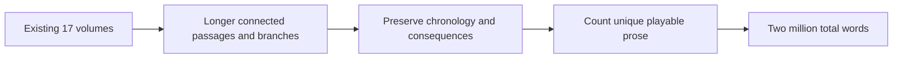
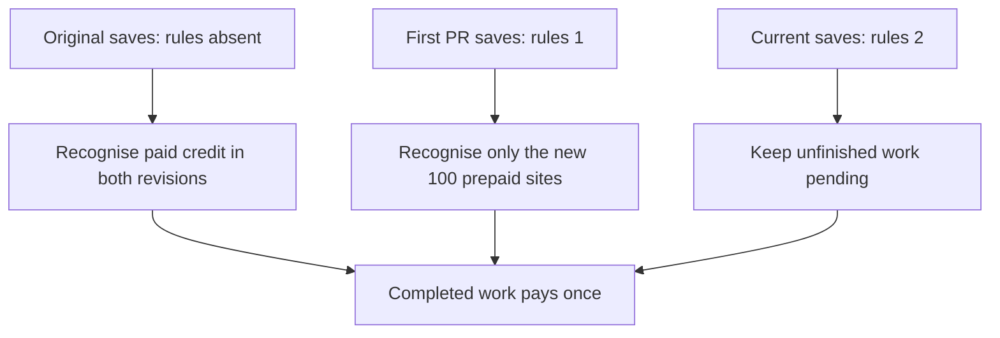
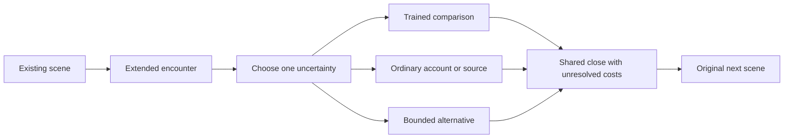

# Existing-volume expansion toward two million words

The user selected deeper existing volumes with longer sequences and additional branches. The displayed manuscript now contains **1,135,382 prose words across 12,831 scenes and 17 books** after the first six existing-volume encounters add **8,630 words in 110 passages**. The new target is **2,000,000 total prose words**, requiring **864,618 further words**. Counts include alternative playable branches. This target is not yet delivered. Outlines, labels, provenance and repeated text do not count.

The following original allocation accounts for the 873,248-word gap before this installment; its new 8,630 words count within those budgets.

| Existing volumes | Planned additional prose |
|---|---:|
| I–IV | 13,000 each |
| V | 11,248 |
| VI–XI | 35,000 each |
| XII–XVII | 100,000 each |
| Total | 873,248 |

The allocations can shift after editorial review while the measured total remains the acceptance criterion. The game keeps each displayed passage at 100 words or fewer; a longer scene therefore spans multiple connected passages. New branches rejoin before the original observation and must retain dates, wages, object custody, injuries, existing conclusions and earned cultivation limits. They should deepen character motives and adversarial evidence rather than multiply interchangeable paragraphs.

The six new native sprites introduce independent human and creature designs for the existing regions. The second causality audit authenticates another 100 choices against `c2f148d5b7c0bc22a19f93439d45fdfa1df28b63`. Combined with the first revision, this PR repairs 201 source sites affected by premature choice rewards; that is a site count, not a claim of 201 unrelated root defects.

The regression suite exercises the additional 100 branches, both older checkpoint rules, checkpoints before task selection, replay after saving, and still-pending work from the original 101 repairs. Unknown rule revisions reject without changing live state. Full game CI captures actual sprites and UI, validates native artwork and narration, and tests the Linux package without the source checkout. The expansion remains draft while the two-million total is incomplete.

## First authored installment

| Encounter | Existing anchor | Added prose | Branches |
|---|---|---:|---:|
| xu_lin | `canal_p01_018` | 1605 | 3 |
| tidemirror_otter | `canal_p01_009` | 1343 | 3 |
| cinderback_pangolin | `forest_01_023` | 1437 | 3 |
| chen_rui | `harbor_p01_023` | 1474 | 3 |
| wu_zheng | `kiln_p01_023` | 1403 | 3 |
| song_mei | `desert_p01_028` | 1368 | 3 |

The canal gauge, recovered whistle, wet shrine kindling, private wage ticket, unpowered fan and completed lunch retain their original consequences. The new scenes change what Yue asks and learns first, with visible time costs and unanswered alternatives. Song Mei's encounter follows the lunch conversation so it preserves the cook's immediate joke. No scene copies Fen's private paper, appoints an adviser, certifies a quarry, derives a water route from music, or awards a realm from choosing a conversation.

