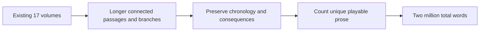
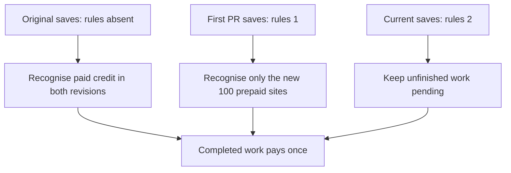

# Existing-volume expansion toward two million words

The user selected deeper existing volumes with longer sequences and additional branches. The current displayed manuscript contains **1,126,752 prose words across 12,721 scenes and 17 books**. The new target is **2,000,000 total prose words**, requiring **873,248 additional words** before any further counted prose. This target is not yet delivered. Outlines, labels, provenance and repeated text do not count.

| Existing volumes | Planned additional prose |
|---|---:|
| I–IV | 13,000 each |
| V | 11,248 |
| VI–XI | 35,000 each |
| XII–XVII | 100,000 each |
| Total | 873,248 |

The allocations can shift after editorial review while the measured total remains the acceptance criterion. The game keeps each displayed passage at 100 words or fewer; a longer scene therefore spans multiple connected passages. New branches rejoin before the original observation and must retain dates, wages, object custody, injuries, existing conclusions and earned cultivation limits. They should deepen character motives and adversarial evidence rather than multiply interchangeable paragraphs.

The six new native sprites introduce independent human and creature designs for the existing regions. The second causality audit authenticates another 100 choices against `c2f148d5b7c0bc22a19f93439d45fdfa1df28b63`. Combined with the first revision, this PR repairs 201 source sites affected by premature choice rewards; that is a site count, not a claim of 201 unrelated root defects.

The regression suite exercises the additional 100 branches, both older checkpoint rules, checkpoints before task selection, replay after saving, and still-pending work from the original 101 repairs. Unknown rule revisions reject without changing live state. Full game CI captures actual sprites and UI, validates native artwork and narration, and tests the Linux package without the source checkout. The expansion remains draft while the two-million total is incomplete.
