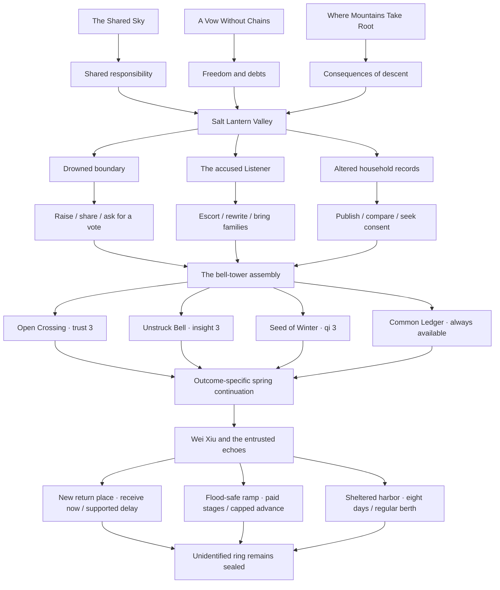
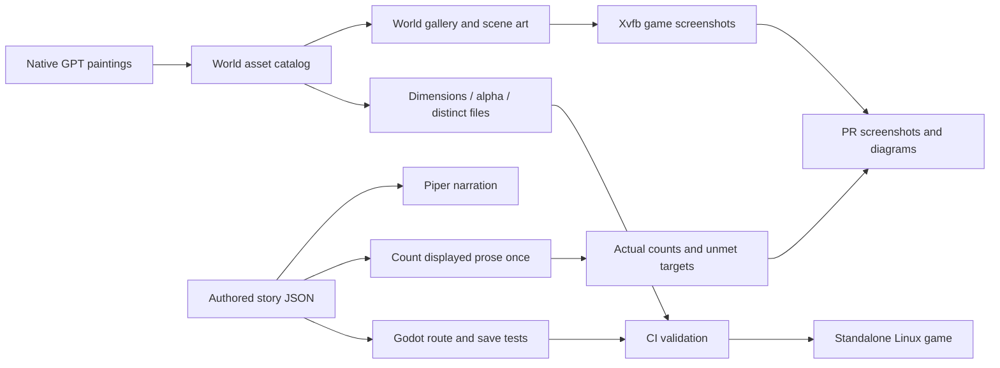

# Jade Vow expansion

## Delivered in this draft

- **234 playable scenes and 13,159 authored prose words** across four books.
- Book I: 36 scenes, 942 words, three endings.
- Book II: 73 scenes, 4,000 words, three investigations, nine approaches, four endings.
- Book III: 87 scenes, 5,332 words, four spring continuations, three river routes, six settlement approaches, three endings.
- Book IV: 38 scenes, 2,885 words, three investigations, four settlements, and route-specific river continuations.
- Five original-scope painted backgrounds at native 1672×941.
- 30 additional building-interior paintings preserved at their individual native sizes; [inventory](INTERIORS.md).
- Five human NPCs and three spirit beasts at native 1024×1536 with alpha.
- Two inspectable item paintings: clapper at 1024×1536 and echo case at 1536×1024.
- Rain, reed light, soft bell ripples, and qi effects, paused by panels and stopped by reduced motion.
- Continuity ledger plus required-knowledge and safety checkpoints.
- Twenty-two rendered viewport screenshots, complete narration coverage, and Linux package validation.

These are exact delivered counts. This draft does **not** fulfill the requested original 100 backgrounds, 500 human NPCs, 501 spirit beasts, the extra 100 interior backgrounds, or a manuscript longer than one million words. An image-generation prompt is not a delivered asset. A plot outline, word budget, alternate playthrough, or repeated paragraph is not an authored word.

## Production target

The requested final manuscript must contain at least **1,000,001 displayed prose words**, counted once per authored scene. Choice captions, character biographies, README text, outlines, and the number of possible routes are excluded. The current counting convention is whitespace-delimited words, applied to the current scene text, including editorial revisions.

`python tools/validate_world.py` writes the actual inventory and manuscript size to `build/content_report.json`. Structural validation passes independently of the production target; a passing draft CI run does not mean the target is fulfilled. Run `python tools/validate_world.py --require-complete` to require all deliverables. The command writes the report and exits unsuccessfully while any quota remains unmet. The manually dispatched CI workflow exposes the same check through its `require_complete` input.

The continuation request adds **100 building-interior backgrounds** to the original 100 backgrounds: **200 backgrounds total**. Only paintings explicitly assigned to the `building_interiors` collection count toward the extra quota; those paintings do not also satisfy the original background quota. The existing valley archive remains part of the original five. Exact repeated scene prose is rejected instead of counted again.

The confirmed sprite target is **500 human portraits plus 501 spirit-beast portraits: 1,001 independent originals**. Native portrait resolution must be at least **1024×1536** (either canvas orientation); larger originals retain their returned dimensions. The image tool is asked for its highest native resolution. Enlargement does not qualify as added original detail. Outfit changes, gesture poses, recolors, mirrors, and atlas crops do not count as independent designs.

Native image dimensions and retained-source provenance are recorded per sprite. Decoded painting fingerprints reject reencoded copies, hidden RGB changes, and transparent padding. These checks supplement inspection of independent faces, silhouettes, costumes, anatomy, and painted details; they do not establish semantic originality alone. Keep the original generated file. Do not satisfy “highest possible resolution” by enlarging a smaller file, cropping many tiny atlas cells, or copying one drawing under multiple names.

## Campaign outline and budgets

The following twenty books have a combined **planned** budget of 1,020,000 words. These words have not been written. Budget alone does not satisfy the manuscript target.

| Book | Working title | Planned words | Central conflict |
|---|---|---:|---|
| I | The Star Beneath the Mountain | 51,000 | Consent and the captive star |
| II | The Valley That Kept Its Name | 51,000 | Shelter, records, and erasure |
| III | The River Without a Shore | 51,000 | A ferry carrying an exile's memories |
| IV | The Orchard of Unfinished Winters | 51,000 | Healing that transfers another person's pain |
| V | The City of Borrowed Faces | 51,000 | Identity sold as cultivation currency |
| VI | The Court Above the Rain | 51,000 | Immortal justice and mortal testimony |
| VII | The Thousand-Mile Funeral | 51,000 | Who may inherit a dead sect's vows |
| VIII | The Desert That Remembers Water | 51,000 | Restoring a river without erasing its new inhabitants |
| IX | The Library Beneath the Moon | 51,000 | A history that edits its readers |
| X | The Seven Unopened Gates | 51,000 | Guardians who can no longer refuse their duty |
| XI | The Sea of Returning Swords | 51,000 | Weapons seeking the lives they ended |
| XII | The Mountain of Small Gods | 51,000 | Worship, dependence, and chosen responsibility |
| XIII | The Winter Parliament | 51,000 | Beast clans and human villages sharing a refuge |
| XIV | The Hand That Unmade Heaven | 51,000 | The creator of the captive-star covenant |
| XV | The Republic of Wandering Souls | 51,000 | Dead citizens demanding a living vote |
| XVI | The Last Examination | 51,000 | Cultivation merit measured by sacrifice |
| XVII | The Storm That Asked Permission | 51,000 | A sentient calamity negotiating its arrival |
| XVIII | The Road Through Every Home | 51,000 | Companions' incompatible promises |
| XIX | The Sky We Could Not Carry | 51,000 | Limits to collective rescue |
| XX | A Vow Freely Left | 51,000 | Endings shaped by what each companion can refuse |

Each chapter must be individually written and edited, as requested. Each book also needs consequential branches, route continuity, character consistency, and reader-facing pacing before its word budget can be marked delivered. Future art must match the existing painted illustrations; scalable vector substitutes are outside the requested scope.

## Quest structure

## Content and review pipeline

## Bug fixes

- Validate a choice destination and every effect before changing stats or history.
- Use the same explicit integer ceiling for gameplay and save loading; saves above 100 are valid.
- Validate settings types and finite numeric values before applying sliders and toggles.
- Preserve journal prose literally rather than interpreting loaded text as BBCode.
- Allow the dialogue panel to scroll when longer prose wraps beyond its visible height.
- Give new speakers a default narration pace instead of failing on missing speaker timing.
- Position role labels after the measured speaker-name width so long names remain readable.
- Keep scene portraits below the navigation bar and above the footer throughout their bob; resizing a cached portrait updates its scale immediately.
- Copy the animation formats actually produced by the renderer; the old animation JSON glob broke screenshot bundling.
- Refresh bundled review media when deterministic story, art, or runtime input hashes change, even when generated voice files are unchanged.

## Continuity review

`data/continuity.json` records reviewed facts, chronology, custody, permissions, and intentional unresolved questions. It is updated with every delivered book. The validator checks that each required evidence or safety scene lies on every structural path to its named decision. Godot separately traverses the choices under stat gates.

Book II takes place in autumn; Book III begins the following spring on every settlement route. Only the release ending grounds Azure Cloud. Common valley art faces grounded ridges. Lin Yue retains the pendant. Wei Xiu is alive, and Su Lan's husband remains dead; erased household records do not erase or resurrect people.

River echoes are volunteered external copies, not missing pieces of minds. Three rings hold separate permissions. The unidentified owner is a deliberate unresolved question in all Book III endings; no route opens that echo to guess an identity. Each settlement makes continued care explicit.

These structural checks supplement an editorial reading of every new scene. They do not certify that every possible literary inconsistency has been eliminated.

The manuscript still needs **986,842** additional authored prose words to reach 1,000,001. The original art quotas still need **95 backgrounds, 495 human NPCs, and 498 spirit beasts**. The two item paintings are additional assets and do not count toward those quotas. The extra interior quota has 30 delivered paintings and 70 remaining. These future-campaign locations are available in the gallery; their existence does not claim that the remaining outlined books have been written.

## Book IV · delivered orchard chapter

Every river ending continues into the same spring while preserving its own echo-custody outcome. Ren Qiao and the Frostroot Hart have independent native portraits and appear in the chapter. Investigate the disconnected treatment circuit, listen to patients over a meal, or compare the winter allocation records. The other investigators report their findings before settlement. The Hart declines another exchange; its permission is separate from every human carrier's and patient's.

The inherited winter demand is removed while the safe closing rhythm remains. Choose a limited breathing trial, paid care rota, separate relief funding, or a reviewed pause with ordinary care. All four outcomes preserve injuries, resource limits, and individual choices. The unidentified third river ring remains sealed.

This delivered chapter adds **2,885** displayed words. It does not fulfill the book's planned 51,000-word budget. The current entire manuscript is **13,159** words, with **986,842** more required. Original sprite delivery is **8**, with **993** more required. The PR remains a draft until the full manuscript, 500/501 sprite allocation, and both background quotas pass production acceptance.
