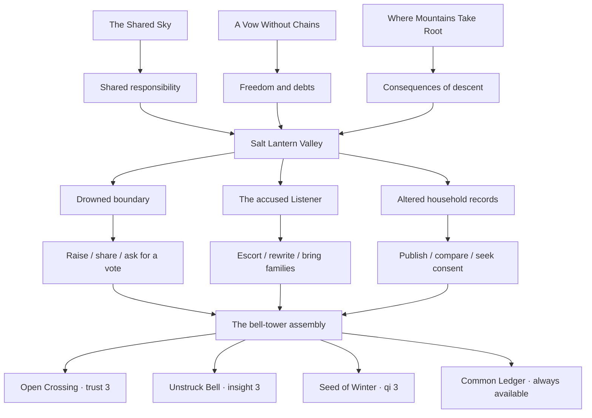
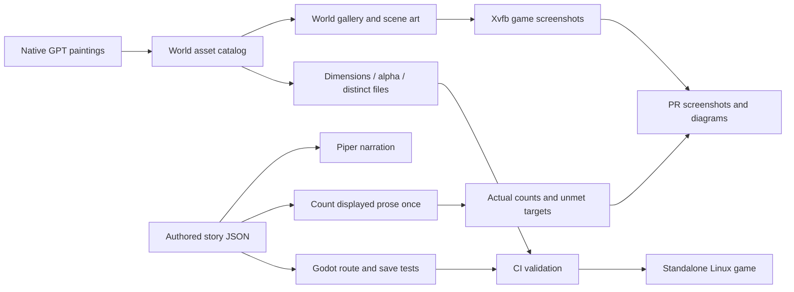

# Jade Vow expansion

## Delivered in this draft

- 102 playable scenes and 4,464 authored words (36 existing scenes plus 66 new scenes).
- Three Book I endings continue into Book II without losing stats or journal history.
- Three investigations, nine approaches, and four additional endings.
- One new painted environment at native 1672×941.
- One adult human NPC and one spirit beast, each at native 1024×1536 with alpha.
- A world art gallery and scene-specific backgrounds and portraits.
- Regression coverage for invalid choice transactions, stats over 100, settings corruption, and world UI.

These are exact delivered counts. This draft does **not** fulfill the requested 100 backgrounds, 100 human NPCs, 100 monsters, or a manuscript longer than one million words. An image-generation prompt is not a delivered asset. A plot outline, word budget, alternate playthrough, or repeated paragraph is not an authored word.

## Production target

The requested final manuscript must contain at least **1,000,001 displayed prose words**, counted once per authored scene. Choice captions, character biographies, README text, outlines, and the number of possible routes are excluded. The current counting convention is whitespace-delimited words, matching the opening's documented 931 words.

`python tools/validate_world.py` writes the actual inventory and manuscript size to `build/content_report.json`. Structural validation passes independently of the production target; a passing draft CI run does not mean the target is fulfilled.

Native image dimensions are recorded per asset. Keep the original generated file. Do not satisfy “highest possible resolution” by enlarging a smaller file, cropping many tiny atlas cells, or copying one drawing under multiple names.

## Campaign outline and budgets

The following twenty books have a combined **planned** budget of 1,020,000 words. These words have not been written. Budget alone does not satisfy the manuscript target.

| Book | Working title | Planned words | Central conflict |
|---|---|---:|---|
| I | The Star Beneath the Mountain | 51,000 | Consent and the captive star |
| II | The Valley That Kept Its Name | 51,000 | Shelter, records, and erasure |
| III | The River Without a Shore | 51,000 | A ferry carrying an exile's memories |
| IV | The Orchard of Unfinished Winters | 51,000 | Healing that transfers another person's pain |
| V | The City of Borrowed Faces | 51,000 | Identity sold as cultivation currency |
| VI | The Court Above the Rain | 51,000 | Immortal justice and mortal testimony |
| VII | The Thousand-Mile Funeral | 51,000 | Who may inherit a dead sect's vows |
| VIII | The Desert That Remembers Water | 51,000 | Restoring a river without erasing its new inhabitants |
| IX | The Library Beneath the Moon | 51,000 | A history that edits its readers |
| X | The Seven Unopened Gates | 51,000 | Guardians who can no longer refuse their duty |
| XI | The Sea of Returning Swords | 51,000 | Weapons seeking the lives they ended |
| XII | The Mountain of Small Gods | 51,000 | Worship, dependence, and chosen responsibility |
| XIII | The Winter Parliament | 51,000 | Beast clans and human villages sharing a refuge |
| XIV | The Hand That Unmade Heaven | 51,000 | The creator of the captive-star covenant |
| XV | The Republic of Wandering Souls | 51,000 | Dead citizens demanding a living vote |
| XVI | The Last Examination | 51,000 | Cultivation merit measured by sacrifice |
| XVII | The Storm That Asked Permission | 51,000 | A sentient calamity negotiating its arrival |
| XVIII | The Road Through Every Home | 51,000 | Companions' incompatible promises |
| XIX | The Sky We Could Not Carry | 51,000 | Limits to collective rescue |
| XX | A Vow Freely Left | 51,000 | Endings shaped by what each companion can refuse |

Each chapter must be individually written and edited, as requested. Each book also needs consequential branches, route continuity, character consistency, and reader-facing pacing before its word budget can be marked delivered. Future art must match the existing painted illustrations; scalable vector substitutes are outside the requested scope.

## Quest structure

## Content and review pipeline

## Bug fixes

- Validate a choice destination and every effect before changing stats or history.
- Use the same explicit integer ceiling for gameplay and save loading; saves above 100 are valid.
- Validate settings types and finite numeric values before applying sliders and toggles.
- Preserve journal prose literally rather than interpreting loaded text as BBCode.
- Allow the dialogue panel to scroll when longer prose wraps beyond its visible height.
- Give new speakers a default narration pace instead of failing on missing speaker timing.
- Position role labels after the measured speaker-name width so long names remain readable.
- Copy the animation formats actually produced by the renderer; the old animation JSON glob broke screenshot bundling.
- Refresh bundled review media when deterministic story, art, or runtime input hashes change, even when generated voice files are unchanged.
