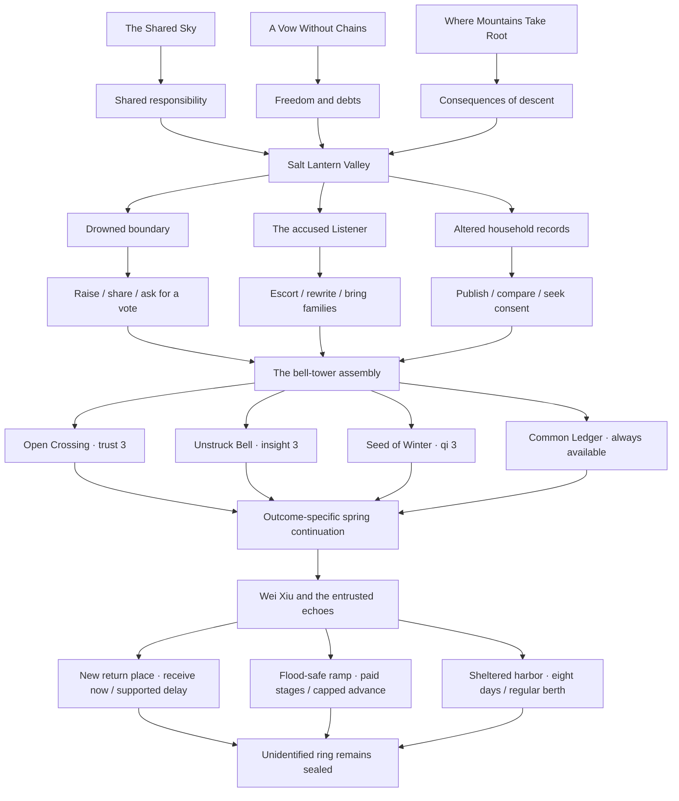
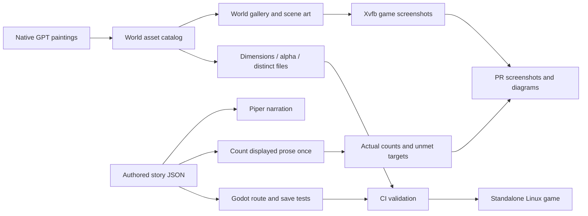

# Jade Vow expansion

## Delivered in this draft

- **1,137 playable scenes and 98,705 authored prose words** across six books.
- Book I: 36 scenes, 942 words, three endings.
- Book II: 73 scenes, 4,000 words, three investigations, nine approaches, four endings.
- Book III: 87 scenes, 5,332 words, four spring continuations, three river routes, six settlement approaches, three endings.
- Book IV: 38 scenes, 2,885 words, three investigations, four settlements, and route-specific river continuations.
- Book V: 119 scenes, 10,456 words, three investigations, four resolutions, and four orchard-outcome continuations.
- Book VI: 784 scenes, 75,090 words, four investigations with local choices, four remedies, and four city-outcome continuations.
- Seven original-scope painted backgrounds: five at native 1672×941 and the market and court terrace at native 1536×1024.
- 32 additional building-interior paintings preserved at their individual native sizes; [inventory](INTERIORS.md).
- Thirteen human NPCs and six spirit beasts at native 1024×1536 with alpha.
- Two inspectable item paintings: clapper at 1024×1536 and echo case at 1536×1024.
- Rain, reed light, soft bell ripples, and qi effects, paused by panels and stopped by reduced motion.
- Continuity ledger plus required-knowledge and safety checkpoints.
- Capture and narration pipelines cover all six books, with thirty-eight required viewport screenshots and standalone Linux playback checks.

These are exact delivered counts. This draft does **not** fulfill the requested original 100 backgrounds, 500 human NPCs, 501 spirit beasts, the extra 100 interior backgrounds, or a manuscript longer than one million words. An image-generation prompt is not a delivered asset. A plot outline, word budget, alternate playthrough, or repeated paragraph is not an authored word.

## Production target

The requested final manuscript must contain at least **1,000,001 displayed prose words**, counted once per authored scene. Choice captions, character biographies, README text, outlines, and the number of possible routes are excluded. The current counting convention is whitespace-delimited words, applied to the current scene text, including editorial revisions.

`python tools/validate_world.py` writes the actual inventory and manuscript size to `build/content_report.json`. Structural validation passes independently of the production target; a passing draft CI run does not mean the target is fulfilled. Run `python tools/validate_world.py --require-complete` to require all deliverables. The command writes the report and exits unsuccessfully while any quota remains unmet. The manually dispatched CI workflow exposes the same check through its `require_complete` input.

The continuation request adds **100 building-interior backgrounds** to the original 100 backgrounds: **200 backgrounds total**. Only paintings explicitly assigned to the `building_interiors` collection count toward the extra quota; those paintings do not also satisfy the original background quota. The existing valley archive remains part of the original five. Exact repeated scene prose is rejected instead of counted again.

The confirmed sprite target is **500 human portraits plus 501 spirit-beast portraits: 1,001 independent originals**. Native portrait resolution must be at least **1024×1536** (either canvas orientation); larger originals retain their returned dimensions. The image tool is asked for its highest native resolution. Enlargement does not qualify as added original detail. Outfit changes, gesture poses, recolors, mirrors, and atlas crops do not count as independent designs.

Native image dimensions and retained-source provenance are recorded per sprite. Decoded painting fingerprints reject reencoded copies, hidden RGB changes, and transparent padding. These checks supplement inspection of independent faces, silhouettes, costumes, anatomy, and painted details; they do not establish semantic originality alone. Keep the original generated file. Do not satisfy “highest possible resolution” by enlarging a smaller file, cropping many tiny atlas cells, or copying one drawing under multiple names.

## Campaign outline and budgets

The following twenty books have a combined **planned** budget of 1,020,000 words. These words have not been written. Budget alone does not satisfy the manuscript target.

| Book | Working title | Planned words | Central conflict |
|---|---|---:|---|
| I | The Star Beneath the Mountain | 51,000 | Consent and the captive star |
| II | The Valley That Kept Its Name | 51,000 | Shelter, records, and erasure |
| III | The River Without a Shore | 51,000 | A ferry carrying an exile's memories |
| IV | The Orchard of Unfinished Winters | 51,000 | Healing that transfers another person's pain |
| V | The City of Borrowed Faces | 51,000 | Identity sold as cultivation currency |
| VI | The Court Above the Rain | 51,000 | Immortal justice and mortal testimony |
| VII | The Furnace Beneath the Snow | 51,000 | A descent, damaged cultivation channels, and incompatible seed rescues |
| VIII | The Desert That Remembers Water | 51,000 | Restoring a river without erasing its new inhabitants |
| IX | The Library Beneath the Moon | 51,000 | A history that edits its readers |
| X | The Seven Unopened Gates | 51,000 | Guardians who can no longer refuse their duty |
| XI | The Sea of Returning Swords | 51,000 | Weapons seeking the lives they ended |
| XII | The Mountain of Small Gods | 51,000 | Worship, dependence, and chosen responsibility |
| XIII | The Winter Parliament | 51,000 | Beast clans and human villages sharing a refuge |
| XIV | The Hand That Unmade Heaven | 51,000 | The creator of the captive-star covenant |
| XV | The Republic of Wandering Souls | 51,000 | Dead citizens demanding a living vote |
| XVI | The Last Examination | 51,000 | Cultivation merit measured by sacrifice |
| XVII | The Storm That Asked Permission | 51,000 | A sentient calamity negotiating its arrival |
| XVIII | The Road Through Every Home | 51,000 | Companions' incompatible promises |
| XIX | The Sky We Could Not Carry | 51,000 | Limits to collective rescue |
| XX | A Vow Freely Left | 51,000 | Endings shaped by what each companion can refuse |

Each chapter must be individually written and edited, as requested. Each book also needs consequential branches, route continuity, character consistency, and reader-facing pacing before its word budget can be marked delivered. Future art must match the existing painted illustrations; scalable vector substitutes are outside the requested scope.

## Quest structure

## Content and review pipeline

## Bug fixes

- Validate a choice destination and every effect before changing stats or history.
- Use the same explicit integer ceiling for gameplay and save loading; saves above 100 are valid.
- Validate settings types and finite numeric values before applying sliders and toggles.
- Preserve journal prose literally rather than interpreting loaded text as BBCode.
- Allow the dialogue panel to scroll when longer prose wraps beyond its visible height.
- Give new speakers a default narration pace instead of failing on missing speaker timing.
- Position role labels after the measured speaker-name width so long names remain readable.
- Keep scene portraits below the navigation bar and above the footer throughout their bob; resizing a cached portrait updates its scale immediately.
- Copy the animation formats actually produced by the renderer; the old animation JSON glob broke screenshot bundling.
- Refresh bundled review media when deterministic story, art, or runtime input hashes change, even when generated voice files are unchanged.

## Continuity review

`data/continuity.json` records reviewed facts, chronology, custody, permissions, and intentional unresolved questions. It is updated with every delivered book. The validator checks that each required evidence or safety scene lies on every structural path to its named decision. Godot separately traverses the choices under stat gates.

Book II takes place in autumn; Book III begins the following spring on every settlement route. Only the release ending grounds Azure Cloud. Common valley art faces grounded ridges. Lin Yue retains the pendant. Wei Xiu is alive, and Su Lan's husband remains dead; erased household records do not erase or resurrect people.

River echoes are volunteered external copies, not missing pieces of minds. Three rings hold separate permissions. The unidentified owner is a deliberate unresolved question in all Book III endings; no route opens that echo to guess an identity. Each settlement makes continued care explicit.

These structural checks supplement an editorial reading of every new scene. They do not certify that every possible literary inconsistency has been eliminated.

The manuscript still needs **901,296** additional authored prose words to reach 1,000,001. The original art quotas still need **93 backgrounds, 487 human NPCs, and 495 spirit beasts**. The two item paintings are additional assets and do not count toward those quotas. The extra interior quota has 32 delivered paintings and 68 remaining. These future-campaign locations are available in the gallery; their existence does not claim that the remaining outlined books have been written.

## Book IV · delivered orchard chapter

Every river ending continues into the same spring while preserving its own echo-custody outcome. Ren Qiao and the Frostroot Hart have independent native portraits and appear in the chapter. Investigate the disconnected treatment circuit, listen to patients over a meal, or compare the winter allocation records. The other investigators report their findings before settlement. The Hart declines another exchange; its permission is separate from every human carrier's and patient's.

The inherited winter demand is removed while the safe closing rhythm remains. Choose a limited breathing trial, paid care rota, separate relief funding, or a reviewed pause with ordinary care. All four outcomes preserve injuries, resource limits, and individual choices. The unidentified third river ring remains sealed.

This delivered chapter adds **2,885** displayed words. It does not fulfill the book's planned 51,000-word budget. The current entire manuscript is **98,705** words, with **901,296** more required. Original sprite delivery is **19**, with **982** more required. The PR remains a draft until the full manuscript, 500/501 sprite allocation, and both background quotas pass production acceptance.

## Book V · delivered city chapter

All four orchard settlements continue during the same spring and preserve their staffing, practice, finance and review outcomes. The paid medicine-jar shipment is a new dispatch waiting on Tao Wen's frozen account, distinct from his earlier canceled fourth parcel. Mo Ran's case and the unidentified third river ring remain sealed.

The masks rent an outward face, permitted voice and temporary recognition use; they transfer no skill, mind, memory or personhood. Three investigations independently establish collar substitution and copied return marks, a director-signed conversion of rental permissions into name-proof collateral, and wax-source timing supported by an independently offered courier consignment. Material tests use two controls and permitted cloth fragments; original tags remain sealed.

The Porcelain Courser owns its dispatch ledger, permits watched and redacted relevant copying, and offers no automatic ride. The Glasswing Moth compares offered surfaces, preserves its workshop duties, and declines an additional hearing test. Certified registry corrections restore public proofs before all four settlements, leaving commercial charges on their own lines.

Choose a bounded credit bridge using existing volunteered hours, separate ledgers with paid checking, a limited worker licensing pool, or a dated audit of only the disputed batch. No route invents fuel, credit, compensation, debt forgiveness or criminal intent. Each ending receives a court request for the hearing record; each receives its own playable court continuation.

Book V adds **10,456 displayed prose words** and **119 scenes**, four independently generated humans, two spirit beasts and one original-scope market background. The entire manuscript is **98,705 words**, with **901,296** required. Sprite delivery is **13 humans + 6 spirit beasts = 19**, with **982** required. Original backgrounds are **7/100**; extra interiors are **32/100**. The PR remains a draft with production acceptance unmet.

## Verified orchard delivery

[PR CI](https://github.com/jgyy/octxian/actions/runs/37085436772) and [branch CI](https://github.com/jgyy/octxian/actions/runs/37085431753) passed on source commit `c7067d19`. Twenty Python tests pass; Godot reaches all 234 scenes and 14 endings across 19,159 capped states. Narration covers every scene. The native originals, alpha, provenance, decoded image fingerprints, continuity checkpoints, UI, 22 viewport captures, Linux export, and standalone playback pass. The two new portraits were also inspected in the actual rendered game.

The generated delivery report matches the audited totals: 13,159 words, 5 human originals, and 3 spirit-beast originals. It reports `complete: false`; draft test success is validation of delivered content and does not satisfy the full production targets.

## Verified city delivery

[PR CI](https://github.com/jgyy/octxian/actions/runs/37088518454) and [branch CI](https://github.com/jgyy/octxian/actions/runs/37088514107) passed on source commit `52d797ba`. Twenty Python tests pass; Godot reaches all **353 scenes and 18 endings** across **34,872** capped states. All **353** scenes have narration. Thirty actual viewport captures, Linux export, and standalone playback pass.

The new originals pass native resolution, alpha, retained-source provenance, file-hash and decoded-painting checks. All six new portraits and the settlement screen were inspected in the actual game: each has its own complete source design, transparent compositing, uniform fitting, readable speaker labels and visible gate summaries. The ungated audit stays available at zero attributes. Review media and narration are bundled in `662f134c`.

Independent acceptance review confirms **23,615** displayed prose words, **9** human originals, **5** beast originals, **6** original-scope backgrounds and **30** extra interiors. All **14** continuity checkpoints and **190** fact anchors are valid. The generated report still says `complete: false`; the full manuscript and artwork quotas remain unmet.

## Book VI · delivered court chapter

Four city outcomes retain their corrected public proofs and bounded commercial settlements. The cliff court stands on fixed foundations separate from Azure Cloud. An ordinary descending goods sling slipped two days before arrival; Bai Qun's landing/guide duties are separate from lift staff's brake and counterweight work. Du Heng's injured right shoulder remains under ordinary care.

Before investigation, a limited emergency rule suspends the disputed new assessment and record-based work bar while admitting corrected proofs. The physical goods lift remains closed. Assisted witness visits use independently supervised carrying chairs on a covered path. Authorized statements are read at the Day Three hearing; Bai's Day One and Du's Day Two visits do not imply another unpaid ascent.

Four teams investigate witness accounts, present rain-gauge and clock comparisons, access costs, and docket authority. Lin Yue follows one team; all share their bounded findings before resolution. Current observations do not reconstruct hidden historical causes. The Heron offers finite observations and one separately agreed safe message flight; it does not accept dangerous flight or indefinite duty. Earlier/corrected statements and copied sources remain distinguishable.

A ninety-six-copper access fund reserves sixty-four for specified baseline services, leaving thirty-two for exactly one remedy. Weather observations, local testimony, staged docket checks, and a limited remand have separate budgets, permissions, return dates and failure reports. Corrected rights and ordinary care do not depend on choosing a specialized remedy. The remand remains available at zero attributes.

This chapter adds **784 playable scenes and 75,090 authored words**. Four new humans and one new beast bring sprite delivery to **19**. The original court terrace and two extra interiors retain native **1536×1024** paintings. Portraits retain native **1024×1536 RGBA** paintings. The new modular loader and compressed narration support continued manuscript growth without duplicating scene prose or invalidating existing saves. Source validation and rendered acceptance are recorded separately when CI completes.
