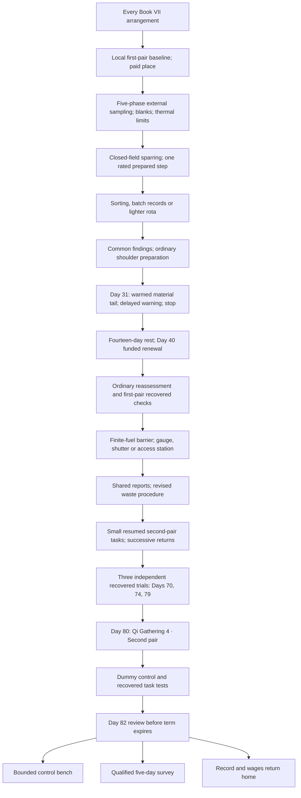

# Ash Bridge Foundry expansion

The continuation adds **299 playable scenes / 22,177 unique displayed words**, from every Book VII arrangement. Lin Yue arrives at Qi Gathering 3 and earns stage 4 through failed practice, recovery and independent tests. All word credit comes from playable node text.

## Cultivation and consequence

The refining lessons distinguish raw admission, compatible qi, useful output and loss. A sealed Foundation owner's fluid supplies an observation, never a shortcut to condensation. Ordinary sparring and one rated Reed-Step teach timing under the existing first pair, without sword aura or internal leg routes. Rest includes doubt, ordinary repair and controlled external observation, with no hidden advancement.

The six-contact comb compares five external phase wells and a sixth blank; it does not directly see a soul or open six meridians. Compatible quantity, conversion, rate, duration, warm-material behavior and delivery loss are distinct. Reference stones power external comparisons, while personal samples and route tasks debit personal reserve.

A material with a clean cool-condition return develops a long tail at ordinary cuff temperature. On Day Thirty-one, Lin Yue delays reporting for one breath, stops, receives ordinary checks and rests the unfinished route for fourteen days. A corrected material specification and independent first-pair recovery sequence precede resumption. Her paid six-week place renews on Day Forty, before expiry, through Day Eighty-four.

Stage four requires eighteen usable units after ordinary activity and sleep, at least 87% compatible charge, two paired routes carrying permitted quarter-unit tasks successively, full discharge and controlled interruption. Trials on Days Seventy, Seventy-four and Seventy-nine each require normal next-day sensation. Certification occurs on Day Eighty. The second arm pair opens no leg meridians, middle dantian, sword aura or great circuit.

Three work/recovery paths share the batch report before route practice. Three creature-defense stations share the fuel, shutter and worker reports before resumption. The voidglass centipede consumes trapped charge; a supported barrier uses separate finite sockets under Su Yan's ninth-stage control. Its shed plate remains an externally tested specimen, never a breakthrough prize.

All three final outcomes preserve stage four. Furnace commands need task-specific tests and separate fuel. Survey work preserves ordinary travel limits. The home route preserves the mother's lasting cultivation cost; her daughter's advancement restores neither the old damaged route nor lost years.

## Native artwork

Nine independent native generations are retained, without enlargement:

| Master | Native size |
|---|---|
| ash_bridge_foundry.png | 1536×1024 |
| su_yan.png | 1024×1536 RGBA |
| voidglass_centipede.png | 1024×1536 RGBA |
| phase_comb.png | 1024×1536 RGBA |
| second_pair_trace.png | 1536×1024 RGBA |
| zhen.png | 1024×1536 RGBA |
| phase_comparison_room.png | 1536×1024 |
| west_kiln_home.png | 1536×1024 |
| yue_mother.png | 1024×1536 RGBA |

[Creation provenance](../assets/art/CULTIVATION_PROVENANCE.md) records each design. The image tool exposes no resolution parameter; prompts requested maximum native detail, and these are the actual returned dimensions. Effects are excluded from sprite quotas.

## Verification

Six Python regressions guard common continuation, independent certification, shared branch findings, recovery, all three formal trials and ungated final options. Godot checks the new participants, environments, fourth-stage label, inspectable comb and effect pause/reduced-motion behavior. CI renders fifty-nine actual viewport captures, including ten new foundry/home/comb views.

The merged-data audit checks unique prose, at most one hundred words per scene, all references, 148 anchored facts and 45 required checkpoints. **1,905 scenes and 28 endings remain reachable across 177,034 capped attribute states.** Final CI and media evidence are linked in draft PR #3.

Whole campaign: **160,095 words**. Credited cultivation recast: **41,982 words / 599 scenes**. Inherited prose awaiting recast: **118,113 words**. The strict target is **1,000,001 words**; **839,906 displayed words** or **958,019 recast words** remain. This is a completed chapter toward that unfinished production goal.
