# Playable million-word continuation

The campaign now has **1,135,382 displayed prose words, 12,831 reachable scenes and 17 books**. The [2026-10-05 narrative revision](NARRATIVE_REVISION_20261005.md) added 2,027 words in 24 scenes, six harder decisions, 101 additional causality repairs and three Bitter Wells originals.

The [existing-volume expansion](EXISTING_VOLUME_EXPANSION_20261005.md) then adds 8,630 words and 110 passages with eighteen branch outcomes, six native character/creature sprites and another 100 authenticated reward-timing sites. The two 2026-10-05 reward audits cover 201 sites of one recurring causality defect.

The 2026-10-04 integration reached 1,124,725 words. Previously playable: 190,875 words. This integrates 930,652 previously stored draft words and adds 3,198 new words in 46 closing scenes. Only playable node text counts, including alternative branches. One journey does not display every branch.

The manuscript exceeds the original strict 1,000,001-word target. The current requested total is 2,000,000 words, with 864,618 further words required. The independent art quotas remain unfinished: 55 human originals, 15 spirit-beast originals, 31 original environments and 41 extra interiors.

| Book | Playable scenes | Displayed prose words |
|---|---:|---:|
| BOOK I · The first retained breath | 114 | 7,725 |
| BOOK II · The valley that kept its name | 204 | 12,368 |
| BOOK III · The river without a shore | 89 | 5,648 |
| BOOK IV · The orchard of unfinished winters | 38 | 2,937 |
| BOOK V · The city of borrowed faces | 119 | 10,368 |
| BOOK VI · The court above the rain | 784 | 74,932 |
| BOOK VII · The circle that kept a crossing | 258 | 24,045 |
| BOOK VIII · The furnace beneath the ash bridge | 299 | 22,218 |
| BOOK IX · The ridge that changed its answer | 94 | 6,017 |
| BOOK X · The storm that signed twice | 159 | 11,961 |
| BOOK XI · Water for the names that stayed | 177 | 12,656 |
| BOOK XII · The Canal That Could Not Be Sold | 1,909 | 169,058 |
| BOOK XIII · The Forest With Two Winters | 1,825 | 154,847 |
| BOOK XIV · The Harbor of Unclaimed Names | 1,679 | 159,777 |
| BOOK XV · The Kiln That Kept Its Ashes | 1,709 | 165,209 |
| BOOK XVI · The Road Beneath the Salt | 1,802 | 150,984 |
| BOOK XVII · The Archive of Ordinary Rain | 1572 | 144,632 |

## Repairs

[Source-anchored audit](CONTINUITY_REPAIRS_20261004.json) fixes **101 identified sites**: 95 choice-causality defects (92 rewards deferred until completed work; three rewards removed from future preferences), three missing closing sequences and three absent salt-to-canal continuations. These are individually evidenced sites, not 101 independent engine bugs. New scenes, missing speaker definitions, art and presentation changes are excluded from that count. Source: `a90350672fb0468b72fc176b22f3e3876c95febc`.

The timing defect previously granted practice on choosing to perform a task. Han's loan history and Bao's gate diagram could even condition tissue without bodily work. Completed-task rewards now follow actual branch completion, use the appropriate capacity and cannot be farmed by revisiting or reloading. Choosing a hoped-for kiln teacher grants no practice while that teacher remains hypothetical.

| Repair | Existing scene | Issue and correction |
|---|---|---|
| CAUSE-001 | canal_p01_021 · option 1 | Selecting "Walk the household towpath with Tian Min." previously awarded trust before the task took place. Award only on leaving canal_p01_029, after its account of the completed work. The reward represents the performed practice, not acceptance of a promise. |
| CAUSE-002 | canal_p01_021 · option 2 | Selecting "Compare the boundary marks with Luo Zhen." previously awarded insight before the task took place. Award only on leaving canal_p01_037, after its account of the completed work. The reward represents the performed practice, not acceptance of a promise. |
| CAUSE-003 | canal_p01_021 · option 3 | Selecting "Hear Han Shou's surviving loan history." previously awarded resolve before the task took place. Award only on leaving canal_p01_045, after its account of the completed work. This task develops source comparison rather than recovered bodily conditioning. |
| CAUSE-004 | canal_p01_071 · option 1 | Selecting "Help Tian prepare the household reading." previously awarded trust before the task took place. Award only on leaving canal_p01_072, after its account of the completed work. The reward represents the performed practice, not acceptance of a promise. |
| CAUSE-005 | canal_p01_071 · option 2 | Selecting "Help Pei Fen distinguish her memories and surviving entries." previously awarded insight before the task took place. Award only on leaving canal_p01_073, after its account of the completed work. The reward represents the performed practice, not acceptance of a promise. |
| CAUSE-006 | canal_p01_071 · option 3 | Selecting "Help Bao present the gate's physical defect." previously awarded resolve before the task took place. Award only on leaving canal_p01_074, after its account of the completed work. This task develops source comparison rather than recovered bodily conditioning. |
| CAUSE-007 | canal_p02_029 · option 1 | Selecting "Help preserve and compare the household receipt." previously awarded insight before the task took place. Award only on leaving canal_p02_039, after its account of the completed work. The reward represents the performed practice, not acceptance of a promise. |
| CAUSE-008 | canal_p02_029 · option 2 | Selecting "Help Bao move and repair the ordinary drying rack." previously awarded resolve before the task took place. Award only on leaving canal_p02_049, after its account of the completed work. The reward represents the performed practice, not acceptance of a promise. |
| CAUSE-009 | canal_p02_029 · option 3 | Selecting "Inspect the towline's contact path with Luo." previously awarded trust before the task took place. Award only on leaving canal_p02_059, after its account of the completed work. The reward represents the performed practice, not acceptance of a promise. |
| CAUSE-010 | canal_p03_029 · option 1 | Selecting "Inspect the private crane supports with Bao." previously awarded resolve before the task took place. Award only on leaving canal_p03_039, after its account of the completed work. This task develops source comparison rather than recovered bodily conditioning. |
| CAUSE-011 | canal_p03_029 · option 2 | Selecting "Compare the offered toll-book pages with An Ru." previously awarded insight before the task took place. Award only on leaving canal_p03_049, after its account of the completed work. The reward represents the performed practice, not acceptance of a promise. |
| CAUSE-012 | canal_p03_029 · option 3 | Selecting "Help Tian clarify the private workers' wages and shifts." previously awarded trust before the task took place. Award only on leaving canal_p03_059, after its account of the completed work. The reward represents the performed practice, not acceptance of a promise. |
| CAUSE-013 | canal_p04_029 · option 1 | Selecting "Trace completed household labor and its receiving references." previously awarded trust before the task took place. Award only on leaving canal_p04_039, after its account of the completed work. The reward represents the performed practice, not acceptance of a promise. |
| CAUSE-014 | canal_p04_029 · option 2 | Selecting "Compare the cash payments and returned-timber credit." previously awarded insight before the task took place. Award only on leaving canal_p04_049, after its account of the completed work. The reward represents the performed practice, not acceptance of a promise. |
| CAUSE-015 | canal_p04_029 · option 3 | Selecting "Align the public plan with Luo's current boundary observations." previously awarded resolve before the task took place. Award only on leaving canal_p04_059, after its account of the completed work. This task develops source comparison rather than recovered bodily conditioning. |
| CAUSE-016 | canal_p05_029 · option 1 | Selecting "Carry the corrections to households" previously awarded trust before the task took place. Award only on leaving canal_p05_039, after its account of the completed work. The reward represents the performed practice, not acceptance of a promise. |
| CAUSE-017 | canal_p05_029 · option 2 | Selecting "Inspect the drain with Bao" previously awarded resolve before the task took place. Award only on leaving canal_p05_049, after its account of the completed work. This task develops source comparison rather than recovered bodily conditioning. |
| CAUSE-018 | canal_p05_029 · option 3 | Selecting "Compare the receiving references with Pei" previously awarded insight before the task took place. Award only on leaving canal_p05_059, after its account of the completed work. The reward represents the performed practice, not acceptance of a promise. |
| CAUSE-019 | canal_p06_029 · option 1 | Selecting "Help Bao fit the replacement cap." previously awarded resolve before the task took place. Award only on leaving canal_p06_039, after its account of the completed work. The reward represents the performed practice, not acceptance of a promise. |
| CAUSE-020 | canal_p06_029 · option 2 | Selecting "Walk the passage notices with Luo." previously awarded trust before the task took place. Award only on leaving canal_p06_049, after its account of the completed work. The reward represents the performed practice, not acceptance of a promise. |
| CAUSE-021 | canal_p06_029 · option 3 | Selecting "Sort the removed materials with Tian." previously awarded insight before the task took place. Award only on leaving canal_p06_059, after its account of the completed work. The reward represents the performed practice, not acceptance of a promise. |
| CAUSE-022 | canal_p07_029 · option 1 | Selecting "Match actual toll entries with Luo." previously awarded insight before the task took place. Award only on leaving canal_p07_039, after its account of the completed work. The reward represents the performed practice, not acceptance of a promise. |
| CAUSE-023 | canal_p07_029 · option 2 | Selecting "Compare upkeep costs and changed jobs with Bao." previously awarded trust before the task took place. Award only on leaving canal_p07_049, after its account of the completed work. The reward represents the performed practice, not acceptance of a promise. |
| CAUSE-024 | canal_p07_029 · option 3 | Selecting "Read Han's proposed private broker terms." previously awarded resolve before the task took place. Award only on leaving canal_p07_059, after its account of the completed work. This task develops source comparison rather than recovered bodily conditioning. |
| CAUSE-025 | canal_p08_029 · option 1 | Selecting "Carry the amended decisions with Han." previously awarded resolve before the task took place. Award only on leaving canal_p08_039, after its account of the completed work. This task develops source comparison rather than recovered bodily conditioning. |
| CAUSE-026 | canal_p08_029 · option 2 | Selecting "Arrange the actual loss-review visits." previously awarded insight before the task took place. Award only on leaving canal_p08_049, after its account of the completed work. The reward represents the performed practice, not acceptance of a promise. |
| CAUSE-027 | canal_p08_029 · option 3 | Selecting "Help Tian invite present paid workers." previously awarded trust before the task took place. Award only on leaving canal_p08_059, after its account of the completed work. The reward represents the performed practice, not acceptance of a promise. |
| CAUSE-028 | canal_p09_029 · option 1 | Selecting "Check the stop's witness marks with Bao." previously awarded insight before the task took place. Award only on leaving canal_p09_039, after its account of the completed work. The reward represents the performed practice, not acceptance of a promise. |
| CAUSE-029 | canal_p09_029 · option 2 | Selecting "Walk the altered retreat notices with Luo." previously awarded resolve before the task took place. Award only on leaving canal_p09_049, after its account of the completed work. The reward represents the performed practice, not acceptance of a promise. |
| CAUSE-030 | canal_p09_029 · option 3 | Selecting "Finish actual worker handovers with Tian." previously awarded trust before the task took place. Award only on leaving canal_p09_059, after its account of the completed work. The reward represents the performed practice, not acceptance of a promise. |
| CAUSE-031 | canal_p10_029 · option 1 | Selecting "Perform the prepared side-drain response, then rebook the test." previously awarded resolve before the task took place. Award only on leaving canal_p10_039, after its account of the completed work. The reward represents the performed practice, not acceptance of a promise. |
| CAUSE-032 | canal_p10_029 · option 2 | Selecting "Hold the feed closed and compare the gauge from stable ground." previously awarded insight before the task took place. Award only on leaving canal_p10_049, after its account of the completed work. The reward represents the performed practice, not acceptance of a promise. |
| CAUSE-033 | canal_p10_029 · option 3 | Selecting "End live work today and examine the emptied pocket." previously awarded trust before the task took place. Award only on leaving canal_p10_059, after its account of the completed work. The reward represents the performed practice, not acceptance of a promise. |
| CAUSE-034 | canal_p11_029 · option 1 | Selecting "Examine the household cut with Bao." previously awarded insight before the task took place. Award only on leaving canal_p11_039, after its account of the completed work. The reward represents the performed practice, not acceptance of a promise. |
| CAUSE-035 | canal_p11_029 · option 2 | Selecting "Walk the occupied lower hollow with Luo." previously awarded resolve before the task took place. Award only on leaving canal_p11_049, after its account of the completed work. The reward represents the performed practice, not acceptance of a promise. |
| CAUSE-036 | canal_p11_029 · option 3 | Selecting "Hear the aunt's offered receiving history." previously awarded trust before the task took place. Award only on leaving canal_p11_059, after its account of the completed work. The reward represents the performed practice, not acceptance of a promise. |
| CAUSE-037 | canal_p12_029 · option 1 | Selecting "Check the nearer warning call with Luo." previously awarded trust before the task took place. Award only on leaving canal_p12_039, after its account of the completed work. The reward represents the performed practice, not acceptance of a promise. |
| CAUSE-038 | canal_p12_029 · option 2 | Selecting "Compare the repaired crossing with Bao." previously awarded insight before the task took place. Award only on leaving canal_p12_049, after its account of the completed work. The reward represents the performed practice, not acceptance of a promise. |
| CAUSE-039 | canal_p12_029 · option 3 | Selecting "Carry the family-approved attribution copies." previously awarded resolve before the task took place. Award only on leaving canal_p12_059, after its account of the completed work. The reward represents the performed practice, not acceptance of a promise. |
| CAUSE-040 | canal_p13_029 · option 1 | Selecting "Check the covered control path with Jiang." previously awarded insight before the task took place. Award only on leaving canal_p13_039, after its account of the completed work. The reward represents the performed practice, not acceptance of a promise. |
| CAUSE-041 | canal_p13_029 · option 2 | Selecting "Compare actual weather messages with Luo." previously awarded resolve before the task took place. Award only on leaving canal_p13_049, after its account of the completed work. This task develops source comparison rather than recovered bodily conditioning. |
| CAUSE-042 | canal_p13_029 · option 3 | Selecting "Walk the lit ground route with the road crew." previously awarded trust before the task took place. Award only on leaving canal_p13_059, after its account of the completed work. The reward represents the performed practice, not acceptance of a promise. |
| CAUSE-043 | canal_p14_029 · option 1 | Selecting "Complete the small release under Jiang's supervision." previously awarded insight before the task took place. Award only on leaving canal_p14_039, after its account of the completed work. The supervised bounded release develops control, without adding fuel or a realm. |
| CAUSE-044 | canal_p14_029 · option 2 | Selecting "Follow the ground observers as they move higher." previously awarded resolve before the task took place. Award only on leaving canal_p14_049, after its account of the completed work. The reward represents the performed practice, not acceptance of a promise. |
| CAUSE-045 | canal_p14_029 · option 3 | Selecting "Deliver the actual closure to shelter receivers." previously awarded trust before the task took place. Award only on leaving canal_p14_059, after its account of the completed work. The reward represents the performed practice, not acceptance of a promise. |
| CAUSE-046 | canal_p15_029 · option 1 | Selecting "Inspect the house approach and private outlet." previously awarded trust before the task took place. Award only on leaving canal_p15_039, after its account of the completed work. The reward represents the performed practice, not acceptance of a promise. |
| CAUSE-047 | canal_p15_029 · option 2 | Selecting "Map the gardener's actual visible loss." previously awarded resolve before the task took place. Award only on leaving canal_p15_049, after its account of the completed work. This task develops source comparison rather than recovered bodily conditioning. |
| CAUSE-048 | canal_p15_029 · option 3 | Selecting "Finish the wet apparatus handover with Jiang." previously awarded insight before the task took place. Award only on leaving canal_p15_059, after its account of the completed work. The reward represents the performed practice, not acceptance of a promise. |
| CAUSE-049 | canal_p16_029 · option 1 | Selecting "Compare offered losses with current observations." previously awarded trust before the task took place. Award only on leaving canal_p16_039, after its account of the completed work. The reward represents the performed practice, not acceptance of a promise. |
| CAUSE-050 | canal_p16_029 · option 2 | Selecting "Assemble the separate grain receiving account." previously awarded insight before the task took place. Award only on leaving canal_p16_049, after its account of the completed work. The reward represents the performed practice, not acceptance of a promise. |
| CAUSE-051 | canal_p16_029 · option 3 | Selecting "Prepare Han's limited private responsibility and delivery record." previously awarded resolve before the task took place. Award only on leaving canal_p16_059, after its account of the completed work. This task develops source comparison rather than recovered bodily conditioning. |
| CAUSE-052 | canal_p17_029 · option 1 | Selecting "Deliver the future operating handover with Luo." previously awarded insight before the task took place. Award only on leaving canal_p17_039, after its account of the completed work. The reward represents the performed practice, not acceptance of a promise. |
| CAUSE-053 | canal_p17_029 · option 2 | Selecting "Carry bounded loss findings to their claimants." previously awarded trust before the task took place. Award only on leaving canal_p17_049, after its account of the completed work. The reward represents the performed practice, not acceptance of a promise. |
| CAUSE-054 | canal_p17_029 · option 3 | Selecting "Compare Han's refund authority and release." previously awarded resolve before the task took place. Award only on leaving canal_p17_059, after its account of the completed work. This task develops source comparison rather than recovered bodily conditioning. |
| CAUSE-055 | canal_p18_029 · option 1 | Selecting "Walk the warning receivers with Luo Zhen." previously awarded resolve before the task took place. Award only on leaving canal_p18_039, after its account of the completed work. The reward represents the performed practice, not acceptance of a promise. |
| CAUSE-056 | canal_p18_029 · option 2 | Selecting "Witness Pei Fen's reserve examination." previously awarded insight before the task took place. Award only on leaving canal_p18_049, after its account of the completed work. The reward represents the performed practice, not acceptance of a promise. |
| CAUSE-057 | canal_p18_029 · option 3 | Selecting "Help Tian Min prepare the sail sample." previously awarded trust before the task took place. Award only on leaving canal_p18_059, after its account of the completed work. The reward represents the performed practice, not acceptance of a promise. |
| CAUSE-058 | canal_p19_029 · option 1 | Selecting "Walk the repaired warning route with Luo Zhen." previously awarded resolve before the task took place. Award only on leaving canal_p19_039, after its account of the completed work. The reward represents the performed practice, not acceptance of a promise. |
| CAUSE-059 | canal_p19_029 · option 2 | Selecting "Witness the dry apparatus receiving." previously awarded insight before the task took place. Award only on leaving canal_p19_049, after its account of the completed work. The reward represents the performed practice, not acceptance of a promise. |
| CAUSE-060 | canal_p19_029 · option 3 | Selecting "Clear the private storage corner by agreement." previously awarded trust before the task took place. Award only on leaving canal_p19_059, after its account of the completed work. The reward represents the performed practice, not acceptance of a promise. |
| CAUSE-061 | canal_p20_029 · option 1 | Selecting "Help Pei Fen settle the finite winter record appointment." previously awarded insight before the task took place. Award only on leaving canal_p20_039, after its account of the completed work. The reward represents the performed practice, not acceptance of a promise. |
| CAUSE-062 | canal_p20_029 · option 2 | Selecting "Accompany Bao Jun to his ordinary recovery review." previously awarded trust before the task took place. Award only on leaving canal_p20_049, after its account of the completed work. The reward represents the performed practice, not acceptance of a promise. |
| CAUSE-063 | canal_p20_029 · option 3 | Selecting "Check the booked orchard journey with the passage agent." previously awarded resolve before the task took place. Award only on leaving canal_p20_059, after its account of the completed work. This task develops source comparison rather than recovered bodily conditioning. |
| CAUSE-064 | canal_p21_029 · option 1 | Selecting "Witness the private workboat's safe removal." previously awarded resolve before the task took place. Award only on leaving canal_p21_039, after its account of the completed work. This task develops source comparison rather than recovered bodily conditioning. |
| CAUSE-065 | canal_p21_029 · option 2 | Selecting "Compare the route and the tenant's receiving map." previously awarded insight before the task took place. Award only on leaving canal_p21_049, after its account of the completed work. The reward represents the performed practice, not acceptance of a promise. |
| CAUSE-066 | canal_p21_029 · option 3 | Selecting "Walk the usable winter alternative with Luo Zhen." previously awarded trust before the task took place. Award only on leaving canal_p21_059, after its account of the completed work. The reward represents the performed practice, not acceptance of a promise. |
| CAUSE-067 | canal_p22_029 · option 1 | Selecting "Read the households' contribution agreements before payment." previously awarded trust before the task took place. Award only on leaving canal_p22_039, after its account of the completed work. The reward represents the performed practice, not acceptance of a promise. |
| CAUSE-068 | canal_p22_029 · option 2 | Selecting "Compare the charter with the completed labor annex." previously awarded resolve before the task took place. Award only on leaving canal_p22_049, after its account of the completed work. This task develops source comparison rather than recovered bodily conditioning. |
| CAUSE-069 | canal_p22_029 · option 3 | Selecting "Check the bounded upstream findings and penalty receipt." previously awarded insight before the task took place. Award only on leaving canal_p22_059, after its account of the completed work. The reward represents the performed practice, not acceptance of a promise. |
| CAUSE-070 | canal_p23_029 · option 1 | Selecting "Attend Tian Min's actual sail fitting as her friend." previously awarded trust before the task took place. Award only on leaving canal_p23_039, after its account of the completed work. The reward represents the performed practice, not acceptance of a promise. |
| CAUSE-071 | canal_p23_029 · option 2 | Selecting "Visit Bao Jun for his sitting lesson and recovery review." previously awarded resolve before the task took place. Award only on leaving canal_p23_049, after its account of the completed work. This task develops source comparison rather than recovered bodily conditioning. |
| CAUSE-072 | canal_p23_029 · option 3 | Selecting "Hear the private family page Han Shou chooses to share." previously awarded insight before the task took place. Award only on leaving canal_p23_059, after its account of the completed work. The reward represents the performed practice, not acceptance of a promise. |
| CAUSE-073 | canal_p24_045 · option 1 | Selecting "Finish the public comparison copies and their receiving." previously awarded insight before the task took place. Award only on leaving canal_end_public, after its account of the completed work. The reward represents the performed practice, not acceptance of a promise. |
| CAUSE-074 | canal_p24_045 · option 2 | Selecting "Leave a clear dry fault index with the actual workshop keepers." previously awarded resolve before the task took place. Award only on leaving canal_end_repair, after its account of the completed work. This task develops source comparison rather than recovered bodily conditioning. |
| CAUSE-075 | canal_p24_045 · option 3 | Selecting "Take the priced brief west-kiln home stop on the booked road." previously awarded trust before the task took place. Award only on leaving canal_end_home, after its account of the completed work. The reward represents the performed practice, not acceptance of a promise. |
| CAUSE-076 | forest_04_001 · option 1 | Selecting "Work with the buyers and examine the terms people signed." previously awarded insight before the task took place. Award only on leaving forest_04_buyer_040, after its account of the completed work. The reward represents the performed practice, not acceptance of a promise. |
| CAUSE-077 | forest_04_001 · option 2 | Selecting "Follow Wen to the upper stand and inspect the winter road." previously awarded insight before the task took place. Award only on leaving forest_04_trail_040, after its account of the completed work. The reward represents the performed practice, not acceptance of a promise. |
| CAUSE-078 | forest_13_008 · option 1 | Selecting "Recommend the paid upper haul, giving the Harts a wider continuous passage." previously awarded insight before the task took place. Award only on leaving forest_13_upper_030, after its account of the completed work. The reward represents the performed practice, not acceptance of a promise. |
| CAUSE-079 | forest_13_008 · option 2 | Selecting "Recommend watched crossing windows, keeping the shorter route shared." previously awarded insight before the task took place. Award only on leaving forest_13_bank_030, after its account of the completed work. The reward represents the performed practice, not acceptance of a promise. |
| CAUSE-080 | forest_16_010 · option 1 | Selecting "Keep the warnings and route signals clear at the message station." previously awarded insight before the task took place. Award only on leaving forest_16_signal_027, after its account of the completed work. The reward represents the performed practice, not acceptance of a promise. |
| CAUSE-081 | forest_16_010 · option 2 | Selecting "Work the water handoff line under its supply supervisor." previously awarded insight before the task took place. Award only on leaving forest_16_water_027, after its account of the completed work. The reward represents the performed practice, not acceptance of a promise. |
| CAUSE-082 | forest_21_010 · option 1 | Selecting "Recommend the raised lower footway and its funded maintenance term." previously awarded insight before the task took place. Award only on leaving forest_21_footway_025, after its account of the completed work. The reward represents the performed practice, not acceptance of a promise. |
| CAUSE-083 | forest_21_010 · option 2 | Selecting "Recommend upper improvements and ten weeks of staffed lower assistance." previously awarded insight before the task took place. Award only on leaving forest_21_assistance_025, after its account of the completed work. The reward represents the performed practice, not acceptance of a promise. |
| CAUSE-084 | harbor_p03_030 · option 1 | Selecting "Work beside Han Pei at the comparison table." previously awarded insight before the task took place. Award only on leaving harbor_p03_034, after its account of the completed work. The reward represents the performed practice, not acceptance of a promise. |
| CAUSE-085 | harbor_p03_030 · option 2 | Selecting "Take Yan Su's dry work line." previously awarded insight before the task took place. Award only on leaving harbor_p03_038, after its account of the completed work. The reward represents the performed practice, not acceptance of a promise. |
| CAUSE-086 | harbor_p03_030 · option 3 | Selecting "Stand with He Ming at the claimant queue." previously awarded insight before the task took place. Award only on leaving harbor_p03_042, after its account of the completed work. The reward represents the performed practice, not acceptance of a promise. |
| CAUSE-087 | harbor_p12_012 · option 1 | Selecting "Listen beside Han at the office help table." previously awarded insight before the task took place. Award only on leaving harbor_p12_018, after its account of the completed work. The reward represents the performed practice, not acceptance of a promise. |
| CAUSE-088 | harbor_p12_012 · option 2 | Selecting "Take the mobile collection route across the inner water." previously awarded insight before the task took place. Award only on leaving harbor_p12_024, after its account of the completed work. The reward represents the performed practice, not acceptance of a promise. |
| CAUSE-089 | harbor_p12_012 · option 3 | Selecting "Receive questions beside Yan's dry work line." previously awarded insight before the task took place. Award only on leaving harbor_p12_030, after its account of the completed work. The reward represents the performed practice, not acceptance of a promise. |
| CAUSE-090 | harbor_final_choice · option 1 | Selecting "Recommend the registry and its checked receiving index." previously awarded insight before the task took place. Award only on leaving harbor_end_registry, after its account of the completed work. The reward represents the performed practice, not acceptance of a promise. |
| CAUSE-091 | harbor_final_choice · option 2 | Selecting "Recommend repair and independently checked fittings." previously awarded insight before the task took place. Award only on leaving harbor_end_repair, after its account of the completed work. The reward represents the performed practice, not acceptance of a promise. |
| CAUSE-092 | harbor_final_choice · option 3 | Selecting "Recommend road visits with permitted returning replies." previously awarded insight before the task took place. Award only on leaving harbor_end_road, after its account of the completed work. The reward represents the performed practice, not acceptance of a promise. |
| CAUSE-093 | kiln_final_choice · option 1 | The preference "Seek further qualified instruction when the next town offers a real opportunity." awards practice before any new teacher, reader or map investigation exists. The ending explicitly leaves that future opportunity unaccepted; remove the reward. |
| CAUSE-094 | kiln_final_choice · option 2 | The preference "Begin with the permitted shared craft account and an actual reader." awards practice before any new teacher, reader or map investigation exists. The ending explicitly leaves that future opportunity unaccepted; remove the reward. |
| CAUSE-095 | kiln_final_choice · option 3 | The preference "Begin with the road's water, work and map questions." awards practice before any new teacher, reader or map investigation exists. The ending explicitly leaves that future opportunity unaccepted; remove the reward. |
| TRANSITION-forest | forest_23_075 | The prior passage promised further closing work and linked to a nonexistent next scene. Supply the actual receiving, paid closure and departure before the next book; preserve stage, custody and local unresolved work. |
| TRANSITION-desert | desert_p23_084 | The prior passage promised further closing work and linked to a nonexistent next scene. Supply the actual receiving, paid closure and departure before the next book; preserve stage, custody and local unresolved work. |
| TRANSITION-archive | archive_24_060 | The prior passage promised further closing work and linked to a nonexistent next scene. Supply the scheduled lesson, paid reading and final receiving before selecting one next post or the ordinary road home; preserve stage, custody and local unresolved work. |
| TRANSITION-salt_end_rotation | salt_end_rotation | This completed salt-road outcome had no continuation, making its authored outcome-specific canal opening unreachable. Preserve its original prose and direct it to the matching opening. |
| TRANSITION-salt_end_maintenance | salt_end_maintenance | This completed salt-road outcome had no continuation, making its authored outcome-specific canal opening unreachable. Preserve its original prose and direct it to the matching opening. |
| TRANSITION-salt_end_purchase | salt_end_purchase | This completed salt-road outcome had no continuation, making its authored outcome-specific canal opening unreachable. Preserve its original prose and direct it to the matching opening. |

## Closing sequences and attributes

Forest closure receives housing and food, completes the booked home visit and return before the seventh-day receiving, and settles tools and wages before a separate harbor departure. Desert closure returns the commission equipment and leaves the guide's actual settlement and clinical care with their local recipients before the northbound application. Archive closure performs the scheduled school lesson and Sun's paid two-sitting reading before the last handover and one possible next post. The new school allocation spends 3 + 2 and retains 5, without reopening the earlier purse.

Each new final decision offers four separately authored trained roles at 10 points, plus qualified support without a gate. Control leads bounded instrument work; comprehension leads source comparison; physique leads cleared ordinary movement; Dao Heart keeps a difficult finite commitment. Outcomes change Lin's role and future work. Scores do not create fuel, heal an injury, award a realm or purchase another person's permission.

```mermaid
flowchart LR
  Salt["Three retained salt outcomes"] --> Canal["XII · canal"]
  Canal --> Forest["XIII · forest + actual closure"]
  Forest --> Harbor["XIV · harbor"]
  Harbor --> Kiln["XV · kiln · earned fifth stage"]
  Kiln --> Desert["XVI · desert + actual closure"]
  Desert --> Archive["XVII · archive + actual closure"]
  Archive --> Choice["Four trained roles / qualified support"]
  Choice --> Finish["One selected future · local obligations retained"]
```



```mermaid
sequenceDiagram
  participant Reader
  participant State
  participant Save
  Reader->>State: Choose task
  State->>State: Change scene; no premature reward
  Reader->>State: Read and complete branch
  State->>State: Validate earned credit on departure
  State->>State: Award once and record completion
  State->>Save: Persist scores and completed-practice IDs
  Save-->>State: Restore together after full validation
  Reader->>State: Revisit completed passage
  State-->>Reader: Preserve existing score
```

## Review media and validation

Six new actual viewport captures show forest and archive ensembles, the independent Lanternwing Crane, desert attribute roles, the new native courtyard painting and Lan Fen's maintenance scene. The capture verifier includes them in the measured report. Native originals retain returned PNG bytes: a 1536×1024 courtyard, a 1024×1536 transparent crane and a 1024×1536 transparent lantern keeper.

Run `python -m tools.validate_million_continuation --verify-source` with the fixed source commit available locally. This compares the exact original choices and transitions using Git and verifies completion anchors, uniqueness, connectivity and manuscript credit. Full CI also runs the existing Python tests, all gated Godot routes, save tests, runtime tests, ensemble/effect regressions, rendered capture checks and source-free Linux package playback. Draft checks preserve the unmet artwork quotas.
