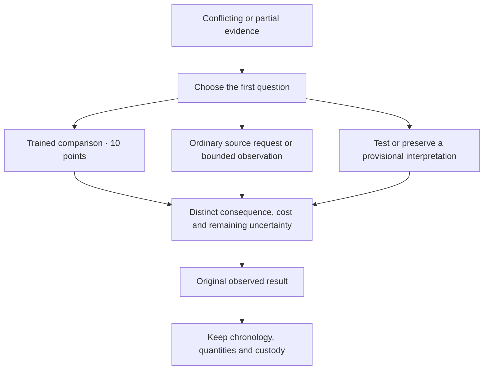
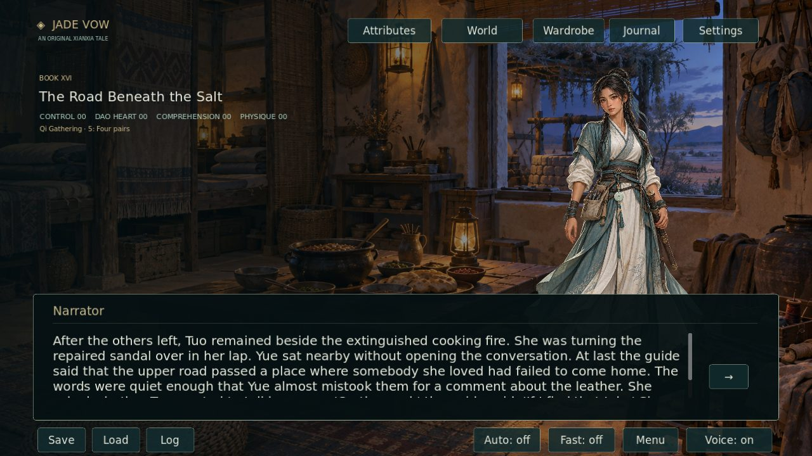
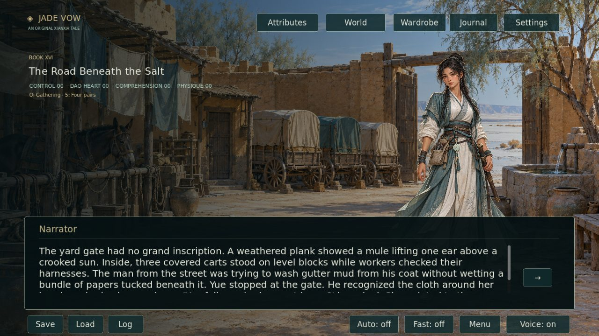
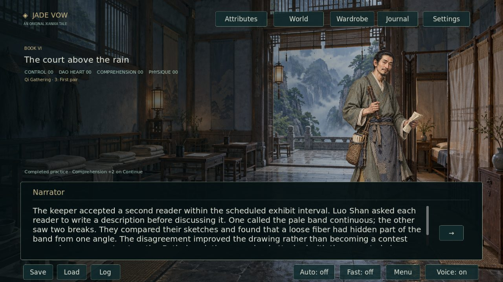

# Narrative revision: 2026-10-05

The playable campaign contains **1,126,752 displayed prose words across 12,721 scenes and 17 books**. This revision adds 2,027 words in 24 new scenes: six dilemmas and eighteen consequences. Alternative playable branches contribute to the total; one journey does not display every branch. The strict million-plus manuscript target remains met.

## Source-backed causality repairs

The fixed review source is `13bae49f55c66c2cb16c956ca3be26491d10bbd6`. [The audit](NARRATIVE_REPAIRS_20261005.json) contains exact original choices, changed choices, exclusive branch paths and unchanged completion prose for **101 repair sites**:
- 81 court practice and evidence choices;
- 8 ring investigation subtasks;
- 6 foundry work and withdrawal roles;
- 3 ridge inquiry roles;
- 3 storm-warning preparation roles.

Each original choice paid its declared growth before its work was completed. The choice now preserves its destination and requirements but defers the same gain until leaving the completed passage. The saved completion record prevents repeat payment. This is one recurring causality issue at 101 evidenced existing-content sites, not 101 independent engine defects.

New saves mark their practice-rule revision. For an earlier version-1 save, the loader recognises a completed passage in its journal, or a previously selected exclusive branch recorded by the choice's journal passage and current scene. It records that old payment without altering the stored attributes. A new save halfway through a branch still receives its unclaimed gain at completion. Unknown rule revisions reject atomically.

## More difficult decisions

| Dilemma | Conflict and costs |
|---|---|
| A sum without an origin | Reconstruct both origins before giving a total. / Request the courier's receiving reference; accept the clerk delay. / Test the simple subtraction against the marked cisterns. |
| The price of waiting | Send the holding notice now, with support unverified. / Wait for Tuo's observed stone before describing the fault. / Take the checked shoulder view before drafting. |
| Two drawings, one inspection | Establish which building each source actually names. / Compare the visible changes before accepting the plan. / Test the old access line as a provisional hypothesis. |
| The unreadable column | Make a blind second copy from the permitted viewpoint. / Defer the mark and request an authorised source comparison. / Retain both readings and state what each would change. |
| A warning that can travel wrongly | Lead with the two-site diagram and observed ground limits. / Test a spoken relay with a receiver before dispatch. / Issue a bounded provisional bulletin and a correction route. |
| A reserve that belongs to people | Present the paid wages first; leave repair liability open. / Separate the repair exposure from the carrying surcharge. / Request the second invoice comparison before answering. |

The six points ask the reader to reason about source scope, uncertainty, dispatch timing and finite responsibility. Specialised routes need trained Comprehension or Physique; at least two ordinary routes remain available. Those routes have distinct costs or failed hypotheses that remain visible in their prose. The alternatives converge immediately before the original observation, preserving the subsequent account, water quantities, custody and examinations. The choices do not create inventory, extra water, new realm stages or instant growth.

## Geographic staging and native art

Seventy existing Bitter Wells scenes used the former kiln home, Ash Bridge Foundry or an expedition camp. They now use the appropriate new town setting. The rest of the road retains its existing camp artwork. The three new originals are separate native 1536×1024 PNG paintings; [provenance](../assets/art/NARRATIVE_20261005_PROVENANCE.md) identifies each Git blob.

These are actual Godot viewport captures generated by CI and bundled after successful validation.

## Validation

The [full build and media bundle](https://github.com/jgyy/octxian/actions/runs/37257393188) passed on code commit `c617d73849ab13420cc72fe2598bbaa8081e7bba`: Python and Godot regressions, all 83 captures, narration and art provenance, and the exported Linux game launched without the source checkout. The bundle committed the verified review media as [`de83501b2fa0dd214b592ac6708c8600275e05e1`](https://github.com/jgyy/octxian/commit/de83501b2fa0dd214b592ac6708c8600275e05e1). These five images have also been inspected directly. CI checks the current draft head after documentation updates.

`python -m tools.validate_narrative_revision --verify-source` authenticates all 101 original choices against the fixed source, checks completion paths, checks 70 original/current location anchors and verifies the six inserted transitions.

`tests/narrative_revision_test.gd` executes each repaired branch, checks no growth on selection, saves unfinished work, resumes and completes it, saves completed credit, revisits it, and migrates its old checkpoint without duplicate payment. It exercises all eighteen dilemma routes and rejects an unknown save-rule revision.

The existing suite still validates every gated route, all continuity checkpoints, native images and source provenance, actual UI and narration, and the exported Linux package without the source checkout. Five new real captures bring the total to 83. The draft retains honest reporting of the separate unfinished artwork quotas.
