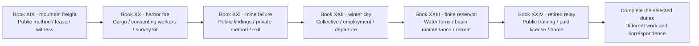
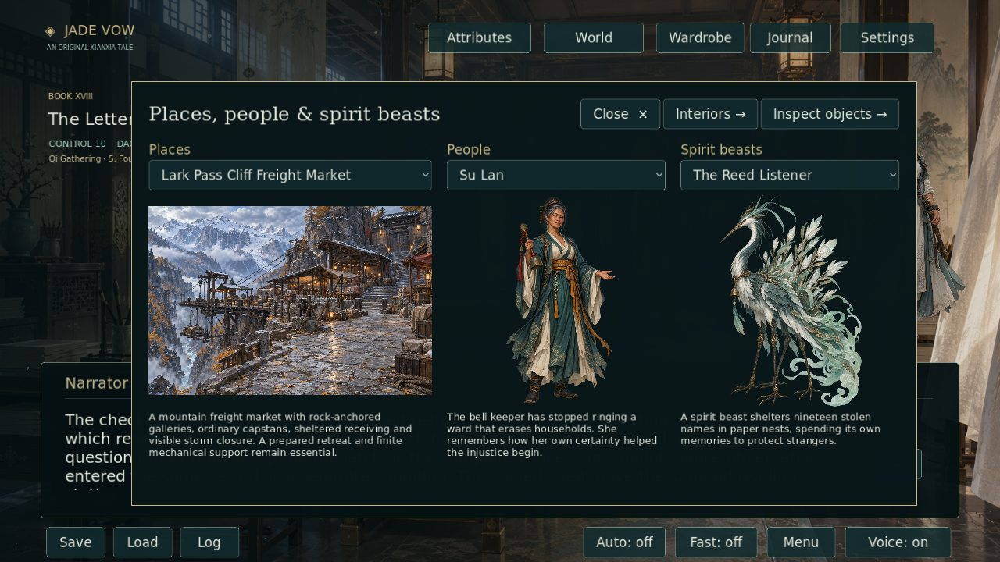
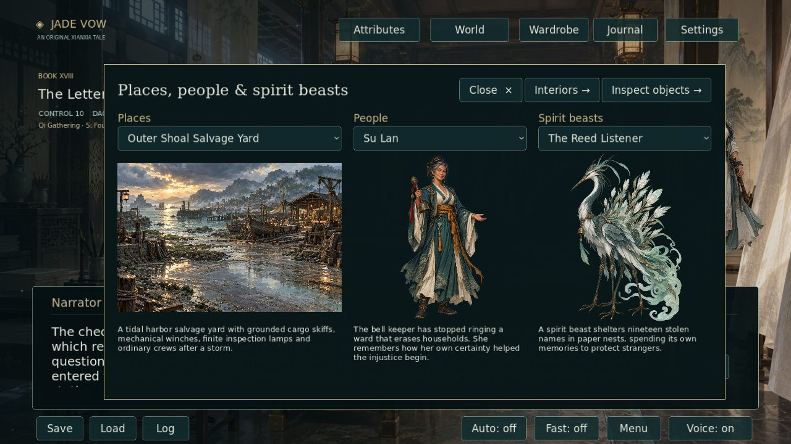
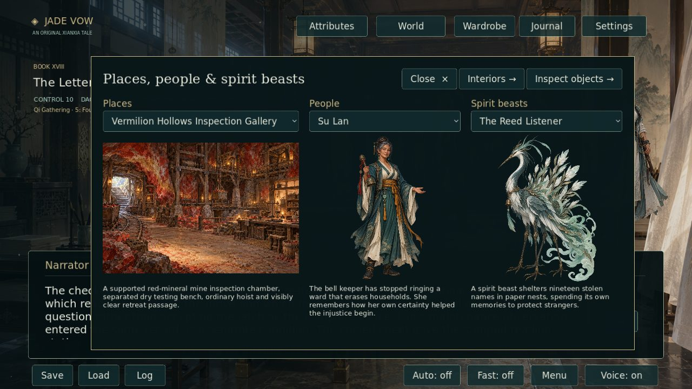
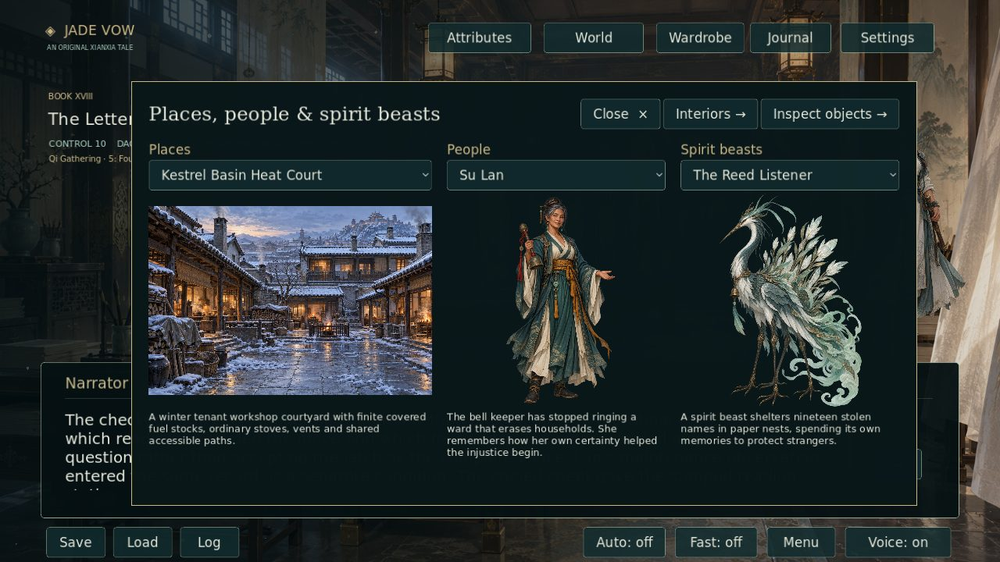
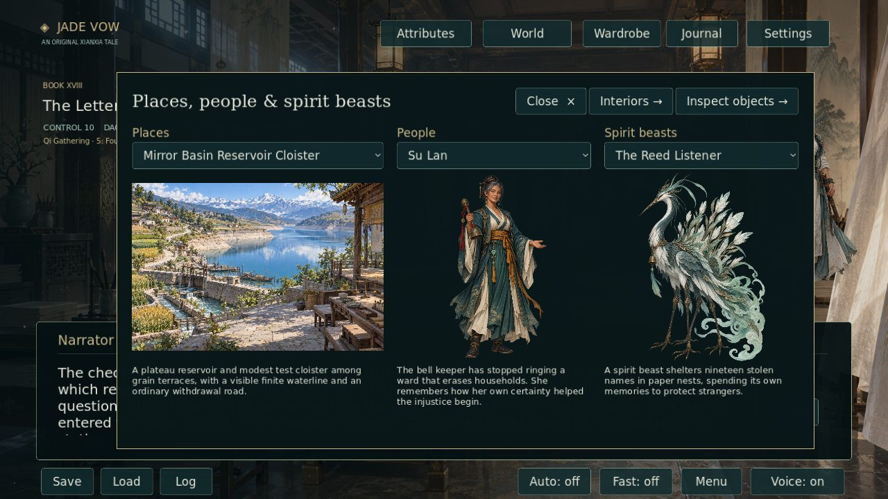
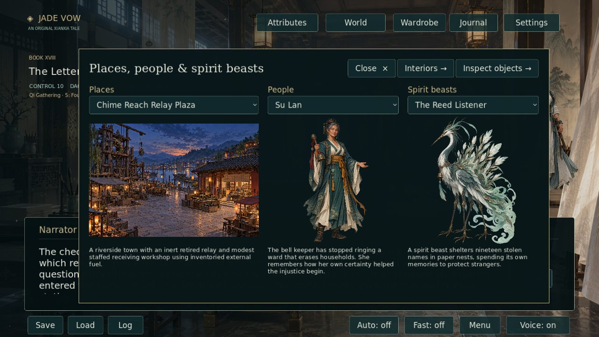
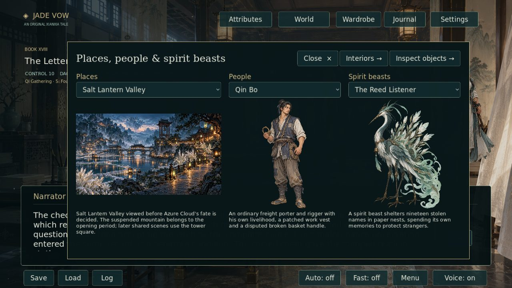

# Native art and actual gallery captures · 2026-10-06

Seven independent new paintings accompany the continuing novels: six locations at actual native **1536 × 1024** pixels and Qin Bo's transparent portrait at **1024 × 1536**. The requested maximum native output is retained; no enlargement is counted. [Original creation records and Git blobs](../assets/art/CONTINUATION_20261006_PROVENANCE.md).

The story currently has **1,154,078 displayed words**. The following six novels remain in authoring and are excluded from that count. Their incoming decisions change source permission, work access, property and funded obligations. Each incoming term closes through actual work before the next local cultivation placement.

The captures below come from the running Godot game's gallery controls. They show the selected native originals in the actual interface; full PNG paintings remain in the art directory. Gallery capture resolution is the real 1280 × 720 window.

Source-backed continuity repair evidence is in [the semantic sweep](SEMANTIC_SWEEP_20261006.md). That sweep verifies six new underlying defects across 27 passages, and does not claim 1,000 verified defects or count prevented draft mistakes as existing-source repairs.
