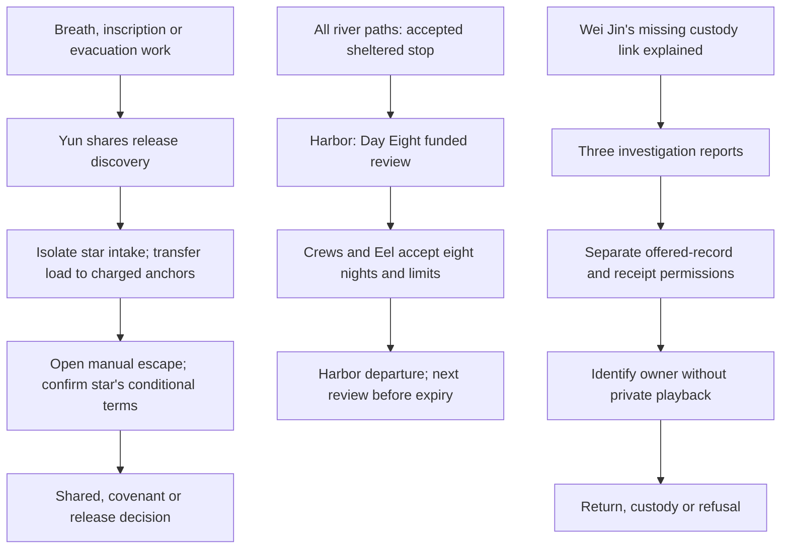

# Plot-hole review · 2026-10-03

This focused review follows cultivation prerequisites, alternate-route knowledge, chronology, accepted work terms and the source of each apparent power across all seven books. It repairs **45 scenes: 41 existing passages and four new prerequisite scenes**. It also corrects the cultivation canon and makes the last earned stage explicit throughout Books III–VII. Those metadata changes earn no rewrite word credit.

The review covers the opening and shared outcomes, the later cultivation and evidence passages, and the common Book VII comparison. Structural checks cover the complete merged campaign. This is not a claim that every possible literary issue in the inherited manuscript has been eliminated.

## Findings and repairs

| # | Plot hole | Repair and playable anchors |
|---|---|---|
| 1 | Body Tempering required an internal pair that the story did not earn until Qi Gathering 3; twelve meridians were described as twelve pairs. | Admission uses an external grounded practice lead. Twelve primary meridians form six paired routes; the chest junction is separate from the Foundation middle dantian. `tempering_after_007`, `tempering_after_009`; cultivation canon. |
| 2 | Three rooms in one examination were treated as the three independent root sessions required by the canon. | Three recovered sessions each use calibrated stones and blanks; admission follows the third result. `tempering_after_005`. |
| 3 | Breath and evacuation routes credited Lin Yue with the optional inscription discovery. | Yun presents the rubbing and installed plate on the common preparation path. `exile`. |
| 4 | Some endings assumed the star had agreed to terms; opening an escape under the lifting load was unsafe. | Qualified operators isolate intake and transfer the immediate load to charged anchors, open the manual exit, then hear the star's conditional terms before every final choice. `fracture` → `star_terms` → `final_choice`. |
| 5 | Emergency support seemed able to fund almost three months of novice training without renewal. | The first morning review funds seven days from sect maintenance, with fresh fuel, accepted turns and review before expiry; stop and landing remain available. `lantern_shared`. |
| 6 | Common sluice prose refloated the mountain after the release ending; the long apprenticeship had no seasonal placement. | The workshop reflects stone and roofs without asserting the mountain's height. The nearly three-month apprenticeship ends in early autumn, before the winter preceding the river campaign. `sluice_004`, `reed_step_018`. |
| 7 | The Listener answered a drawn sword although the rewritten arrival carried a measuring case. | The Listener sets limits on the closed case and the requested test. `reed_voice`. |
| 8 | The seed route treated a paid and completed roof repair as unfinished the next spring. | The carpenter checks completed joints for winter wear. The seedling's future shelter remains separate. `river_from_seed`. |
| 9 | The stair route put the Eel back into exhausting circling after every route had already established a sheltered stop. | An ordinary boat conducts the survey while the Eel rests at the accepted, funded mooring. `stair_soundings`. |
| 10 | The harbor's eight-day interim watches continued after their funded term without an accepted renewal. | Day Eight review approves twenty copper: sixteen for eight two-copper night checks, four for emergency movement. Crews and Eel accept scope; the next review precedes the last Day Sixteen check. Existing ordinary duties are not billed twice. `harbor_review`, `harbor_review_terms`. |
| 11 | Later references to the old agreement could imply that expired paid watches were indefinite duties. | Closed-copy protection and permission for a safe stop remain distinct from expired work terms. `ring_old_agreement`. |
| 12 | Wei Jin remembered entrusting a copy, yet the story did not explain why he had never identified the third ring. | He retains his counterfoil. A missing custody page and illegible outer reference blocked identification; the recovered exterior R-3 entry is the first readable link. Offered record comparison remains separate from private playback. `river_book`, `ring_jin_offer`, `ring_jin_context`. |
| 13 | A childhood anecdote gave Lin Yue personal qi before the mortal opening. | The rice mishap used ordinary kiln-vent heat. `ring_archive_mortality`. |
| 14 | A first-pair novice suddenly healed patients, circulated qi through her legs, projected force, anchored a tree with her body and emitted sword aura. | Orchard diagnostics use an isolated quarter-unit socket; breathing is ordinary pacing. Marsh light is a discharged reference trace; poles move reeds. Road posts and ropes bear the load; a plain blade cuts slack hemp. No stage is awarded offscreen. Orchard, marsh and road power passages. |
| 15 | City heating and court storage appeared to draw prolonged service from an unmeasured novice reserve. | Finite precharged cups and keeper-owned storage wards supply the energy. Lin Yue provides only bounded rated control/status pulses or grounded reference light, then discharges. Licensed operators keep control. City perfumer/credit and court rain/docket passages. |

## Required branch sequence

## Verification

Five focused regression tests reject bypasses of the source-isolation/terms sequence, sheltered stop, harbor renewal and owner comparison, and reject an unwritten later-stage promotion. The existing world validator checks every continuity checkpoint and recomputes manuscript credit.

The merged-data audit finds **1,606 of 1,606 scenes and all 25 endings reachable across 151,435 capped attribute states**, with unique prose, a maximum of 100 words per scene, valid actors/art/stages, 135 anchored facts and 39 required checkpoints. Runtime CI adds narration, Godot route/save/UI checks, forty-nine viewport screenshots and a standalone Linux launch. Final CI evidence is linked in the draft PR.

Current delivery is **137,918 displayed words**; **19,805 words in 300 scenes** are credited to the cultivation recast. This review adds 401 net displayed words and 3,035 newly credited rewrite words. The rest of the million-word rewrite remains in production.
