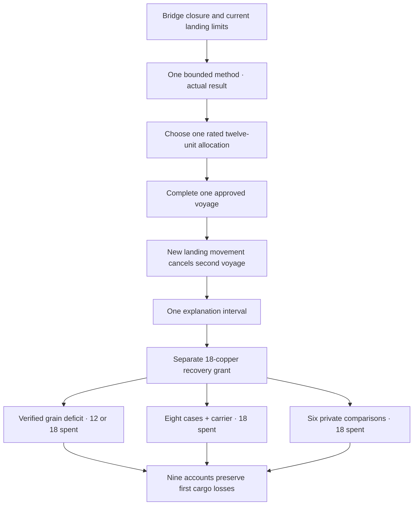
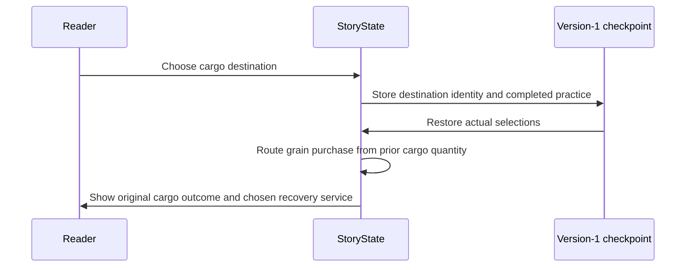
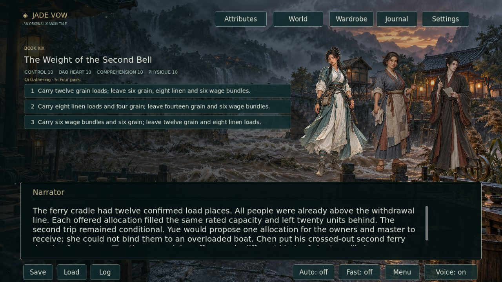
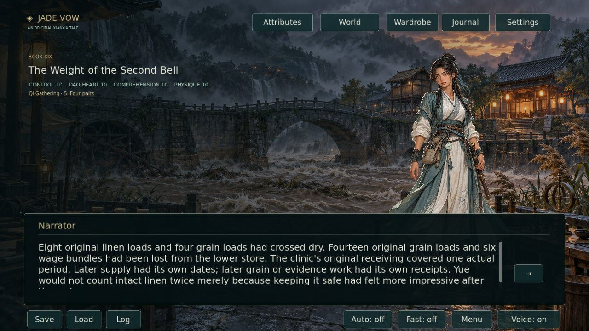

# Reed Crossing continuation · 2026-10-06

Book XIX, *The Weight of the Second Bell*, continues `letters_watch_end` while retaining that ending ID and prose. It adds **9,109 displayed prose words and 125 scenes**. The campaign now has **1,163,187 displayed words and 13,204 scenes across 19 books**, leaving **836,813 words** for two million. Only playable node prose contributes; choice labels, audit records and this document contribute no manuscript credit.

The river has closed the bridge before Lin chooses a cargo allocation. Thirty-two standardized units await one twelve-place ferry departure. The second voyage is conditional, and an independent inspection later cancels it. People have already withdrawn above the store's flood line. A closed ridge bypass becomes a possible later carrier route only after its own clearance. The scene gives Lin a finite decision without making ordinary care or human rescue depend on a cargo menu.

Four diagnostic approaches produce different evidence. Trained qi comparison uses two external fuel portions on a disconnected bench; source comparison establishes dated leaf order; ordinary rod work records two measured ranges; log reading retains unmeasured gaps. They do not establish intention, structural authority or a hypothetical saved ferry. Growth follows performed work and is saved once. Explanation choices preserve the closure and private wage identities while using the remaining receiving interval differently.

| First ferry allocation | Grain delivered / missing | Linen delivered / lost | Wage bundles delivered / lost |
|---|---:|---:|---:|
| Grain | 12 / 6 | 0 / 8 | 0 / 6 |
| Linen | 4 / 14 | 8 / 0 | 0 / 6 |
| Wage sources | 6 / 12 | 0 / 8 | 6 / 0 |

Each allocation carries twelve units and leaves twenty. The flood makes undelivered stock unusable; later recovery has its own receiving and cannot restore original signatures or sterile seals.

The separate eighteen-copper recovery grant pays one service. Grain purchases use the actual deficit: six replacements plus a six-copper carrier spend twelve and return six; twelve replacements plus carrying spend eighteen, leaving two missing when the first voyage carried only four grain. The linen circuit spends eighteen for eight new sealed cases and carrying, with distinct supply periods where the first cases survived. Private wage work spends eighteen on six independent comparisons and receiving, without turning the grant into wage payment. Nine cargo-policy combinations retain both their original losses and performed later work.

Two source contradictions in Book XVIII are repaired at [fixed source a8d6ddf](https://github.com/jgyy/octxian/commit/a8d6ddf1d7c73c77fc8c66be6932fab403269bfc):

| Source scene | Contradiction | Repair |
|---|---|---|
| `letters_watch_cover_books_05` | A packet-bearing cart is called unloaded in the same passage. | Identify the cart as laden. |
| `letters_watch_cover_path_05` | Damp stock is isolated without first completing the braced retrieval required by the fractured-beam restriction. | State the post-squall qualified bracing and controlled retrieval before isolation. |

[The machine-readable audit](REED_CROSSING_REPAIRS_20261006.json) retains complete before/after nodes and corroborating source passages. Continuation wiring, new scenes, checks, documentation and art do not count as repairs. **Two independent underlying defects are evidenced; the requested 1,000-repair target remains unverified.** This is not a claim that the rest of the manuscript has no contradictions.

One original background is retained at **1672 × 941 native PNG pixels**. The highest native landscape output was requested and the returned bytes were preserved. [Generation record](../assets/art/REED_CROSSING_20261006_PROVENANCE.md). Existing intact portraits of Lin Yue, Jiang Tao, Yuan Lian and Chen Rui are staged where physically present.

The four images below are produced by the Godot viewport under Xvfb. Outcome captures traverse actual cargo selections with identical attributes and the same later grain policy; they do not use composited mockups.

Verification:

- `python -m tools.validate_reed_crossing --verify-source` authenticates both current-source repairs.
- `tests/reed_crossing_test.gd` traverses all **108 method/cargo/explanation/policy combinations**, checks nine retained cargo-policy accounts, saves, low-stat alternatives, quantity-dependent grain orders and one-time growth.
- Existing Python and Godot suites validate the whole campaign, all earlier authenticated audits, narration, native art, viewport captures and source-free Linux playback.
- `tools/verify_screenshots.py` checks all four new real captures and distinct outcomes at identical attributes.
- `--require-complete` still enforces two million words and independent artwork quotas. Passing draft CI does not satisfy unfinished production targets.
