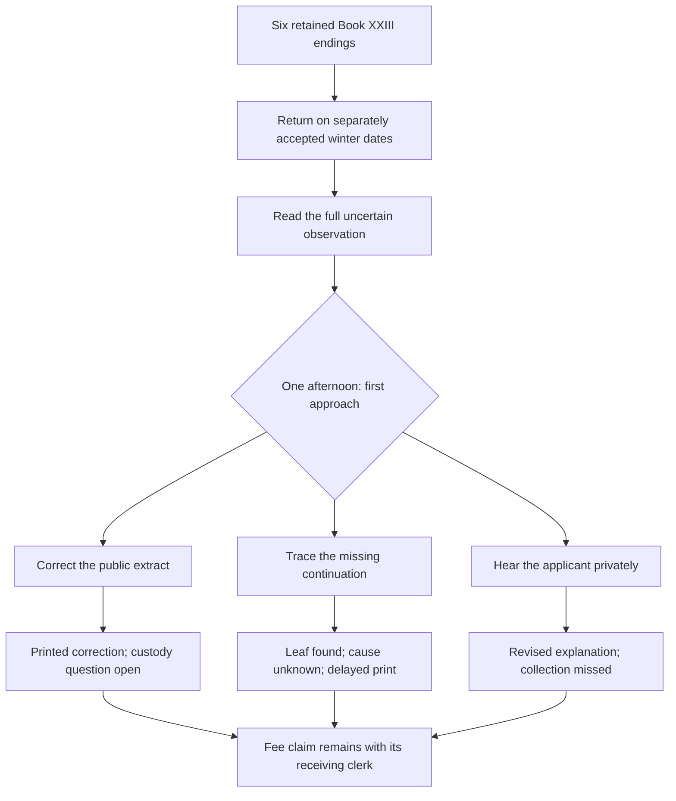
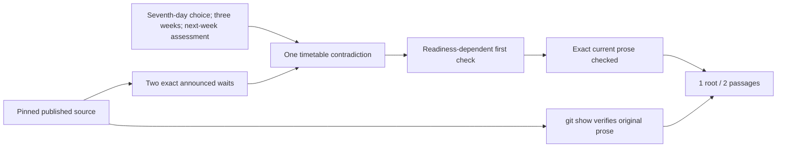
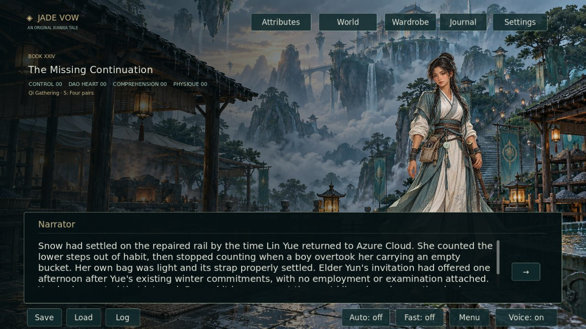
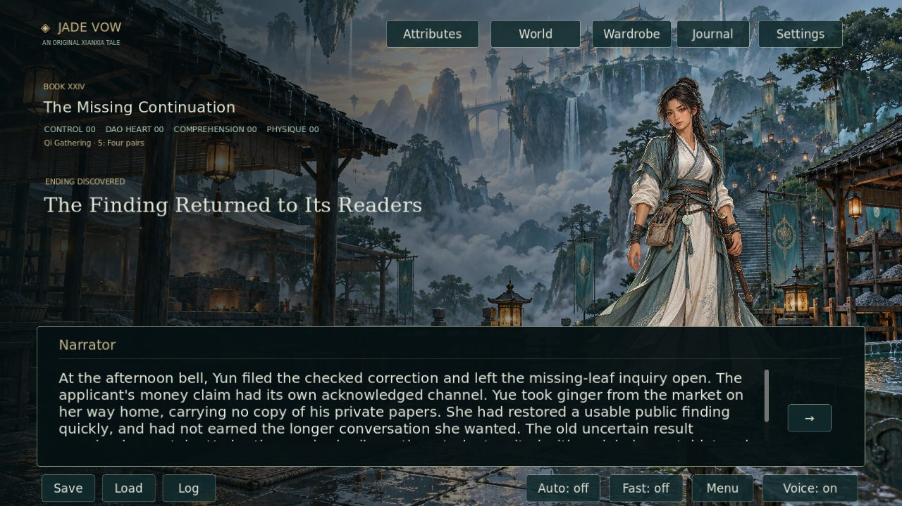
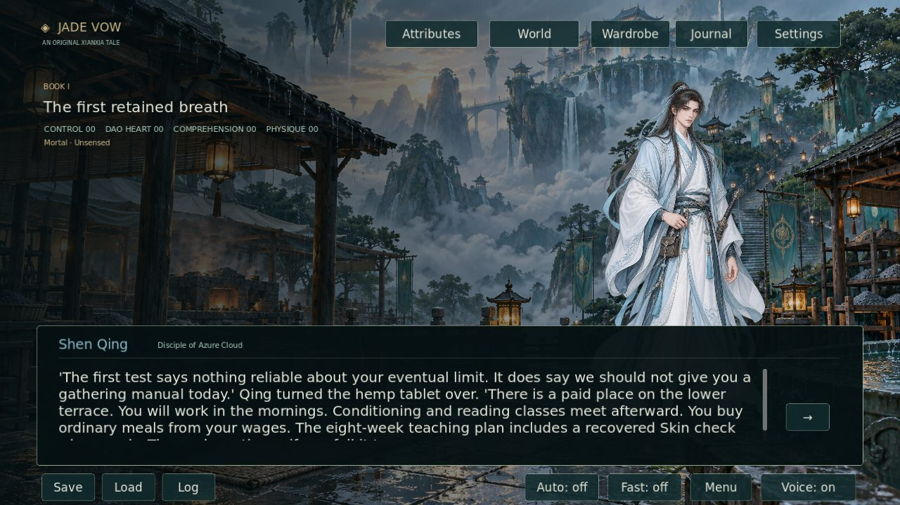

# Book XXIV · The Missing Continuation

This first continuation batch adds **2,490 displayed prose words in 32 scenes**. Two published opening passages gain 13 net words through one timetable repair. The complete campaign therefore contains **2,082,566 displayed words in 24,373 scenes across 24 books**.

The requested **3,000,000-word total remains unfinished: 917,434 words remain**. The requested **1,000 authenticated plot repairs remain unfinished**. This batch authenticates one underlying timetable contradiction across two published passages, rather than counting each passage as a separate plot hole. It does not establish a newly measured campaign-wide historical repair total.

## The story

Lin Yue returns to Azure Cloud during a separately accepted winter afternoon. A public teaching extract has omitted the uncertainty disposition from her first qi observation. A recent applicant reads that incomplete extract as proof that teachers concealed her early success.

Three approaches supply different evidence and impose different costs:

| Selected approach | Completed work | Remaining consequence |
| --- | --- | --- |
| Public correction | The complete finding is printed and checked before the next class | The leaf's old displacement is unexplained; the applicant declines a longer conversation |
| Custody investigation | A missing continuation is found and its present location recorded | No culprit is established; the applicant makes a second journey and printed copies wait |
| Applicant conversation | Private concerns inform a checked explanation and a real timetable request | The printer's collection is missed and the missing leaf remains unfound |

Every approach leaves the applicant's fee claim with its responsible receiving clerk. None promises a refund, identifies a culprit without evidence, publishes the household's private papers or awards new cultivation. Lin retains Qi Gathering 5: Four pairs and her shoulder arrangements. Earlier season endings and their prose remain available in the journal.

## Published timetable repair

The pinned source is [9461af86a503a358f356c628e30c3a721471f920](https://github.com/jgyy/octxian/commit/9461af86a503a358f356c628e30c3a721471f920).

The two opening promises in `mortal_005` and `mortal_018` place the first examination eight weeks away. The actual route proceeds from the seventh-day choice, through three elapsed weeks and a following-week Skin assessment, to a recovered award around week five. The correction separates the eight-week teaching plan from the readiness-dependent first Skin check. The assessment, recovery requirements and earned rank stay in their existing scenes.

[Exact before/after passages and unchanged timing evidence](RETURN_REPAIRS_20261009.json). The earlier CULT-002 repair corrected a first-week label at the award; this batch does not count that earlier repair again. New Book XXIV scenes receive no historical repair credit.

## Validation and review media

Python tests cover real branch coverage, distinct consequences and existing ending continuations. The fixed-source validator checks both original passages and all five supporting timing scenes with `--verify-source`. Godot tests play all three choices at zero scores and round-trip their endings, selected destinations and journals through saves.

The main capture mode continues from a played season ending and creates six new viewport captures. The verifier expects **170 total captures**, measures image content and checks that return choices and endings render distinctly. The standalone package walks the three return outcomes with narration. CI bundles verified captures and the measured report on the feature branch, then validates that resulting commit again.

The [full source build](https://github.com/jgyy/octxian/actions/runs/37872072969) passed 159 Python tests and all Godot checks. It traversed all 24,373 scenes across 470,024 capped states, verified 170 captures and 24,373 narration clips, and passed the standalone package including all three return outcomes. The [verified bundle commit](https://github.com/jgyy/octxian/commit/2072315c14fbeadbf1fdc679c9894486a21d5bde) retains the measured report and fresh captures. These results validate the delivered batch; the report still records 917,434 missing manuscript words and unfinished production quotas.

No new sprite is needed for these scenes: Lin Yue, Shen Qing and Elder Yun already have registered artwork, and the lower training terrace is already retained. Existing originals keep their native bytes and provenance. Any later required painting should request the image generator's maximum native output and record the delivered size rather than claim an unsupported resolution.

The strict world validator now requires three million displayed words; the earlier independent artwork quotas still apply. A passing draft run validates the delivered content while reporting its remaining quotas. It is not evidence that either requested manuscript or plot-repair target is complete.
