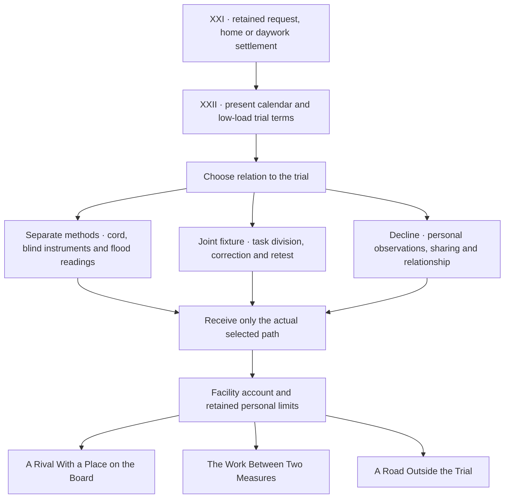

# Book XXII · The Other Measure

Lin Yue meets Qiu Lian, a practitioner whose quick closing method challenges Yue's preference for recoverability. The player can enter separate witnessed comparisons, build a joint reversible fixture, or decline the trial and follow independent questions. Each route has its own work, failures, choices, delayed consequences and relationship outcomes. Qiu sometimes outperforms Yue, makes her own mistakes, and retains her own plans.

The source continues all three Book XXI settlements while retaining their ending markers, journal and earned attributes. The new trial occupies three confirmed free afternoons; existing commitments stay on their own dates. Both practitioners remain at Qi Gathering 5: Four pairs. The trial creates no cultivation credit, employment, prize or specialist qualification.

## Authored manuscript

| Source | Scenes | Displayed prose words |
| --- | ---: | ---: |
| Shared introduction, history callbacks, receiving and endings | 35 | 2,828 |
| Separate-method competition | 340 | 27,340 |
| Joint reversible fixture | 300 | 21,701 |
| Independent questions outside the trial | 300 | 20,351 |
| **New Book XXII** | **975** | **72,220** |

Counts include distinct playable alternatives and exclude choices, labels, prompts and documentation. Existing-source repairs add eleven words. At Book XXII delivery, the manuscript contained **1,337,201 words across 15,518 scenes and 22 books**, with **662,799 words remaining**. [Book XXIII's six completed paths](SEASON_PATHS_20261008.md) now take the campaign past two million.



Saved decisions name actual destinations. Later scenes read those records rather than reconstructing choices from attribute scores. Obsolete choices are removed only from traversal signatures; save files retain the full actual decision history. Missing older decisions do not establish participation, refusal, performance or a new qualification.

## Finite facility account

| Facility grant disposition | Copper |
| --- | ---: |
| Space | 9 |
| Purchased consumables | 6 |
| Witness attendance | 6 |
| Unused amount returned at the trial term's close | 3 |
| **Total** | **24** |

The steward holds this account. Remaining purchased stock stays with the facility. Neither practitioner receives the grant as wages or personal money. Lin's shoulder arrangements remain throughout every path. The later receiving date allows the independent path's subsequent letters and meetings; it does not extend the three-afternoon facility trial.

## Native character sprites

Two independently generated full-body PNG RGBA originals are delivered at **1024 × 1536 native pixels**. Maximum native output was requested; original generator bytes and transparency are retained. These count as two human NPC originals, making 67 human NPCs and 82 world sprites in the draft. They have not been enlarged to meet a quota.

[Qiu Lian](../assets/art/world/rival_qiu_zhen.png) · [Su Yao](../assets/art/world/rival_su_yao.png) · [Exact prompts](../assets/art/RIVALS_20261008_PROMPTS.json) · [Native provenance](../assets/art/RIVALS_20261008_PROVENANCE.md)

## Authenticated historical repairs

This continuation repairs **two distinct literary defects at three source passages**:

1. The shared commission calendar unconditionally asserted an accepted unworked appointment on routes that established only finished work or an enquiry. The corrected scene records only a documented acceptance.
2. Tuo Yin's established female identity changed to masculine pronouns at two late desert references. Both references now preserve that identity.

[Calendar before/after evidence](COMMISSION_CONTINUITY_REPAIRS_20261008.json) · [Tuo Yin before/after evidence and overlap review](LATE_IDENTITY_REPAIRS_20261008.json)

A separate engine fix prevents an already saved matching choice from awarding or charging its effects again. Its regression covers a reward at the attribute cap, a negative cost, saved checkpoints and repeat navigation. It receives zero literary repair credit. New rival events and corrections made before publication receive no historical defect credit. The requested **1,000 authenticated plot-hole target remains unmet**.

The wider audit searched 151 Books XII–XVII files and independently checked Forest/Archive numeric and date anchors. No further indisputable defect was added merely to increase the count. This is a focused review, not a claim that every possible literary problem has been eliminated.

## Verification and review media

Required CI runs the two fixed-source repair validators, Python rival graph checks, Godot saved-choice tests, prior campaign regressions, native decoded artwork checks, narration coverage, real game captures and source-free Linux playback.

```bash
git fetch --depth=1 origin 0fe9938bf765611b3fe9d31c747fec6067346620
python -m tools.validate_commission_calendar_repair --verify-source
python -m tools.validate_late_identity_repairs --verify-source
python -m unittest discover -s tests -p test_rival_paths.py
godot --headless --path . --script tests/rival_paths_test.gd
```

Nine new captures walk the actual zero-score root and branches with save/load checkpoints, covering both new people, the path choice, three entries and three completed outcomes. The screenshot verifier adds its measured count to the delivery report only after all captures pass; the verified Book XXII total was 149. Book XXIII adds fifteen season captures for an expected current total of 164. The Book XXII source-free package checked all 22 chapters, actual three-path completion, both native portraits and new Vorbis narration. Current checks also include Book XXIII and its six completed paths.

[Path choice](screenshots/rival_paths.jpg) · [Qiu Lian](screenshots/rival_qiu_zhen.jpg) · [Su Yao](screenshots/rival_su_yao.jpg) · [Competition](screenshots/rival_compete.jpg) · [Joint work](screenshots/rival_cooperate.jpg) · [Independence](screenshots/rival_independent.jpg) · [Competitive ending](screenshots/rival_end_compete.jpg) · [Joint ending](screenshots/rival_end_cooperate.jpg) · [Independent ending](screenshots/rival_end_independent.jpg)

[Workflow](https://github.com/jgyy/octxian/actions/workflows/ci.yml) · [Machine-readable manuscript accounting](CULTIVATION_PROGRESS.json) · [Latest generated content report](content_report.json)

The two-million-word manuscript target is met by Book XXIII. The 1,000 authenticated repair and full-production artwork targets remain unfinished. The PR stays a draft.
