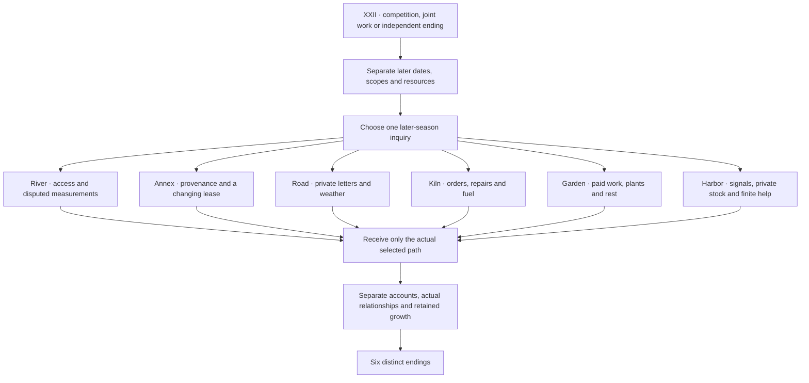

# Book XXIII · The Work Ahead

Six later-season paths continue after the instrument trial's three afternoons and finite grant close. Each contains twenty connected arcs and consequences of actual choices. Lin's existing accepted commitments stay on their own dates; new work starts only on separately confirmed terms. Her earned Qi Gathering 5: Four pairs and shoulder arrangements remain throughout.

## Manuscript

| Source | Files | Scenes | Displayed prose words |
| --- | ---: | ---: | ---: |
| Shared opening, prior-history callbacks, receiving and six endings | 1 | 35 | 2,800 |
| Water | 20 | 1,525 | 129,456 |
| Archive | 20 | 1,363 | 122,036 |
| Road | 20 | 1,536 | 119,436 |
| Kiln | 20 | 1,410 | 118,690 |
| Garden | 20 | 1,354 | 120,672 |
| Harbor | 20 | 1,600 | 129,771 |
| **New Book XXIII** | **121** | **8,823** | **742,861** |

The campaign now contains **2,080,063 words in 24,341 scenes across 23 books**, exceeding the requested two million. Counts include distinct playable alternatives and exclude labels, choice text, prompts and documentation. None of the 120 path files is an unpublished placeholder. The six later inquiries remain distinct from the three choices made in Book XXII.

## Decisions that survive later visits

The river route retains the seventh arc's panel disposition until the twentieth arc's actual close. Replacing, repairing or borrowing gives different owned equipment and costs; a returned loan cannot reappear as an owned panel. The eighth arc's private order is fulfilled or declined on its actual later terms. Separate gauge zeros cannot establish a common absolute datum merely because their numbers look comparable.

The copying annex preserves whether sources were inspected, copies were offered or requests were refused. Public summaries do not confer access to originals or private recollections. An expiring lease and the smaller renewed room have their own dates and responsibilities. A limited copying commitment does not make Lin the custodian or conservator of original records.

The letter circuit retains private custody, declined letters and voluntary company. A canceled session remains canceled. Lin's actual copying error is corrected through the authorized receivers rather than erased by narration. Later visits and paid tasks require their own dates and terms.

The kiln keeps rejected wares, actual refunds, replacement-fuel costs and the separate household orders. A cold-handling challenge records two comparable pairs in reversed order; both participants total seventeen correct observations. The unscored inquiry and refusal do neither hidden challenge nor silent victory. Ordinary public handling creates no specialist license.

The garden keeps the selected annual plants or plum, a later knowledge choice, and the actual family farewell. A two-hour storm session does not become three paid hours or require unpaid replacement work. Patient information stays private and growth makes no cure claim. A separately permitted naturally fallen leaf becomes Lin's private pressed keepsake in the nineteenth arc on both plant routes.

The harbor keeps observations apart from navigation, rigging, rescue and quarantine authority. He Ming is the female salt packer and migrant delegate; Yan Su performs professional rigging. Private canvas availability is not a public grant, wages or visitors' property. Declining an extension leaves that extension unperformed; separately agreed closing and later return tasks keep their own limits.

Saved decisions record destinations. Later gates read those actual records. An unavailable legacy choice supplies the shared unclaimed fallback, not a convenient invented action. The graph drops obsolete decisions only from traversal signatures; save files retain full history.

## Accounts and custody

The earlier **24-copper trial account remains closed**: nine space, six consumables, six witnesses, three unused returned. It cannot finance a later season.

| Later account | Actual boundaries |
| --- | --- |
| River facility | A new 40-copper grant:12 space,8 supplies,12 witnesses,4 cleanup and4 initially reserved. The storm replacement is separately authorized. Material choices close with40/38/36 spent and0/2/4 returned for replace/repair/borrow; private orders and Lin's separately paid reading remain separate. |
| Early letter pilot | 12 copper for three confirmed sessions and stated post/paper handling; actual unused money returned. |
| Second letter circuit | 18 copper:6 fees,5 travel,4 post and3 returned. |
| Lark Pass circuit | 40 authorized;29 actually spent(6 fees,16 accepted travel,7 paper/post) and11 returned(2 canceled fee,4 travel,1 materials,4 unactivated reserve). The snow closure cancels the fourth session without a substitute. |
| First kiln order | 312 received against336 actual costs; the 80 reserve becomes 56. A separately approved 12 roof repair leaves 44; the twentieth arc actually returns all 44, closing the reserve at zero. Two 36-piece wet batches yield 64 accepted and 8 rejected pieces. |
| Winter kiln work |Nine independently quoted household services total 90; all 90 are actually received after completion, with qualified makers responsible for operations. |
| Garden repair | 160 available:120 labor and40 materials. Nineteen 3-hour visits and one 2-hour storm visit produce 59 paid hours per helper,118 labor total, and two unspent labor coins. Annual materials cost9 with33 total returned; plum materials cost14 with28 total returned. Both accounts actually close at160. |
| Harbor stock | 18 private canvas rolls:8 prior commitments,6 initial ordinary orders,3 later released orders and1 supplier return. These are objects, not copper. Private terms, professional authority and compensation stay separate. |

No new inquiry awards cultivation points, completed practice or an unearned qualification. Qiu has independent work and choices; an old cooperative route does not supply a standing claim on her time. Responsible owners retain originals, private letters, drawings, wages, clinical information and professional decisions.

## Source review and historical repair credit

The source audit checks **8,823 new scenes** under actual choice histories, including blank legacy records and each of the three prior rival paths. The new chapter is acyclic, all scenes are reachable, and at most **4** decisions remain relevant at once. Its source traversal visits **18,642** distinct relevant-history states. **35** new checkpoint-removal checks protect introductions, actual selection, later work and closing accounts.

A second author reviews each completed route's long callbacks, finite accounts, chronology and custody. This review supplements mechanical checks and does not claim the absence of all possible plot holes.

No Book XXIII event counts as a repaired historical defect. Corrections to this continuation's newly authored manuscript, including CI review iterations, receive zero historical credit. Book XXII's two authenticated literary roots across three source passages remain separately evidenced. The saved-choice replay fix is an engine correction; the He Ming gallery follow-up aligns an asset description with already established story facts and adds no literary root credit.

[Book XXII evidence](RIVAL_PATHS_20261008.md) · [Catalog before/after](HARBOR_CATALOG_FOLLOWUP_20261008.json) · [New manuscript editing](SEASON_PREPUBLICATION_REVIEW_20261008.json)

An additional published-source repair corrects one claimant-attribution root at two Book XVIII passages. The earlier conditional house right and paid loss compensation belong to He Xi's mother; Sun Nian remains the separate witness with her own later runoff statement and limited inspection permission. The fix adds one existing-source word, making this update's net addition 742,862 words. Together with Book XXII, this continuation authenticates three literary roots at five original passages. [Pinned source and exact before/after evidence](LETTERS_CLAIMANT_REPAIRS_20261008.json).

The **1,000 authenticated plot-hole target remains unmet**. The manuscript target is met, while full-production art quotas remain unfinished. The PR stays a draft.

## Native artwork and actual game checks

Seven original backgrounds retain the generator's native PNG bytes: six 1672×941 images and one 1659×948 image. Maximum native resolution was requested; no source was enlarged, padded, cropped or re-encoded. Three belong to the additional building-interior collection. Together with the two native 1024×1536 rival sprites, these are nine new originals in this continuation.

[Seven exact prompts and immutable source records](../assets/art/SEASON_20261008_PROMPTS.json) · [Native provenance](../assets/art/SEASON_20261008_PROVENANCE.md) · [Rival sprites](../assets/art/RIVALS_20261008_PROVENANCE.md)

The source tests exercise every actual-history route and saved choice, retain prior ending markers, bound future history and verify native dimensions, byte counts, Git blob hashes and playable placements. Godot tests round-trip each local decision and route context through saves. Capture and package checks walk six real zero-score paths to their actual endings.

Fifteen new viewport captures cover the path choice, six entries, six endings, the village letter counter and the kiln public room. The full verifier expects 164 actual captures and writes its measured count only after validation passes. CI regenerates narration for changed prose, verifies every retained clip and launches the exported Linux game without the source checkout.

[Path choice](screenshots/season_paths.jpg) · [River](screenshots/season_water.jpg) · [Archive](screenshots/season_archive.jpg) · [Letters](screenshots/season_road.jpg) · [Kiln](screenshots/season_kiln.jpg) · [Garden](screenshots/season_garden.jpg) · [Harbor](screenshots/season_harbor.jpg) · [Letter counter](screenshots/season_letter_counter.jpg) · [Kiln sample room](screenshots/season_kiln_public_room.jpg)

[River ending](screenshots/season_end_water.jpg) · [Archive ending](screenshots/season_end_archive.jpg) · [Road ending](screenshots/season_end_road.jpg) · [Kiln ending](screenshots/season_end_kiln.jpg) · [Garden ending](screenshots/season_end_garden.jpg) · [Harbor ending](screenshots/season_end_harbor.jpg)

[Workflow](https://github.com/jgyy/octxian/actions/workflows/ci.yml) · [Machine-readable counts](CULTIVATION_PROGRESS.json) · [Latest measured content report](content_report.json)
