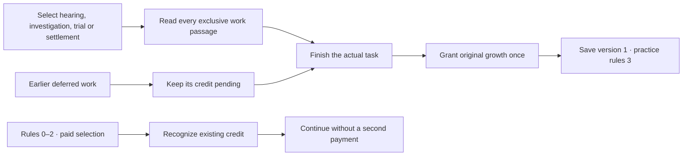
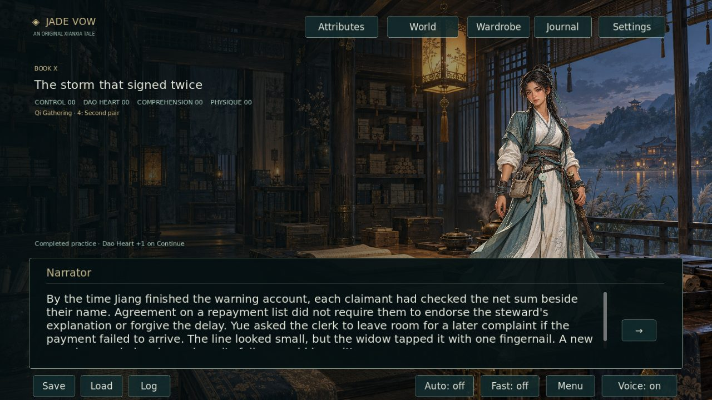
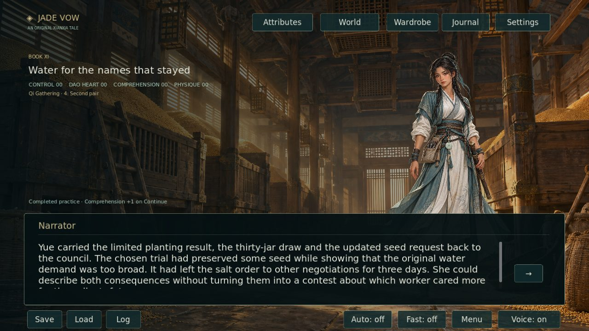

# Storm and salt-road completion credit · 2026-10-06

The fixed source is [c90102c720c0fd97fe31559851c57ee38e976d55](https://github.com/jgyy/octxian/commit/c90102c720c0fd97fe31559851c57ee38e976d55). Thirteen choices still paid growth when Lin Yue selected work that their prose explicitly placed in the future. Those gains now follow each exclusive branch's final existing passage. The original amounts, requirements, destinations, displayed prose, cultivation stage and continued endings are preserved.

## Confirmed repairs

| Existing choice | Premature sites | Completed work now credited |
|---|---:|---|
| `storm_hearing_choice` | 1 | Claimants finish checking the correction list |
| `storm_final_choice` | 3 | Publishing, workshop service or home preparation finishes |
| `salt_investigation_choice` | 3 | Channel, purchase or household investigation returns its findings |
| `salt_trial_choice` | 3 | Washing, seed or reserve trial returns its actual result |
| `salt_final_choice` | 3 | The selected rotation, maintenance or purchase settlement finishes |

The [machine-readable audit](STORM_SALT_REPAIRS_20261006.json) records each exact original choice, resulting choice, exclusive branch, completion paragraph and unchanged reward. These are **13 source sites of one recurring causal defect**, additional to prior audits. They are not 100 independent plot holes. The request for 100 new repairs has **87 unfulfilled sites**; this review does not invent defects or recount earlier fixes.

## Save compatibility

Save version remains 1. New saves identify `practice_rules: 3`. Rules 0–2 previously paid these thirteen choices at selection, so their actual prior payments are recognized without changing scores. A save at an unselected choice receives no recognition. Once-only completion records persist after reloading. Work that rules 1 or 2 already deferred remains pending under its original threshold.

## Manuscript and artwork

The manuscript remains **1,135,382 displayed words in 12,831 scenes across 17 books**. Only playable node prose counts; this batch changes no displayed text. The **2,000,000-word target is not met**: **864,618 new words remain**. README and development scope now state that shortfall instead of claiming completion. Draft CI still checks delivered content; production acceptance retains the full target.

Existing native artwork covers these existing locations and people. This repair batch requires no new plot illustrations. The original art quotas remain independent and unfinished.

## Review captures

CI renders two additional actual Godot viewport screenshots and validates their dimensions and nonblank content. The feature-branch bundle publishes them after the full game job succeeds.

The captions refer to actual completed work and the pending growth cue shown before Continue. They are not generated mockups.

## Verification

`python -m tools.validate_storm_salt_repairs --verify-source` authenticates every original choice and completion against the fixed source and rejects branch shortcuts, early rewards, shared completions and recounting prior audits. Python regression fixtures deliberately reintroduce those faults. Godot tests cover all thirteen branches, rules 0–3, saves before and after work, preserved older payments, earlier pending credit, duplicate-payment prevention, continued endings, overflow and atomic invalid-save rejection.

Full CI additionally retains the existing source audits, all campaign routes, native-art integrity, narration, UI, real captures and source-free Linux package playback. Passing draft CI does not imply the two-million-word target or 100 new repairs have been delivered.
