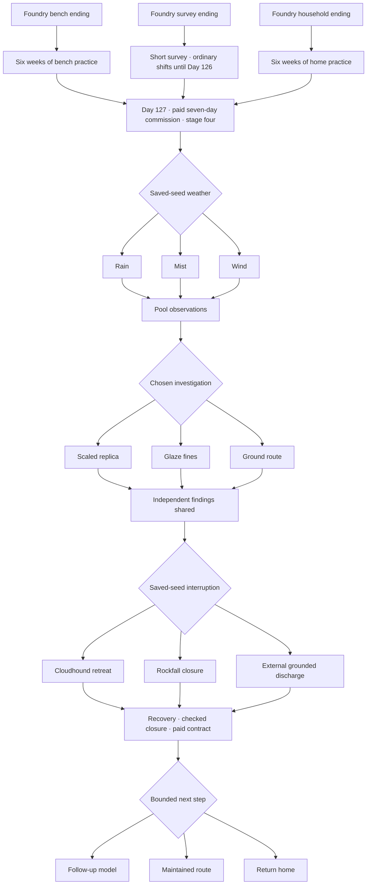

# Book IX: The ridge beneath the thunder

Book IX contains **94 scenes and 5,978 current displayed words** after continuity corrections. It continues each foundry ending through its own preparation period. The paid place ends on Day 84; the following six-week bench term ends on Day 126. All three entrances depart on Day 127, the forty-seventh morning after fourth-stage certification. Lin Yue remains at Qi Gathering **4: Second pair** throughout; field competence and a paid commission do not grant another stage.

Jiang Tao leads a seven-day Thunderfen survey. The team separates a scaled circuit replica, conductive glaze-fines examination and a checked ordinary ground route. Qualified investigators report independent findings before the common recovery checks, repair contract and paid closure. Wet glaze fines form a bypass in the permanent storm rod. The temporary replica and protection fuel remain separate; the damaged upper spur remains closed in every ending.

The Copperback Tortoise's shell taps are observable signals, not a mind-reading channel. The Cloudhound's appearance establishes a retreat condition, not who caused the old failure. A storm compass measures local conditions without prediction. The new effect depicts an external discharge into a rated ground bed.

## Chance and choices

Two events independently select one of three conditions. Rain, mist or wind changes the field approach; a cloudhound, rockfall or bounded external surge changes the return interruption. They rejoin mandatory scenes. None awards an attribute, grants rights or supplies a breakthrough.

A per-journey seed and event records make chance persistent across saving before or after an event and revisiting it. Player choices still select a replica study, material study or ground survey, then a bounded follow-up model, maintained route or return home. Existing cooperation stays available without a social score.

## Native media and verification

Seven independently generated masters add two locations, Jiang Tao, two monsters, a storm compass and an interrupted discharge. Native dimensions and retained blobs are recorded in [Thunderfen provenance](../assets/art/THUNDERFEN_PROVENANCE.md). Their actual game captures include the weather Continue UI, both creatures, surveyor, effect, final choices and object inspection.

Python regressions check mandatory findings/recovery, outcome continuity, unchanged earned stage, audit accuracy and chance alternatives. Godot validates seeded events, save compatibility, all possible routes, runtime resources and the standalone package. CI validates native art and narration, captures 72 viewports, and bundles the verified media on the feature branch.

The strict 1,000,001-word target remains **809,227 displayed words away**. This chapter is a delivered continuation in an unfinished larger manuscript.

All three outcomes now continue to [Book X's storm ledger](STORM_LEDGER_EXPANSION.md), followed by [Book XI's finite water commission](SALT_ROAD_EXPANSION.md). The full campaign now contains 2,335 scenes and 190,774 displayed words.
